# 👁️ Argus — User Guide

**What Argus is:** a dashboard and control plane over your local `~/.claude`
folder. It watches the files Claude Code already writes (background jobs,
transcripts, history, stats) and turns them into a live web view — and it can
fire its own scheduled and pipelined `claude -p` runs on top.

Argus **never modifies the state Claude Code owns** — it treats jobs,
transcripts, history and daemon files as strictly read-only. It _does_ own and
write its own state under `~/.claude/argus/` (schedules, pipelines, run
records, issue triage, accounts) and, when you apply setup fixes, its signal
hooks under `~/.claude/hooks/` and a hook entry in `settings.json`. The
monitoring tabs (Agents, Sessions, Activity, Projects, Stats, Search,
Inventory, Tasks) are observe-only, while the Launch, Scheduler, Pipelines,
Issues, Budget and Users tabs let you create, run, revise, triage, cap and
cancel work.

**Security note:** because Argus can launch `claude -p` agents with your
credentials, the server binds to loopback (`127.0.0.1`) only and rejects
cross-origin and unknown-Host requests. If you deliberately expose it on
another interface (`ARGUS_HOST`), set `ARGUS_TOKEN` so the surface is
authenticated.

Every feature below has its own section: what it's for, what you see, what you
can do, and where the data comes from.

## Contents

| #   | Feature                               | Route          | What it answers                           |
| --- | ------------------------------------- | -------------- | ----------------------------------------- |
| 0   | [Global UI](#global-ui)               | —              | nav, live dot, auto-refresh, setup banner |
| 1   | [Command Center](#1-command-center)   | `#/command`    | how are my pipelines doing right now?     |
| 2   | [Briefing](#2-briefing)               | `#/briefing`   | what happened while I was away?           |
| 3   | [Chronicle](#3-chronicle)             | `#/chronicle`  | what ran when, across every source?       |
| 4   | [Launch](#4-launch)                   | `#/launch`     | fire one `claude -p` run right now        |
| 5   | [Scheduler](#5-scheduler)             | `#/schedules`  | fire `claude -p` on a schedule            |
| 6   | [Monitors](#6-monitors)               | `#/monitors`   | did my schedules actually run?            |
| 7   | [Issues](#7-issues)                   | `#/issues`     | why are runs failing, grouped by cause?   |
| 8   | [Pipelines](#8-pipelines)             | `#/pipelines`  | author multi-phase, human-gated flows     |
| 9   | [Budget](#9-budget)                   | `#/budget`     | how much am I spending — and cap it       |
| 10  | [Users & sign-in](#10-users--sign-in) | `#/users`      | who may run/edit pipelines?               |
| 11  | [Search](#11-search)                  | `#/search`     | where did I say/see _that_?               |
| 12  | [Agents](#12-agents)                  | `#/agents`     | what's running / done / failed right now? |
| 13  | [Agent Detail](#13-agent-detail)      | `#/agent/<id>` | how did _this_ agent get here?            |
| 14  | [Sessions](#14-sessions)              | `#/sessions`   | what was actually said in a conversation? |
| 15  | [Activity](#15-activity)              | `#/activity`   | what have I prompted lately, everywhere?  |
| 16  | [Projects](#16-projects)              | `#/projects`   | which folders are active, and when?       |
| 17  | [Stats](#17-stats)                    | `#/stats`      | what's my usage / cost / token spend?     |
| 18  | [Inventory](#18-inventory)            | `#/inventory`  | what's installed and available?           |
| 19  | [Tasks](#19-tasks)                    | `#/tasks`      | what task workspaces exist / are locked?  |
| 20  | [Cron panel](#20-cron-panel)          | Scheduler tab  | why native cron routines can't be shown   |

---

## Global UI

Applies to every tab.

- **The "Argus" logo + colored dot** (top-left): the dot is the live-connection
  indicator. **Green = "live"** (WebSocket to the server is connected); **gray =
  "reconnecting…"** (socket dropped, falling back to polling). It reflects
  Argus's link to its own server, not the health of your agents.
- **Navigation** is split by role: the nine **destination** tabs (Command
  Center, Briefing, Chronicle, Launch, Scheduler, Monitors, Issues, Pipelines,
  Budget) sit in the bar;
  the 🔍 icon opens **Search**; the **⋯ More** menu holds the reference tabs
  (Stats, Inventory, Projects, Tasks, Users). Drill-down views (Agents,
  Detail, Sessions, Activity) are reached through links and breadcrumbs.
- **Auto-refresh:** the server pushes a "something changed" ping over a
  WebSocket whenever a watched file mutates, and the UI re-fetches. If the
  socket drops, each tab also polls on a timer (most tabs 10s; Stats 30s;
  Search on keystroke). You rarely need to refresh the browser.
- **Notifications:** a bottom-right **toast stack** (max 4, auto-dismiss
  after 8s) fires from any tab when a background agent finishes or fails,
  when a **monitor alert** arrives (down / failing / recovered — see
  [Monitors](#6-monitors)), and when a **budget alert** arrives (crossing
  80%, crossing a limit, or dropping back under — see [Budget](#9-budget)).
  If you grant the browser's notification
  permission (asked once), the same events also fire **native OS
  notifications**, so you hear about failures with the tab in the background.
- **Routing** is hash-based (`#/command`, `#/agents`, `#/search`…), so tabs
  are bookmarkable and the back button works. An unknown hash lands on the
  Command Center.
- **Setup banner:** when a prerequisite is missing — the signal Stop hook, the
  gate PreToolUse hook, Argus data directories, `claude`/`node` on PATH, or a
  parseable `pipelines.json`/`settings.json` — a red **"Setup incomplete"**
  strip appears above every tab listing each check as ✓ / ⚠ / ✗. If anything
  auto-fixable is wrong, an **Apply fixes** button repairs it in one click
  (`POST /api/setup/apply`). The banner disappears entirely once everything
  passes. The hooks matter: without the Stop hook pipelines can't detect step
  completion, and without the gate hook a gated phase can't pause for you.

---

## 1. Command Center

_Pipelines at a glance — the home tab._ Route: `#/command`

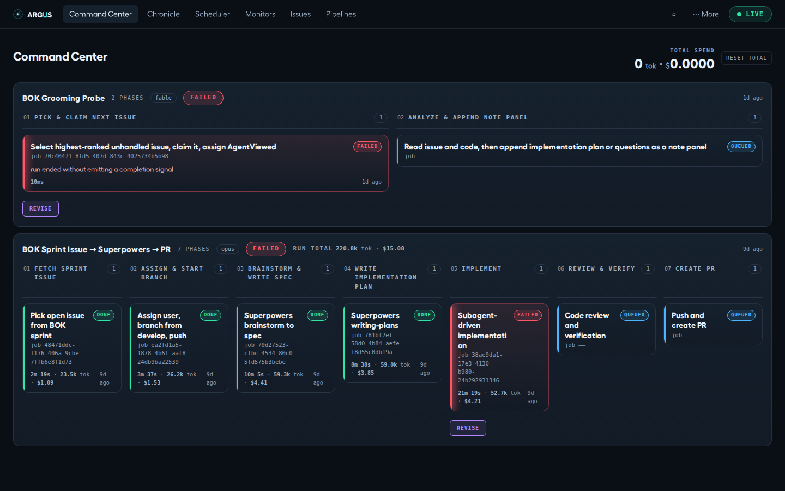

**Purpose:** one card per pipeline, attention-first, with a column per phase
and a tile per step. Approve/Revise gates appear inline on the row that needs
you — this is the wall you keep open on a second monitor.

**What you see:**

- A **card per pipeline**: name, phase count, the pipeline's **model chip**
  (e.g. `fable`, `opus`), an aggregated **status pill** (`awaiting approval`
  wins over `failed` over `working`…), the latest run's **Σ cost** (tokens +
  USD, including superseded revise attempts), and a freshness stamp.
- Under the header, **one column per phase** (numbered `01`, `02`, … with a
  step-count badge), and under each phase its **step tiles**: step name,
  `job <runId>`, a status pill, the failure reason if it failed, a live
  activity line and animated sweep bar while working, and a per-step meter —
  duration, tokens, dollars (e.g. `2m 19s · 23.5k tok · $1.09`).
- If two instances of one pipeline run concurrently, the card splits into
  labeled sub-sections, one per instance.
- **Total spend** (top-right): the all-time board total. **Reset total** is a
  two-click armed confirm — the reset is irreversible.

**What you can do:**

- **Approve** (green) a gated phase that's awaiting you — the pipeline resumes.
- **Revise** (labeled **Retry** after a crash-restart) — optionally attach a
  revise note, hit **Send**, and the phase restarts with your feedback.
- Both actions require a signed-in, approved account (see
  [Users & sign-in](#10-users--sign-in)); the buttons render for everyone but
  the server answers 401 unless you're authenticated.

**Cost semantics:** a metric appears once at least one run reports it via the
`claude -p` result envelope; steps still running (or predating cost capture)
show nothing. Money spent on a retried phase still counts toward the row Σ.

**Where the data comes from:** `GET /api/overview` (re-fetched on the
`pipelines:changed` WS ping), `GET /api/totals` + `POST /api/totals/reset`,
gate actions `POST /api/instances/:id/approve` / `/revise`.

---

## 2. Briefing

_The "while you were away" digest — read this first after time away._
Route: `#/briefing`

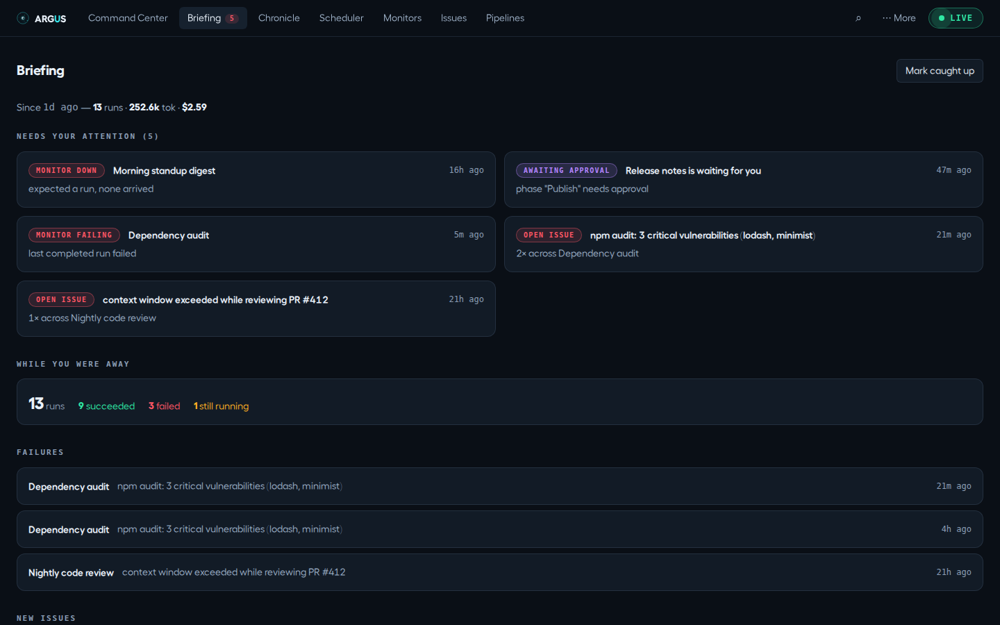

**Purpose:** Argus exists so agents can run unattended — which means you're
usually not looking when things happen. The Briefing answers the two questions
you'd otherwise tour four tabs for: **what needs me right now**, and **what
happened since I last caught up**.

**The attention badge:** the Briefing tab shows a red count chip in the nav
bar whenever something needs you (visible from any tab). The count is the
number of attention cards below.

**Needs your attention** — state-now cards, most severe first, each
deep-linking to the tab where you act on it:

- **Monitor down** (→ Monitors): a schedule's expected run never arrived —
  the dead-man's switch fired.
- **Awaiting approval** (→ Pipelines): a gated pipeline phase is paused
  waiting for your Approve/Revise.
- **Monitor failing** (→ Monitors): the schedule runs, but its last completed
  run failed.
- **Open issue** (→ Issues): an unresolved failure group, with its occurrence
  count and affected schedules.

**While you were away** — everything below is scoped to the window since your
last acknowledgement (or the last 24 h if you've never acknowledged; capped at
7 days):

- The header line totals the window: **runs · tokens · cost**.
- A run-outcome strip: succeeded / failed / interrupted / cancelled / skipped
  / still running counts.
- **Failures** — the windowed failed runs (schedule, first error line, when),
  newest first.
- **New issues** — failure groups whose _first_ occurrence is inside the
  window, i.e. genuinely new breakage, not an old known issue recurring.
- **Pipelines finished** — instances that reached a terminal state in the
  window.

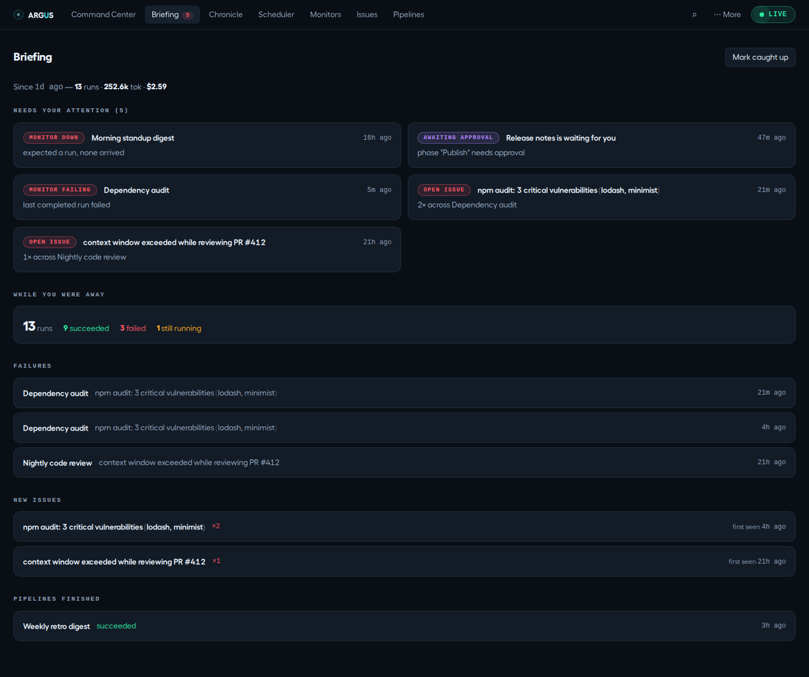

**Mark caught up** (top right): stamps now as your acknowledgement point and
resets the window — the digest empties, and tomorrow's briefing starts from
this moment. Attention cards are unaffected (a down monitor stays down until
it actually recovers). The acknowledgement is stored in Argus-owned
`~/.claude/argus/briefing.json`.

**All caught up:** when nothing needs attention and nothing ran in the
window, the tab says so and gets out of the way.

**Where the data comes from:** `GET /api/briefing` (a pure derivation over
runs + schedules + issue triage + pipeline instances; re-fetched on the
`schedules:changed`, `pipelines:changed`, `issues:changed` and
`briefing:changed` WS pings), `POST /api/briefing/ack`.

---

## 3. Chronicle

_Everything that ran, on one timeline._ Route: `#/chronicle`

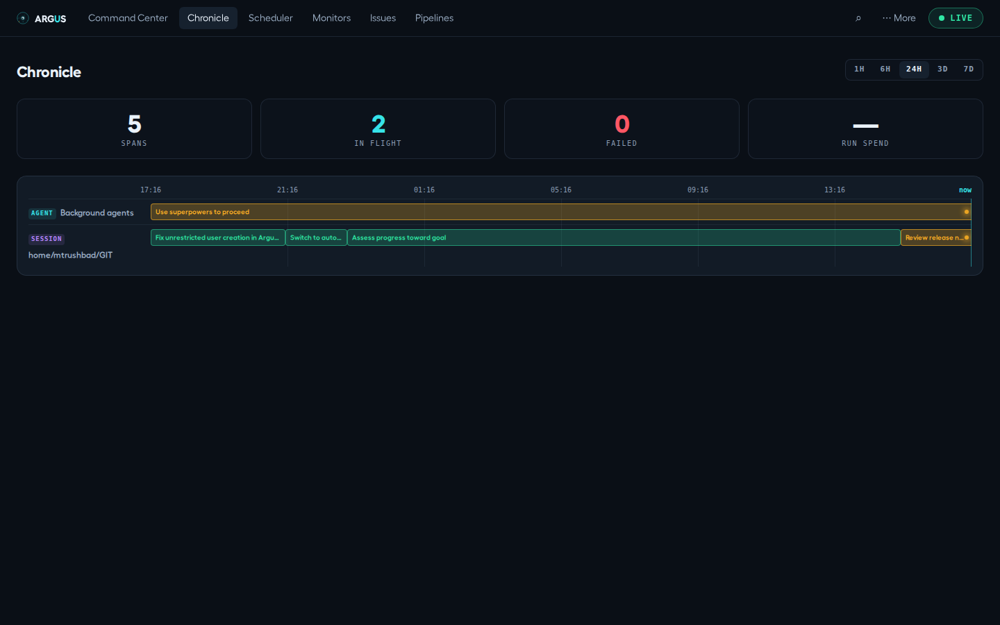

**Purpose:** a swimlane timeline that merges **scheduler runs**, **background
agents**, and **sessions** into a single windowed view — see a day of activity
in one glance, spot overlaps, and click into anything.

**What you see:**

- A **time-window switch** (top-right): **1H / 6H / 24H / 3D / 7D** (default
  24H). This is the zoom — there's no free pan; the window always ends at
  `now` (bold marker on the right edge).
- Four counters: **Spans**, **In flight** (still running), **Failed**, and
  **Run spend** (USD reported by scheduler runs in the window).
- One **swimlane per group**, labeled with a kind badge — `SCHED` (a
  schedule's runs), `AGENT` (background agents), `SESSION` (one lane per
  project) — followed by rows of **span bars** colored by status
  (working/done/failed/queued). Still-running spans render open-ended with a
  pulsing dot at `now`. Hover a bar for label, start→end, status and cost.
- Empty state: _"Nothing happened in this window. Widen it, or launch an
  agent and watch it appear."_

**What you can do:** switch the window; click a span to jump to its source
(e.g. a schedule's card in the Scheduler).

**Where the data comes from:** `GET /api/chronicle?hours=N` (1–336), merging
the scheduler's run records with `~/.claude/jobs/` and
`~/.claude/projects/*/​*.jsonl`.

---

## 4. Launch

_Fire one `claude -p` run right now._ Route: `#/launch`

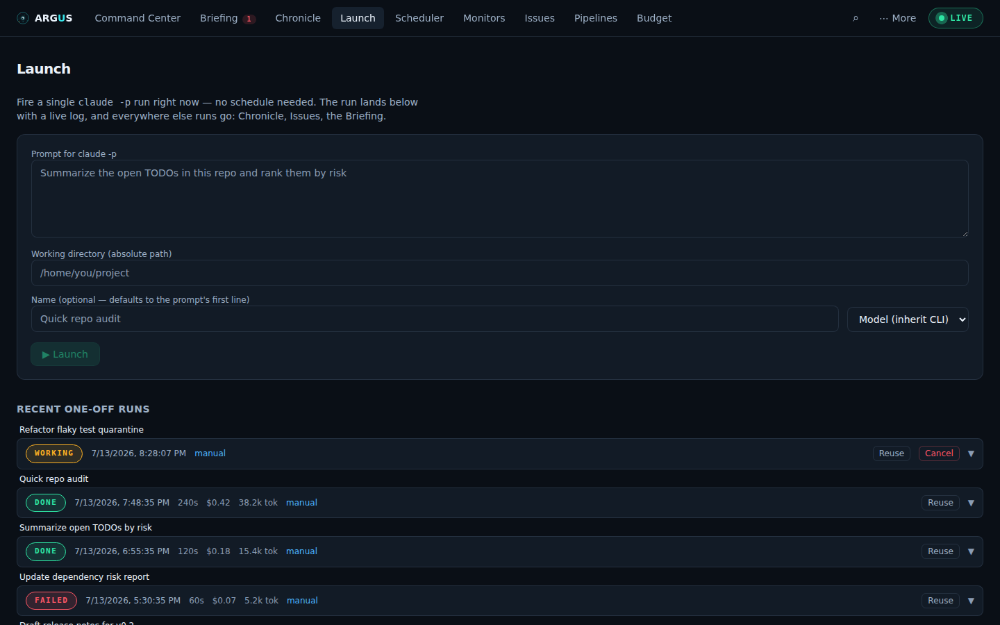

**Purpose:** not everything deserves a schedule. Launch fires a **single
one-off run** — a quick audit, a report, a cleanup — straight from the
dashboard: prompt, working directory, go. No schedule object is created and
nothing recurs.

**The form:**

- **Prompt for `claude -p`** and a **working directory** (absolute path,
  must exist) — the only two required fields; **▶ Launch** stays disabled
  until both are filled.
- **Name** (optional) — how the run is titled everywhere; left empty it
  defaults to the prompt's first line (ellipsized at 60 chars).
- **Model** — inherit the CLI default, pick an alias (Opus / Sonnet / Haiku),
  or type a custom model id; passed to the agent as `--model`.

**Recent one-off runs** — the last 20 launches, newest first, each titled and
expandable exactly like a schedule's run rows: status pill, start time,
duration, cost and tokens once reported, the error or result summary, a link
to the **transcript** in Sessions, and a **live-tailing log** (refreshes every
3s while running). A running launch has a **Cancel** button, and every row has
**Reuse** — it copies that run's prompt, directory, name and model back into
the form for a tweak-and-refire loop.

**Where one-off runs show up:** everywhere runs go. They share the `oneoff`
run bucket (pruned to the same 50-run window a schedule gets), appear as a
single **"One-off runs"** lane in the [Chronicle](#3-chronicle), a failed
launch groups into [Issues](#7-issues) and lands in the
[Briefing](#2-briefing)'s failure digest, and reported cost counts toward the
[Budget](#9-budget) and the Command Center's total spend. They never touch
[Monitors](#6-monitors) — there is no expected slot for a one-off.

**Where the data comes from:** `POST /api/launch` (`202` with the run
record), then the standard run surface — `GET /api/runs?scheduleId=oneoff`,
`GET /api/runs/:id`, `POST /api/runs/:id/cancel`.

---

## 5. Scheduler

_Recurring `claude -p` runs, owned by Argus._ Route: `#/schedules`

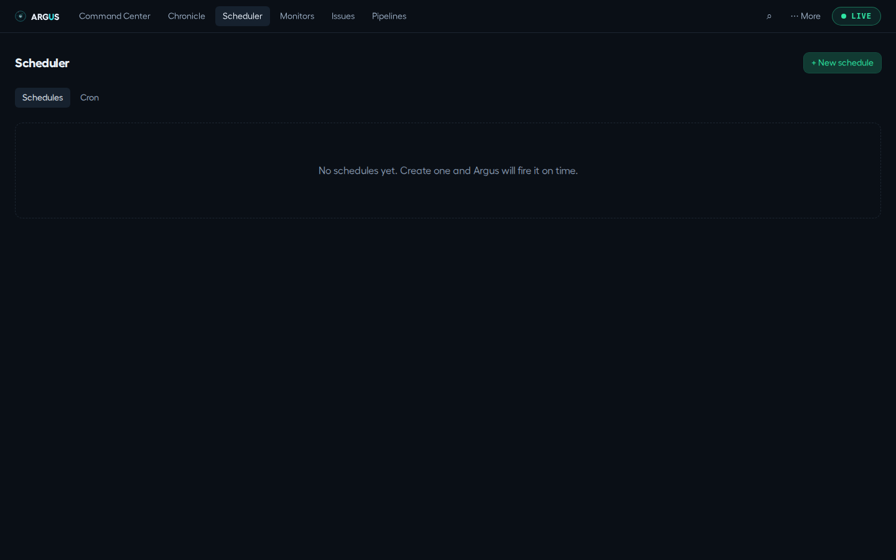

**Purpose:** define headless prompts that Argus fires on a trigger — nightly
audits, periodic report generators, cleanup jobs — then watch their run
history and logs without leaving the page. Two sub-tabs: **Schedules** (this
section) and **Cron** (see [Cron panel](#20-cron-panel)).

**Creating a schedule** — click **+ New schedule**:

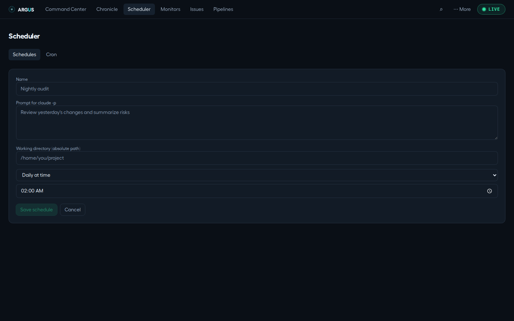

- **Name** — how it appears everywhere (cards, Chronicle, Monitors).
- **Prompt for `claude -p`** — the full prompt the headless agent receives.
- **Working directory** — absolute path the agent runs in.
- **Trigger** — one of: **every N minutes** (interval), **daily at HH:MM**,
  **weekly on a day at HH:MM**, or **windowed** (every N minutes, but only
  between a start and end time on selected weekdays — e.g. "every 30 min,
  09:00–13:00, Mon–Fri"). Overlap policy defaults to _skip if still running_.
- **Catch up a missed run on recovery** — off by default. Normally a slot
  only fires within a short grace window (a few minutes), so if the machine
  was asleep or Argus wasn't running when a slot came due, that slot is
  silently skipped and the schedule waits for the next one. Tick this and the
  missed slot fires **once**, as soon as Argus is back — anacron-style. Only
  the most recent missed slot is run: an every-15-minutes schedule that
  slept through the night catches up with one run, not thirty. Ideal for
  "morning briefing"-type dailies on a laptop; leave it off for jobs where a
  stale run is worse than no run.
- **Save schedule** stays disabled until name, prompt and working directory
  are filled.

**What each schedule card shows:** the trigger summary and its **next fire
time** (plus a **catch-up** chip when missed-run recovery is on), the working
directory, a pulsing "running" indicator while a run is in flight, and the
**last five runs** — status pill, start time, duration, cost and tokens if
reported, and a `manual` tag on run-now firings.

**What you can do:**

- **Run now** — fire immediately, regardless of the trigger.
- **Enable / Disable** — pause the trigger without deleting anything.
- **Edit** / **Delete** (with confirm).
- **Expand a run** to see its error or result summary, a link to the full
  **transcript** in Sessions, and a **live-tailing log** (refreshes every 3s
  while running). A running run has a **Cancel** button.

**Where the data comes from:** Argus's own state —
`~/.claude/argus/schedules.json` and run records under `~/.claude/argus/runs/`
via `GET/POST /api/schedules`, `PUT/DELETE /api/schedules/:id`,
`POST /api/schedules/:id/run`, `GET /api/runs`, `POST /api/runs/:id/cancel`.

---

## 6. Monitors

_A dead-man's switch over your schedules._ Route: `#/monitors`

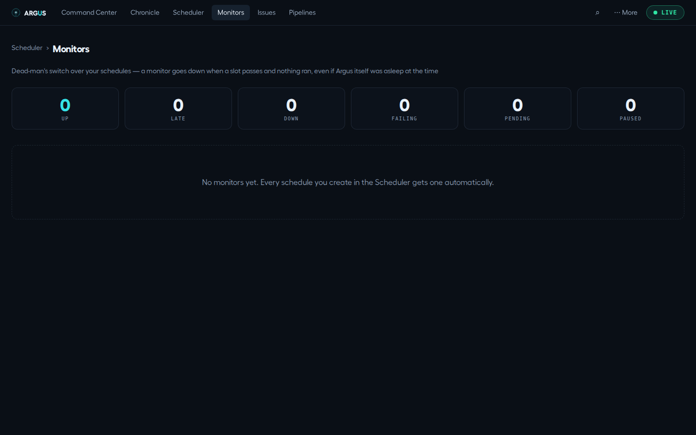

**Purpose:** answer "did my schedules actually run?" — not "what did Argus
launch," but "did the expected slot pass with nothing landing," which also
catches the case where **Argus itself was asleep** at fire time. Every
schedule you create gets a monitor automatically; there's nothing to author
here.

**What you see:**

- A six-tile summary: **Up / Late / Down / Failing / Pending / Paused**.
- One **monitor card** per schedule: its name (links back to the Scheduler),
  a status pill, a **heartbeat bar** of the last 30 runs (one tick per run,
  colored by outcome), and a stats line — **uptime %** (succeeded vs failed
  over the last 30), **last run** time, and either the **next** expected time
  or, when late/down, the slot that was **expected** and missed.
- Cards that are `down` or `failing` get a red border so they jump out.

**Status meanings:** `up` — last expected slot ran; `late` — a slot is
overdue but within grace (10% of the trigger period, clamped 5–60 min);
`down` — a slot passed grace with no run; `failing` — runs happen on time but
the latest one failed; `pending` — no run yet; `paused` — the schedule is
disabled.

**Alerts — the switch actually pages you.** Detection alone isn't enough for
a page you don't have open, so the server re-checks every monitor on its
scheduler tick (~30s) and pushes an alert the moment one **transitions**:

- **Monitor down** — a slot passed its grace with no covering run.
- **Monitor failing** — runs are landing on time, but the latest one failed.
- **Monitor recovered** — a down/failing monitor came back up (a catch-up
  run, a fixed prompt, the next slot succeeding…).

Each alert reaches you three ways: an **in-app toast** (bottom-right, any
tab), a **native OS notification** if you've granted the browser permission
(Argus asks once), and a **webhook POST** when `ARGUS_WEBHOOK_URL` is set —
the same JSON channel that already carries run/pipeline failures, so one
Slack/mail bridge covers everything. Only observed transitions alert: on a
fresh server boot the first check is a silent baseline, so restarting Argus
never replays a storm of already-known-down alerts (the Briefing tab is the
place that shows current bad state).

**What you can do:** the tab itself is deliberately read-only — fix problems
in the Scheduler or Issues tabs.

**Where the data comes from:** `GET /api/monitors`, derived on every read
from schedules + run records (no separate state to go stale); alerts arrive
as `monitors:alert` frames on `/ws`.

---

## 7. Issues

_Failed runs grouped by root cause._ Route: `#/issues`

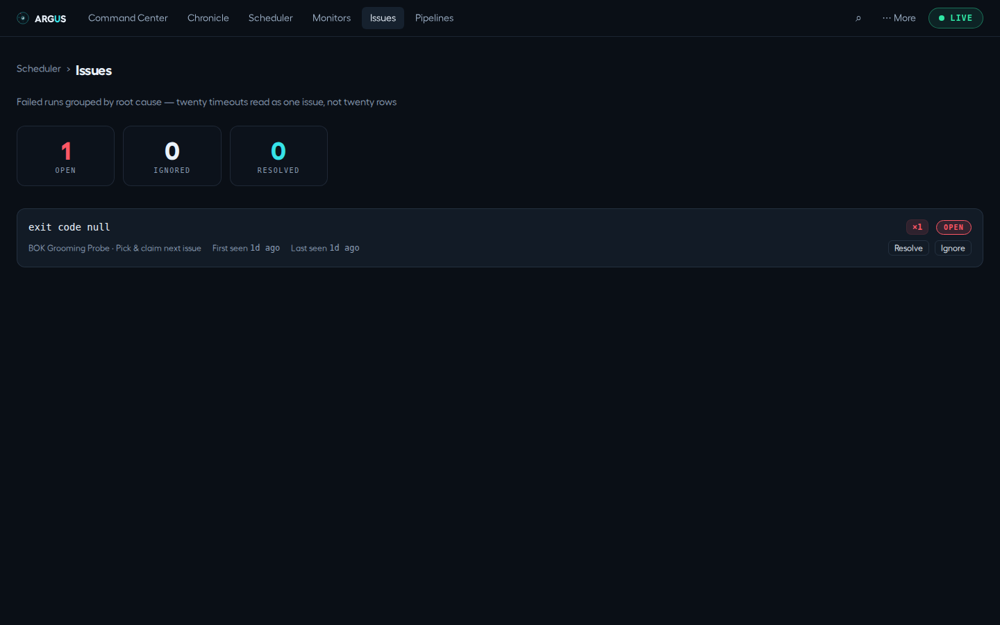

**Purpose:** Sentry-style grouping — twenty timeouts read as **one issue with
×20**, not twenty rows. Each distinct failure fingerprint (normalized error)
becomes one card.

**What you see:**

- Summary tiles: **Open / Ignored / Resolved**.
- One **issue card** per fingerprint: the error title (monospace), an
  **×N occurrence badge**, a state badge, which schedules it affects, and
  first/last-seen times. Open issues get a red border.
- Expanding a card loads its **occurrences** — per-run time, schedule name,
  and the exact error text (up to the latest 50).

**What you can do (the triage lifecycle):**

- **Resolve** — mark it fixed. If a _newer_ failure with the same fingerprint
  arrives later, the issue **auto-reopens** — resolved means "fixed going
  forward", not "hide forever".
- **Ignore** — mute it (known-noisy failures). Stays ignored until you reopen.
- **Reopen** — available on resolved/ignored issues; drops the triage record.

**Where the data comes from:** `GET /api/issues` +
`GET /api/issues/:fingerprint`, derived from run records on every read; only
your triage decisions persist (`~/.claude/argus/issues.json`).

---

## 8. Pipelines

_Author multi-phase, human-gated agent flows._ Route: `#/pipelines`

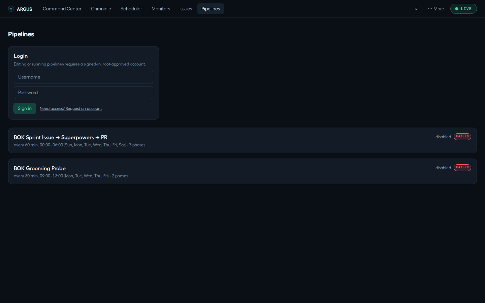

**Purpose:** define pipelines — ordered **phases**, each with a working
directory and one or more **steps** (a step = one `claude -p` run with its own
prompt) — then launch them manually or on a trigger and watch them on the
[Command Center](#1-command-center). A phase can be **gated**: the pipeline
pauses there until a human approves or revises.

**What you see:** one card per pipeline with its trigger summary, phase
count, a `disabled` tag when paused, and a live status pill aggregated from
running instances. When you're **signed out**, the **Login** panel appears
here (see [Users & sign-in](#10-users--sign-in)) — viewing is open, but every
mutating action requires a signed-in, root-approved account.

**The pipeline form** (+ New pipeline / Edit):

- **Name**, **trigger** (manual — i.e. no trigger — or interval / daily /
  weekly / windowed), **overlap policy** (skip if running / allow overlap),
  and a pipeline-default **model** (Opus, Sonnet, Haiku, custom, or inherit
  the CLI default).
- An ordered list of **phases** — each with a name, a working directory, and
  a **"Requires human approval (gated)"** checkbox.
- Inside each phase, ordered **steps** — each with a name, an optional
  per-step **model override**, and its prompt. Reorder or remove phases and
  steps freely; **Save** stays disabled until every phase has a name, cwd and
  at least one complete step.

**What you can do (signed in):**

- **Run now** — start an instance (hidden while one is running unless overlap
  is allowed).
- **Stop / Stop all (N)** — abort active instances (with confirm).
- **Enable / Disable**, **Edit**, **Delete** (with confirm).
- Approving/revising a **gated phase** happens on the Command Center, inline
  on the paused row.

**How steps complete:** the Stop-hook and gate-hook installed by Setup let
each spawned agent signal "step finished" / "needs input" back to Argus
(`POST /api/instances/:id/signal`, authenticated by a per-instance token —
this is the one instance endpoint that doesn't need a login).

**Where the data comes from:** `~/.claude/argus/pipelines.json` and instance
records under `~/.claude/argus/instances/` via `GET/POST /api/pipelines`,
`PUT/PATCH/DELETE /api/pipelines/:id`, `POST /api/pipelines/:id/start`,
`GET /api/overview`, `POST /api/instances/:id/{approve,revise,abort}`.

---

## 9. Budget

_Spend guardrails over every unattended dollar._ Route: `#/budget`

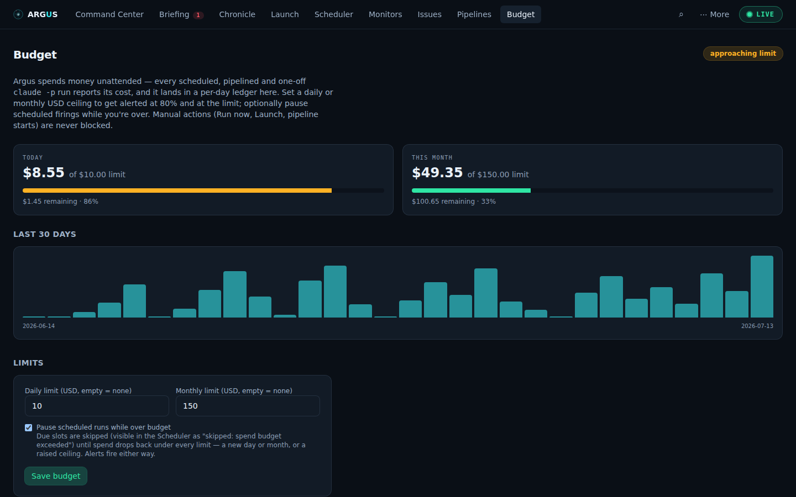

**Purpose:** Argus's whole point is spending your API credits while you're
not looking — schedules, pipelines and one-off launches all report what each
run cost. The Budget tab turns those reports into a **per-day ledger** and
lets you put a ceiling on it: get alerted when you approach or cross a limit,
and optionally **pause scheduled firings** until you're back under.

**What you see:**

- A **state pill** (top right): `no limits set` / `under budget` /
  `approaching limit` (≥ 80% of any limit) / `over budget`.
- **Today** and **This month** cards: spent so far, the limit, a colored
  progress bar (green → amber at 80% → red at the limit), and the remaining
  or overage amount. Both windows follow your local calendar, like schedule
  triggers do.
- **Last 30 days** — a spend bar chart; hover a bar for the day's dollars
  and run count.
- **Limits** — the config form: a daily USD limit, a monthly USD limit
  (either may be empty = no limit), and the hard-stop checkbox.

**The hard stop** ("Pause scheduled runs while over budget"): while any limit
is exceeded, due schedule slots are **skipped** instead of fired — each skip
is recorded as a `skipped` run ("skipped: spend budget exceeded") so the
Scheduler shows exactly what didn't happen, and the slot still counts as
covered for [Monitors](#6-monitors) (a budget pause is not an outage). Firing
resumes by itself the moment spend drops under every limit — a new day, a new
month, or a raised ceiling. **Manual actions are never blocked**: Run now,
Launch and pipeline starts always work — a human clicking a button is its own
authorization.

**Alerts:** the server re-checks the budget on its scheduler tick (~30s) and
pushes a transition alert the moment the state changes — **Budget warning**
(crossed 80%), **Budget exceeded** (crossed a limit; the alert says whether
scheduled runs are paused), **Budget back under limit**. Each reaches you the
same three ways as monitor alerts: in-app toast, native OS notification (if
granted), and an `ARGUS_WEBHOOK_URL` POST (`budget.warning` /
`budget.exceeded` / `budget.cleared`). Only observed transitions alert — a
restart never replays a known-exceeded state.

**How spend is counted:** each completed run's cost (reported by the
`claude -p` result envelope) is folded into the day it ended, at the same
exactly-once point that feeds the all-time totals — so scheduled, manual,
one-off and pipeline-step runs all count, and the ledger survives run-record
pruning. Runs that report no cost (older CLIs, crashed spawns) add nothing.

**Where the data comes from:** Argus-owned `~/.claude/argus/budget.json`
(limits) and `~/.claude/argus/spend.json` (ledger) via `GET /api/budget` and
`PUT /api/budget`; alerts arrive as `budget:alert` frames on `/ws`.

---

## 10. Users & sign-in

_Who may run and edit pipelines._ Route: `#/users` (root only) + the login
panel on the Pipelines tab

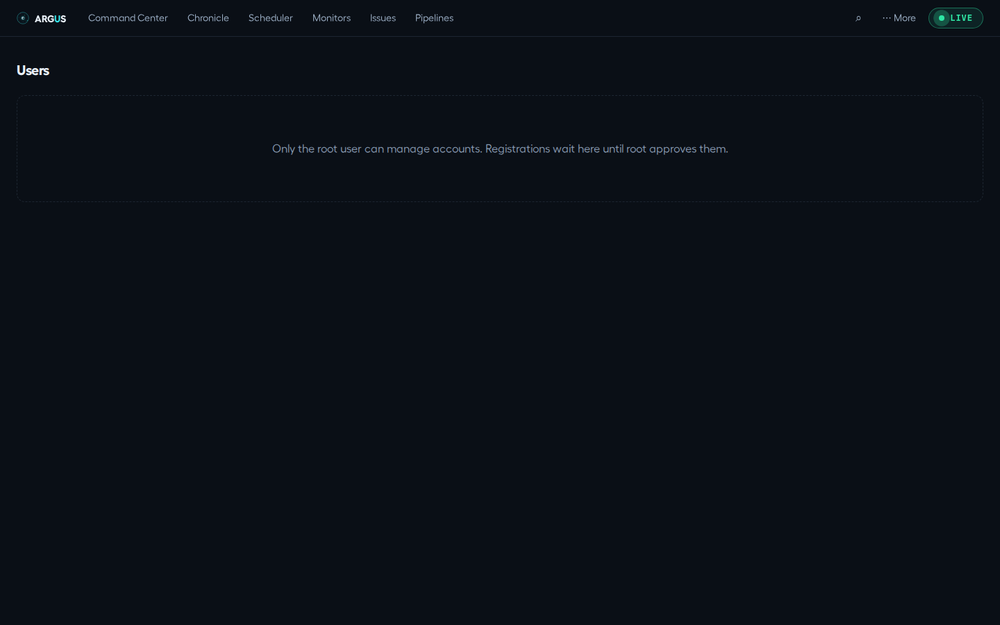

**Purpose:** Argus's mutating pipeline surface is account-gated with a
two-role model: **root** (the first account, manages users) and **members**
(can run/edit pipelines once approved).

**The three auth flows** (all on the Pipelines tab's panel):

1. **First launch — create the root account.** On an unconfigured server the
   panel offers a one-time root bootstrap (username + password, min 8 chars).
   This is **localhost-only**, enforced server-side. The password is stored
   only as a salted scrypt hash — never plaintext.
2. **Login** — username + password; the session is an HttpOnly cookie. Sign
   out from the same panel (your username + **Sign out** appear when
   authenticated).
3. **Request an account** — anyone on the machine can register; the account
   lands **pending** until root approves it.

**The Users tab** (visible in ⋯ More only to root): all accounts, **pending
first** — each with username, role, and an "awaiting approval" tag. Root can
**Approve** or **Reject** a pending registration, and **Remove** an active
member (never yourself). Non-root visitors see only an explanatory notice
(that's the screenshot above).

**Forgot the root password?** Delete `~/.claude/argus/auth.json` on the
machine running Argus and bootstrap again.

**Where the data comes from:** `GET /api/auth/status`,
`POST /api/auth/{setup,login,register,logout}`, `GET /api/users`,
`POST /api/users/:username/{approve,reject}`; state in
`~/.claude/argus/auth.json`.

---

## 11. Search

_Full-text across all transcripts._ Route: `#/search` (the 🔍 in the nav)

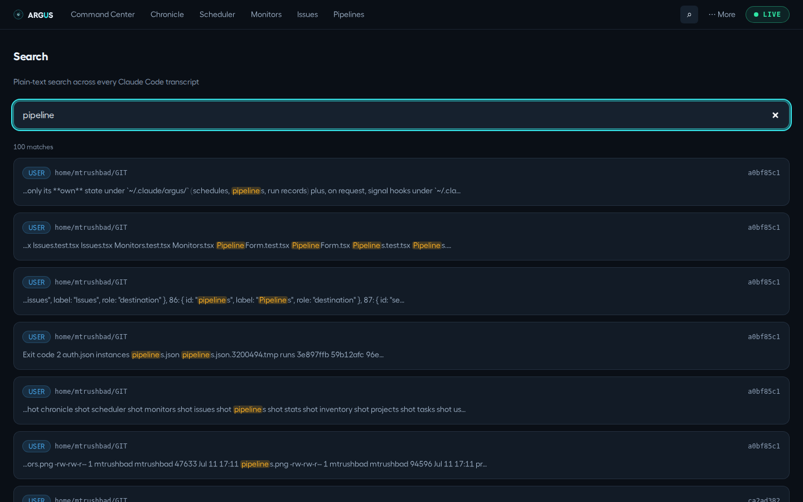

**Purpose:** find any text anywhere in your session history — a phrase, a
file name, an error message — when you don't remember which session it was in.

**What you see:** a search box; as you type (debounced ~300ms), a live match
count and results. Each result shows a role badge (user/assistant), the
project, the session's short id, and a **snippet centered on the match** with
your terms highlighted. Helper states cover "Type to search", "Searching…"
and "No matches".

**How to use it:** just type — case-insensitive substring matching, capped at
100 matches. Click a result to open that transcript.

**Where the data comes from:** `GET /api/search?q=`, scanning every
`~/.claude/projects/<project>/<session>.jsonl` per query.

---

## 12. Agents

_The status board for background jobs._ Route: `#/agents`

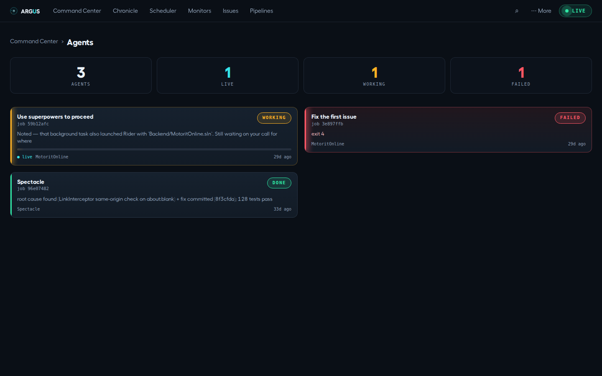

**Purpose:** the at-a-glance board for all background Claude Code jobs.

**What you see:**

- A **summary row**: total agents, how many are **live**, **working**, and
  **failed**.
- A grid of **agent cards**: name, short id, a color-coded status pill
  (`working / done / failed / idle / queued`), a pulsing green **live** dot if
  it's running right now, the current detail line, a result box when there's
  finished output, and a footer — folder, tempo, and last-update time.

**How to use it:** scan colors to triage — green pulse = running now, red =
failed. **Click any card** to open that agent's [Detail](#13-agent-detail).

**Where the data comes from:** `GET /api/agents`, merging
`~/.claude/jobs/<short>/state.json` with `~/.claude/daemon/roster.json`
(an agent is "live" only if it's an active worker in the roster).

---

## 13. Agent Detail

_Single-agent deep dive + timeline._ Route: `#/agent/<short>`

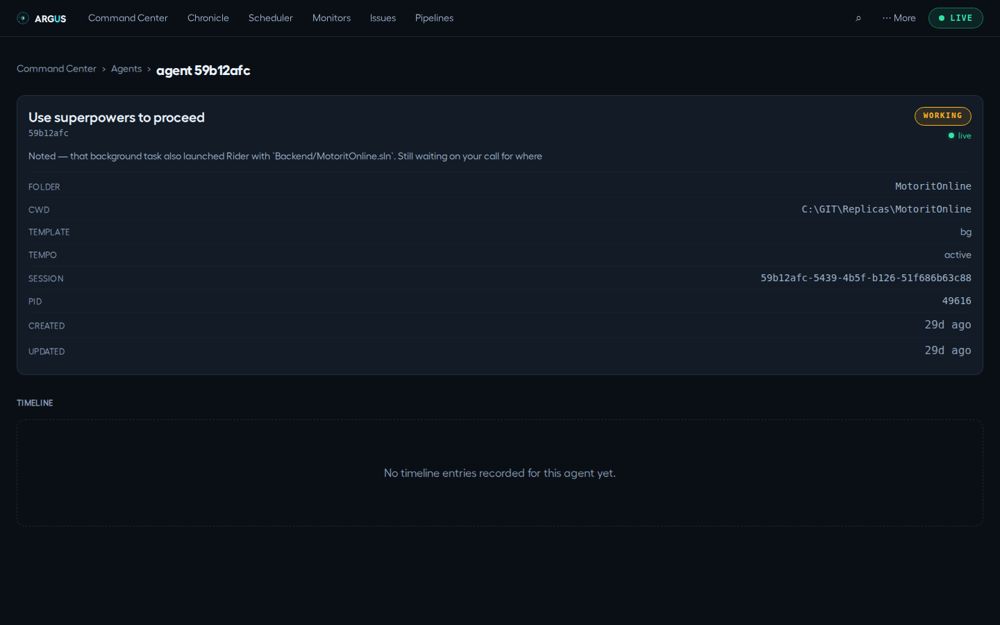

**Purpose:** everything about one agent, including the chronological trail of
how it got to its current state. A card click on Agents lands here.

**What you see:**

- A **metadata card**: name, short id, status pill, live dot, current
  detail/result text, and the full field list — folder, full CWD, template,
  tempo, session id, PID, task counts, and created/updated timestamps as
  relative times.
- A **timeline**: every recorded state transition, newest first, with a
  status-colored dot, pill, timestamp and optional detail line; long entries
  get a "Show details" expander. Agents that predate timeline capture show an
  honest "no timeline entries recorded" note instead.

**How to use it:** read the timeline bottom-to-top to follow the agent's life
story. Use the breadcrumb to go back to Agents.

**Where the data comes from:** `GET /api/agents/:short/timeline`, reading
`~/.claude/jobs/<short>/timeline.jsonl`. Works even for agents no longer in
the main list.

---

## 14. Sessions

_Browse & read transcripts._ Route: `#/sessions`

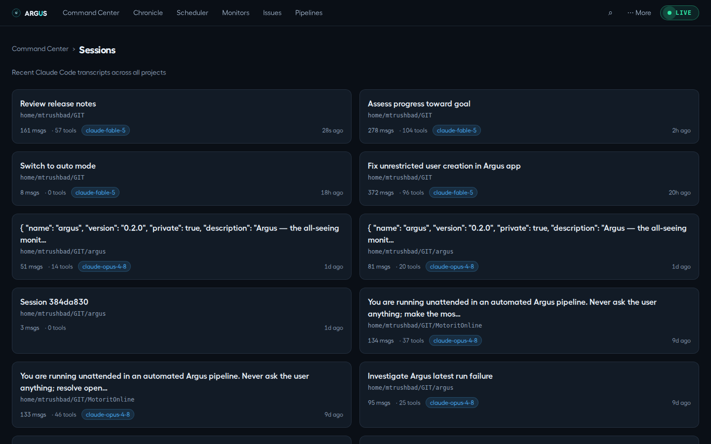

**Purpose:** read the actual conversation transcripts of your Claude Code
sessions across all projects.

**What you see:** cards sorted by most-recent activity — title (from the
first user prompt or AI-generated), project, message count, tool-use count,
the model used, and last-activity time.

**Clicking a card opens the transcript:**

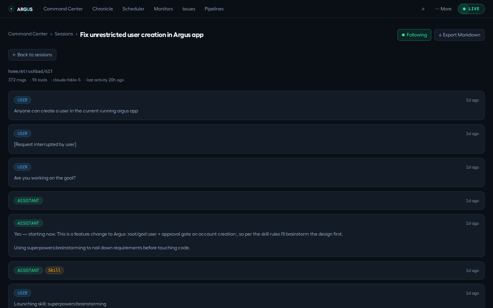

- The full message stream in order — each message with a role pill
  (user/assistant), a tool badge where a tool was invoked, a red error badge
  on failed steps, and a timestamp.
- **Following** (top-right): auto-scrolls to the newest message as a live
  session grows — Argus doubles as a live viewer for running sessions.
- **Export Markdown**: download the whole transcript as a `.md` file.
- **Back to sessions** returns to the list.

**Where the data comes from:** `GET /api/sessions` and
`GET /api/sessions/:project/:id`, reading
`~/.claude/projects/<encoded-project>/<session-id>.jsonl`.

---

## 15. Activity

_Global prompt feed._ Route: `#/activity`

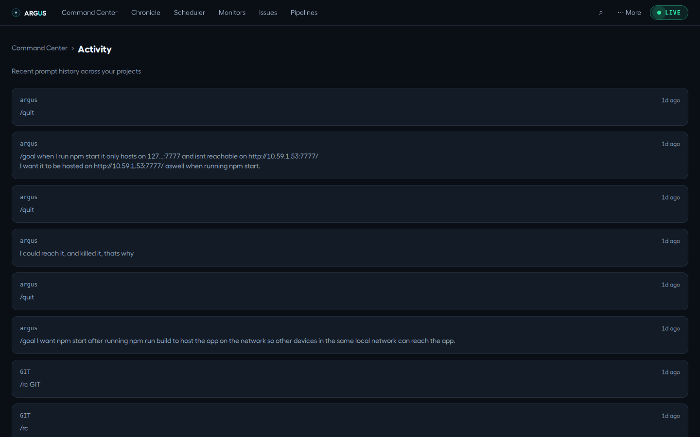

**Purpose:** a single chronological stream of recent prompts issued across
**all** projects and sessions — your "what have I been doing lately" firehose.

**What you see:** a newest-first list; each row shows the project name, a
relative timestamp, and the prompt text (truncated to ~240 chars). Read-only.

**Where the data comes from:** `GET /api/activity`, reading
`~/.claude/history.jsonl` (most recent ~100 entries).

---

## 16. Projects

_Working-directories overview._ Route: `#/projects`

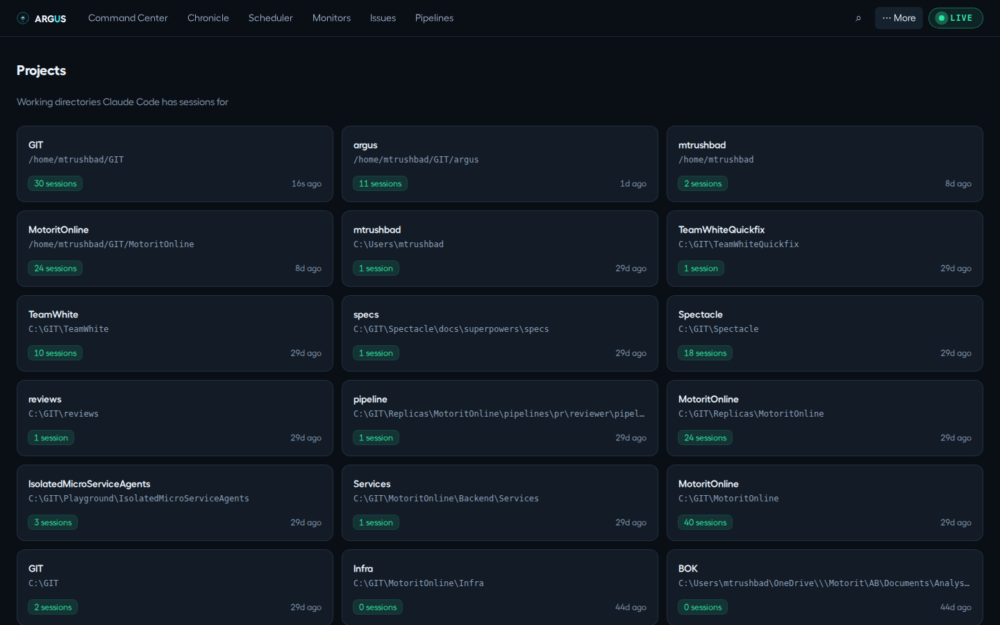

**Purpose:** a directory-level roll-up — every folder Claude Code has worked
in, with how much activity each has.

**What you see:** a grid of project cards — short folder name, the full
decoded path, a **session-count** badge, and last-activity time. Paths from
other operating systems (e.g. a Windows `C:\GIT\…` history read on Linux)
decode correctly — Argus keys off the encoded names, not absolute paths.

**How to use it:** see which repos are most active and when each was last
touched. Informational only — drill into content via Sessions or Search.

**Where the data comes from:** `GET /api/projects`, scanning
`~/.claude/projects/` subdirectories.

---

## 17. Stats

_Usage analytics._ Route: `#/stats`

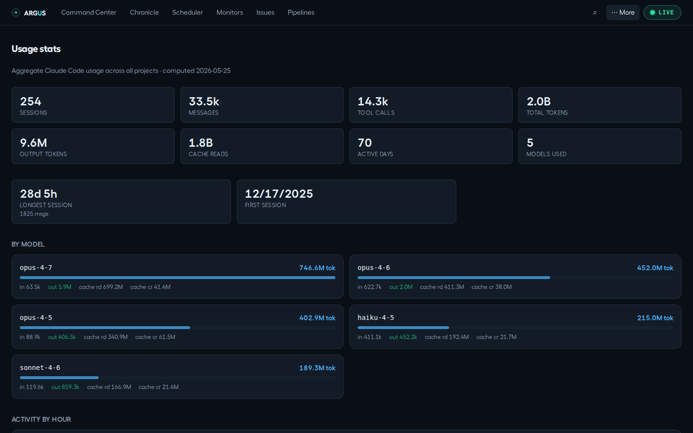

**Purpose:** aggregate usage analytics across all your Claude Code activity.

**What you see:**

- **Headline cards:** total sessions, messages, tool calls, total tokens,
  output tokens, cache reads, active days, models used — plus, when the CLI
  reports them, total cost, longest session, and first-session date.
- **By-model breakdown:** tokens per model with an
  input/output/cache-read/cache-creation split, sorted by volume.
- **Activity-by-hour:** 24 bars showing when you work.
- **Recent daily activity:** a last-30-days table of per-day volume.

**Where the data comes from:** `GET /api/stats`, reading the pre-computed
`~/.claude/stats/stats-cache.json` (shape varies by CLI version; secondary
metrics appear only if present).

---

## 18. Inventory

_Installed extensions catalog._ Route: `#/inventory`

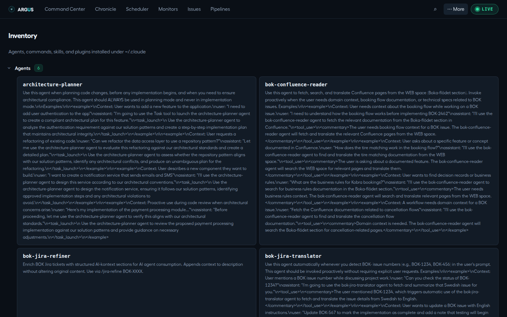

**Purpose:** see everything installed into your Claude Code environment — the
agents, commands, skills, and plugins available to you.

**What you see:** four collapsible, color-accented sections with count badges —
**Agents**, **Commands**, **Skills**, **Plugins** (with marketplace and
version) — each item showing its name and description from frontmatter.

**How to use it:** a reference catalog — "what do I have and what does each
do." No install/remove actions.

**Where the data comes from:** `GET /api/inventory`, reading
`~/.claude/agents/`, `commands/`, `skills/`, and
`plugins/installed_plugins.json`.

---

## 19. Tasks

_Task-queue workspace inventory._ Route: `#/tasks`

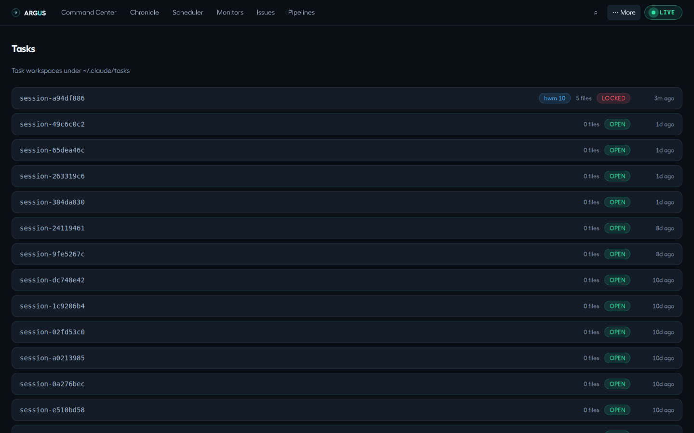

**Purpose:** a low-level view of Claude Code's internal task directories (the
in-session task queue's working folders) — mostly diagnostic.

**What you see:** one row per task workspace — its id, a **highwatermark**
badge (progress marker) if present, the file count, a **lock status** (red =
locked/in use, green = open), and last-updated time. Read-only.

**Where the data comes from:** `GET /api/tasks`, scanning
`~/.claude/tasks/<id>/` for `.lock` / `.highwatermark` files.

---

## 20. Cron panel

_An honest empty state, by design._ Found under **Scheduler → Cron** sub-tab
(there is deliberately no `#/cron` route).

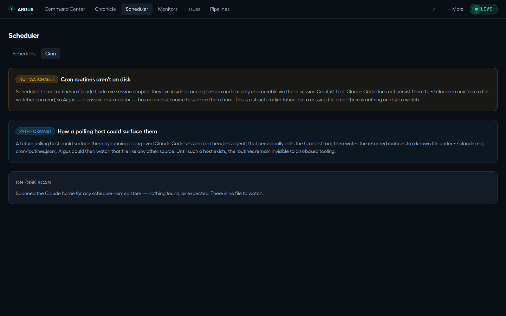

**Purpose:** explain why Claude Code's **native cron routines** can't be shown
as a live table — and what would be needed to surface them.

**What you see:**

- A **"not watchable"** panel: cron routines are session-scoped — they live
  inside a running Claude session, enumerable only via the in-session
  `CronList` tool, and are never persisted under `~/.claude`. A pure
  file-watcher fundamentally cannot see them.
- A **"path forward"** panel: a polling host could publish them to a file
  (e.g. `cron/routines.json`) that Argus would then watch like any source.
- An **on-disk scan**: Argus name-matches anything schedule-related under
  `~/.claude` and lists candidates as hints — usually "nothing found, as
  expected."

Don't confuse this with **Argus's own Scheduler** (section 5), which is fully
on-disk and fully supported — this panel is only about Claude Code's
harness-managed routines.

**Where the data comes from:** `GET /api/cron`, returning
`{ available: false, reason, howTo }` plus filename hints.

---

## Quick mental model

| Tab                | Answers the question                      | Source                                      |
| ------------------ | ----------------------------------------- | ------------------------------------------- |
| **Command Center** | How are my pipelines doing right now?     | `argus/pipelines.json` + `argus/instances/` |
| **Chronicle**      | What ran when, across everything?         | runs + jobs + transcripts, merged           |
| **Launch**         | Fire one `claude -p` run right now        | `argus/runs/` (the `oneoff` bucket)         |
| **Scheduler**      | What fires on a timer, and how did it go? | `argus/schedules.json` + `argus/runs/`      |
| **Monitors**       | Did the expected runs actually land?      | derived from schedules + runs               |
| **Issues**         | Why are runs failing, grouped by cause?   | derived from runs + `argus/issues.json`     |
| **Pipelines**      | What multi-phase flows are defined?       | `argus/pipelines.json`                      |
| **Budget**         | How much am I spending — and cap it       | `argus/budget.json` + `argus/spend.json`    |
| **Users**          | Who may run/edit pipelines?               | `argus/auth.json`                           |
| **Search**         | Where did I say/see _that_?               | all `projects/*/*.jsonl`                    |
| **Agents**         | What's running / done / failed right now? | `jobs/*/state.json` + `daemon/roster.json`  |
| **Detail**         | How did _this_ agent get here?            | `jobs/<short>/timeline.jsonl`               |
| **Sessions**       | What was actually said in a conversation? | `projects/*/*.jsonl`                        |
| **Activity**       | What have I prompted lately, everywhere?  | `history.jsonl`                             |
| **Projects**       | Which folders are active, and when?       | `projects/*/`                               |
| **Stats**          | What's my usage / cost / token spend?     | `stats/stats-cache.json`                    |
| **Inventory**      | What's installed and available?           | `agents/ commands/ skills/ plugins/`        |
| **Tasks**          | What task workspaces exist / are locked?  | `tasks/<id>/`                               |
| **Cron panel**     | Why can't I see native cron routines?     | none (session-scoped)                       |

_Screenshots in this guide live in [`docs/screenshots/`](screenshots/) and
were captured from a live instance. To refresh them after a UI change, run the
app and re-capture at 1440×900._
