# 👁️ Argus — User Guide

**What Argus is:** a dashboard and control plane over your local `~/.claude`
folder. It watches the files Claude Code already writes (background jobs,
transcripts, history, stats) and turns them into a live web view — and it can
fire its own scheduled and pipelined `claude -p` runs on top.

Argus **never modifies the state Claude Code owns** — it treats jobs,
transcripts, history and daemon files as strictly read-only. It _does_ own and
write its own state under `~/.claude/argus/` (schedules, pipelines, run
records, issue triage, accounts) and, when you apply setup fixes, its signal
hooks under `~/.claude/hooks/` and a hook entry in `settings.json`. The
monitoring tabs (Agents, Sessions, Activity, Projects, Stats, Search,
Inventory, Tasks) are observe-only, while the Launch, Scheduler, Pipelines,
Issues, Budget and Users tabs let you create, run, revise, triage, cap and
cancel work.

**Security note:** because Argus can launch `claude -p` agents with your
credentials, the server binds to loopback (`127.0.0.1`) only and rejects
cross-origin and unknown-Host requests. If you deliberately expose it on
another interface (`ARGUS_HOST`), set `ARGUS_TOKEN` so the surface is
authenticated.

Every feature below has its own section: what it's for, what you see, what you
can do, and where the data comes from.

## Contents

| #   | Feature                                | Route          | What it answers                            |
| --- | -------------------------------------- | -------------- | ------------------------------------------ |
| 0   | [Global UI](#global-ui)                | —              | nav, live dot, auto-refresh, setup banner  |
| 1   | [Command Center](#1-command-center)    | `#/command`    | how are my pipelines doing right now?      |
| 2   | [Briefing](#2-briefing)                | `#/briefing`   | what happened while I was away?            |
| 3   | [Chronicle](#3-chronicle)              | `#/chronicle`  | what ran when, across every source?        |
| 4   | [Launch](#4-launch)                    | `#/launch`     | fire one `claude -p` run right now         |
| 5   | [Scheduler](#5-scheduler)              | `#/schedules`  | fire `claude -p` on a schedule             |
| 6   | [Monitors](#6-monitors)                | `#/monitors`   | did my schedules actually run?             |
| 7   | [Issues](#7-issues)                    | `#/issues`     | why are runs failing, grouped by cause?    |
| 8   | [Pipelines](#8-pipelines)              | `#/pipelines`  | author multi-phase, human-gated flows      |
| 9   | [Budget](#9-budget)                    | `#/budget`     | how much am I spending — and cap it        |
| 10  | [Users & sign-in](#10-users--sign-in)  | `#/users`      | who may run/edit pipelines?                |
| 11  | [Search](#11-search)                   | `#/search`     | where did I say/see _that_?                |
| 12  | [Agents](#12-agents)                   | `#/agents`     | what's running / done / failed right now?  |
| 13  | [Agent Detail](#13-agent-detail)       | `#/agent/<id>` | how did _this_ agent get here?             |
| 14  | [Sessions](#14-sessions)               | `#/sessions`   | what was actually said in a conversation?  |
| 15  | [Activity](#15-activity)               | `#/activity`   | what have I prompted lately, everywhere?   |
| 16  | [Projects](#16-projects)               | `#/projects`   | which folders are active, and when?        |
| 17  | [Stats](#17-stats)                     | `#/stats`      | what's my usage / cost / token spend?      |
| 18  | [Inventory](#18-inventory)             | `#/inventory`  | what's installed and available?            |
| 19  | [Tasks](#19-tasks)                     | `#/tasks`      | what task workspaces exist / are locked?   |
| 20  | [Cron panel](#20-cron-panel)           | Scheduler tab  | why native cron routines can't be shown    |
| 21  | [Flight Recorder](#21-flight-recorder) | `#/run/<id>`   | what was it doing at minute four?          |
| 22  | [Watchtower](#22-watchtower)           | `#/watchtower` | did it run the way it _usually_ runs?      |
| 23  | [Autopsy](#23-autopsy)                 | `#/run/<id>`   | why did this run fail, in one paragraph?   |
| 24  | [Verdict](#24-verdict)                 | `#/run/<id>`   | was the output any _good_?                 |
| 25  | [Sentinel](#25-sentinel)               | `#/sentinel`   | what is on fire, and who has it?           |
| 26  | [Weave](#26-weave)                     | `#/pipelines`  | fan-out, fan-in, retries, artifacts        |
| 27  | [Ledger](#27-ledger)                   | `#/budget`     | where did the money go, and where next?    |
| 28  | [The Vault](#28-the-vault)             | `#/stats`      | what happened last quarter, and last year? |
| 29  | [Omnibar](#29-omnibar)                 | `⌘K`           | say it, see the exact changes, confirm     |
| 30  | [Constellation](#30-constellation)     | `#/fleet`      | N machines, one lens                       |

---

## Global UI

Applies to every tab.

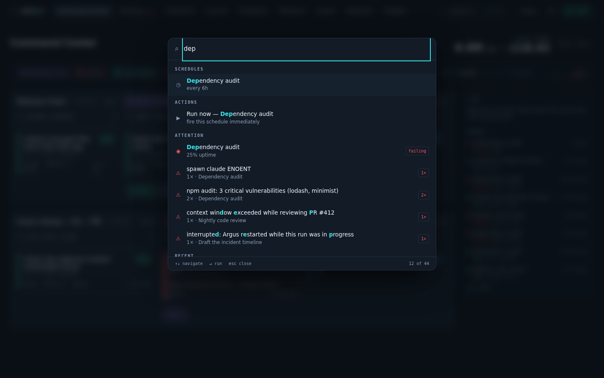

_`⌘K` from anywhere: three characters find the schedule, its live monitor
health, the issues it raised, and the action that fires it now._

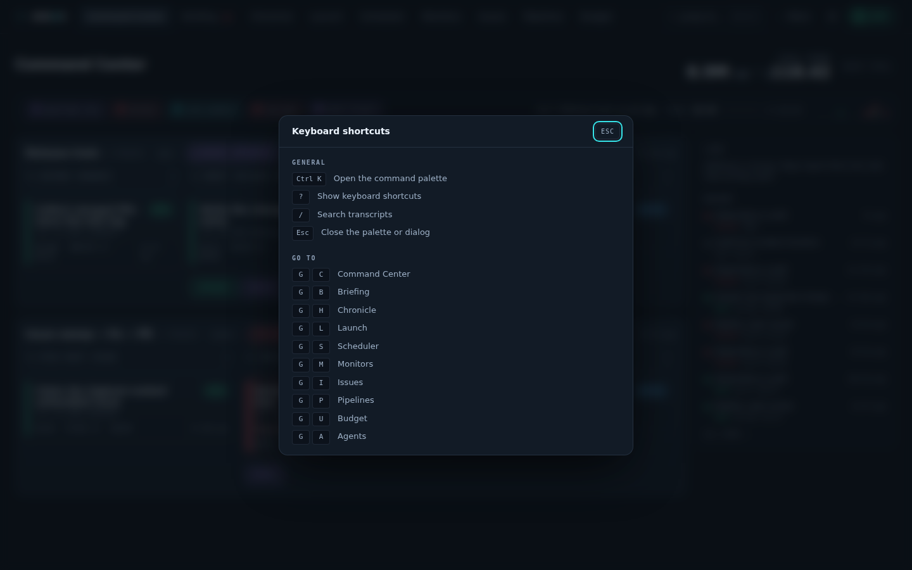

- **Command palette — `⌘K` / `Ctrl K`.** The fastest way to anything. Type a few
  characters and it fuzzy-matches across every destination, pipeline, schedule,
  failing monitor, open issue, background agent, project and recent transcript —
  "dpa" finds _Dependency audit_, "rt" finds _Release train_. It also carries
  **actions**: approve a pipeline waiting at a gate, run a schedule now, mark the
  Briefing caught up. `↑`/`↓` move, `Enter` runs, `Esc` closes; the rows you use
  float to the top next time you open it with an empty query. An action that
  talks to the server keeps the palette open long enough to report a failure
  rather than closing over it. The **Jump to… ⌘K** button in the bar opens the
  same thing.
- **Keyboard shortcuts — `?`.** Lists every binding, and only the ones currently
  available. `g` then a letter jumps: `g c` Command Center, `g b` Briefing,
  `g h` Chronicle, `g l` Launch, `g s` Scheduler, `g m` Monitors, `g i` Issues,
  `g p` Pipelines, `g u` Budget, `g a` Agents. `/` goes to transcript search.
  Single-letter shortcuts never fire while you are typing in a field.
- **The connection pill** (top-right) reflects Argus's link to its own server,
  not the health of your agents. **Green "Live"** = the WebSocket is connected.
  **Red "Offline · retrying in 8s"** = it dropped, with the actual countdown to
  the next attempt and a **Retry** button for when you know you have just fixed
  the server. Reconnects back off to 30s but happen immediately when you return
  to the tab, so coming back never means waiting one out.
- **Notification bell** (top-right): every alert raised _this session_, newest
  first, with an unread count — because a toast lasts eight seconds and most of
  them fire while you are in another tab. Each entry links to the view it is
  about; opening the panel marks them read. For what changed while Argus ran
  without you at all, use [Briefing](#2-briefing).
- **Navigation** is split by role: the nine **destination** tabs (Command
  Center, Briefing, Chronicle, Launch, Scheduler, Monitors, Issues, Pipelines,
  Budget) sit in the bar; the **⋯ More** menu holds the reference tabs
  (Stats, Inventory, Projects, Tasks, Users). Drill-down views (Agents,
  Detail, Sessions, Activity) are reached through links, breadcrumbs and the
  palette. On a phone the bar collapses to a **menu** naming your current
  destination, listing every tab at once with its attention badge.
- **Auto-refresh:** the server pushes a "something changed" ping over a
  WebSocket whenever a watched file mutates, and the UI re-fetches. Those
  re-fetches are conditional, so a ping that did not change what you are looking
  at costs a few bytes and repaints nothing. If the socket drops, each tab polls
  on a timer instead; while a fetch is failing the last good values stay on
  screen rather than blanking. You rarely need to refresh the browser.
- **Notifications:** a bottom-right **toast stack** (max 4, auto-dismiss
  after 8s) fires from any tab when a background agent finishes or fails,
  when a **monitor alert** arrives (down / failing / recovered — see
  [Monitors](#6-monitors)), and when a **budget alert** arrives (crossing
  80%, crossing a limit, or dropping back under — see [Budget](#9-budget)).
  If you grant the browser's notification
  permission (asked once), the same events also fire **native OS
  notifications**, so you hear about failures with the tab in the background.
  Everything that toasts is also kept in the bell above.
- **Loading** shows a skeleton shaped like the content that is coming, so the
  layout is settled before it lands. Relative timestamps ("3m ago") keep
  themselves current instead of freezing at first render.
- **When a view breaks**, only that view breaks: it is replaced by a message
  naming it and a **Try again** button, while the nav, the palette and every
  other tab keep working.
- **Routing** is hash-based (`#/command`, `#/agents`, `#/search`…), so tabs
  are bookmarkable and the back button works. An unknown hash lands on the
  Command Center.
- **Setup banner:** when a prerequisite is missing — the signal Stop hook, the
  gate PreToolUse hook, Argus data directories, `claude`/`node` on PATH, or a
  parseable `pipelines.json`/`settings.json` — a red **"Setup incomplete"**
  strip appears above every tab listing each check as ✓ / ⚠ / ✗. If anything
  auto-fixable is wrong, an **Apply fixes** button repairs it in one click
  (`POST /api/setup/apply`). The banner disappears entirely once everything
  passes. The hooks matter: without the Stop hook pipelines can't detect step
  completion, and without the gate hook a gated phase can't pause for you.

---

## 1. Command Center

_Pipelines at a glance — the home tab._ Route: `#/command`

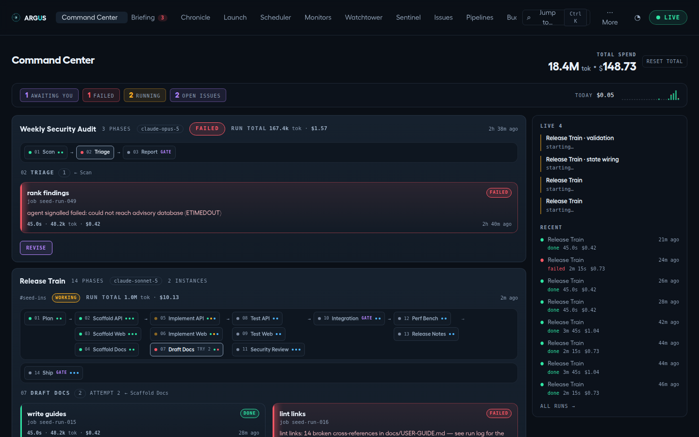

**Purpose:** one card per pipeline, attention-first, with a column per phase
and a tile per step. Approve/Revise gates appear inline on the row that needs
you — this is the wall you keep open on a second monitor.

**What you see:**

- A **situation strip** across the top, answering "does anything need me?"
  without reading the board: counts for gates awaiting you, failures, runs in
  flight, live agents, down/failing monitors and open issues — each a link to the
  view that explains it. It shows **only what is true**: a metric with nothing to
  report is omitted rather than drawn as a grey zero, and when there is genuinely
  nothing it says so. On the right: the next scheduled firing with a live
  countdown, today's spend against your daily limit as a bar, and a 24-hour
  histogram of run outcomes (failures stacked in red over successes).
- A **live activity rail** down the right: **Live** shows what is running right
  now with each step's current tool call — including scheduled runs and one-off
  launches, which have no card on the board — and **Recent** lists the last
  completed runs with outcome, duration and cost. On a narrow screen it moves
  below the board.
- A **card per pipeline**: name, phase count, the pipeline's **model chip**
  (e.g. `fable`, `opus`), an aggregated **status pill** (`awaiting approval`
  wins over `failed` over `working`…), the latest run's **Σ cost** (tokens +
  USD, including superseded revise attempts), and a freshness stamp.
- Under the header, **one column per phase** (numbered `01`, `02`, … with a
  step-count badge), and under each phase its **step tiles**: step name,
  `job <runId>`, a status pill, the failure reason if it failed, a live
  activity line and animated sweep bar while working, and a per-step meter —
  duration, tokens, dollars (e.g. `2m 19s · 23.5k tok · $1.09`).
- If two instances of one pipeline run concurrently, the card splits into
  labeled sub-sections, one per instance.
- **Total spend** (top-right): the all-time board total. **Reset total** is a
  two-click armed confirm — the reset is irreversible.

**What you can do:**

- **Approve** (green) a gated phase that's awaiting you — the pipeline resumes.
  `⌘K` → "approve" reaches the same action without finding the card first.
- **Revise** (labeled **Retry** after a crash-restart) — optionally attach a
  revise note, hit **Send**, and the phase restarts with your feedback.
- Both actions require a signed-in, approved account (see
  [Users & sign-in](#10-users--sign-in)); the buttons render for everyone but
  the server answers 401 unless you're authenticated.
- **Click a step's name** to open its drawer, over the board rather than away
  from it: the run id, model, start time, duration, tokens, cost, the failure
  reason if it failed, a link to the transcript, **Cancel run** while it is
  still going, and the run log — tailing live while the step works.
- A tile that has just changed status flashes briefly, so a transition you
  weren't watching for doesn't pass unnoticed.

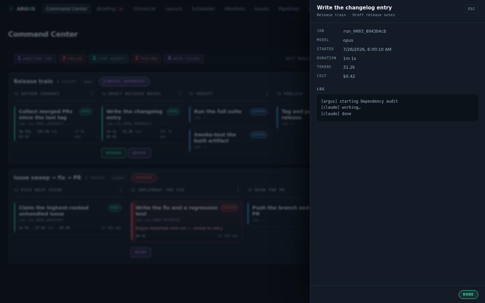

_A step's drawer opens over the board, so inspecting one run doesn't cost you the
view of the other eleven._

**Cost semantics:** a metric appears once at least one run reports it via the
`claude -p` result envelope; steps still running (or predating cost capture)
show nothing. Money spent on a retried phase still counts toward the row Σ.

**Where the data comes from:** `GET /api/overview` (re-fetched on the
`pipelines:changed` WS ping), `GET /api/insight` for the situation strip,
`GET /api/runs` for the rail, `GET /api/runs/:id` for the drawer's log,
`GET /api/totals` + `POST /api/totals/reset`, gate actions
`POST /api/instances/:id/approve` / `/revise`, and
`POST /api/runs/:id/cancel`.

---

## 2. Briefing

_The "while you were away" digest — read this first after time away._
Route: `#/briefing`

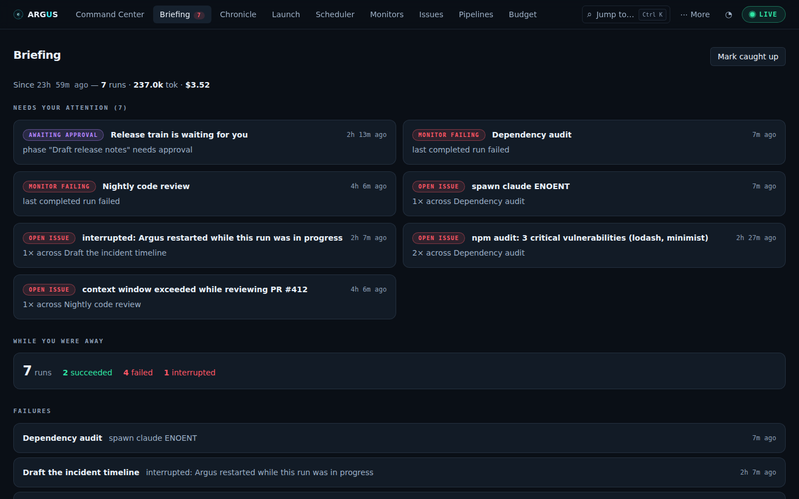

**Purpose:** Argus exists so agents can run unattended — which means you're
usually not looking when things happen. The Briefing answers the two questions
you'd otherwise tour four tabs for: **what needs me right now**, and **what
happened since I last caught up**.

**The attention badge:** the Briefing tab shows a red count chip in the nav
bar whenever something needs you (visible from any tab). The count is the
number of attention cards below.

**Needs your attention** — state-now cards, most severe first, each
deep-linking to the tab where you act on it:

- **Monitor down** (→ Monitors): a schedule's expected run never arrived —
  the dead-man's switch fired.
- **Awaiting approval** (→ Pipelines): a gated pipeline phase is paused
  waiting for your Approve/Revise.
- **Monitor failing** (→ Monitors): the schedule runs, but its last completed
  run failed.
- **Open issue** (→ Issues): an unresolved failure group, with its occurrence
  count and affected schedules.

**While you were away** — everything below is scoped to the window since your
last acknowledgement (or the last 24 h if you've never acknowledged; capped at
7 days):

- The header line totals the window: **runs · tokens · cost**.
- A run-outcome strip: succeeded / failed / interrupted / cancelled / skipped
  / still running counts.
- **Failures** — the windowed failed runs (schedule, first error line, when),
  newest first.
- **New issues** — failure groups whose _first_ occurrence is inside the
  window, i.e. genuinely new breakage, not an old known issue recurring.
- **Pipelines finished** — instances that reached a terminal state in the
  window.

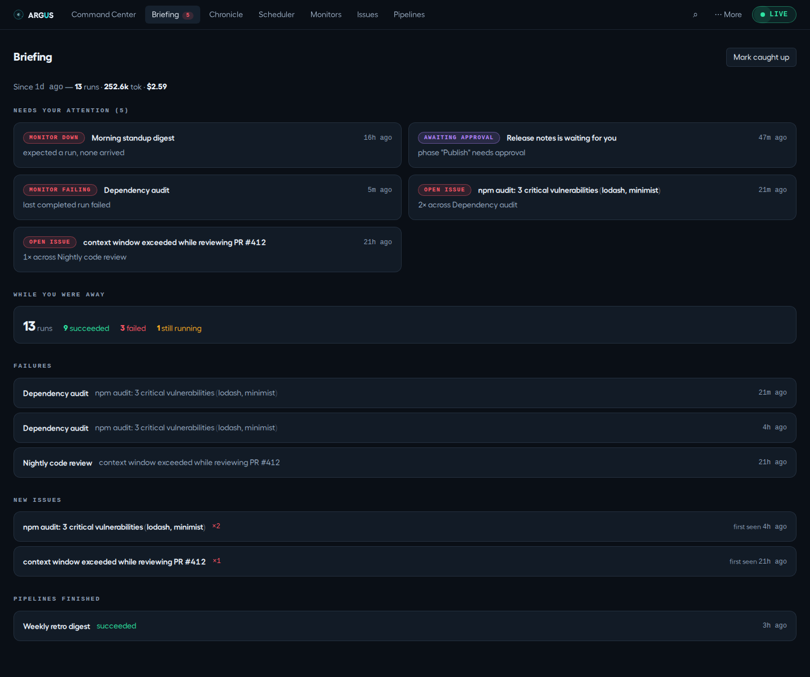

**Mark caught up** (top right): stamps now as your acknowledgement point and
resets the window — the digest empties, and tomorrow's briefing starts from
this moment. Attention cards are unaffected (a down monitor stays down until
it actually recovers). The acknowledgement is stored in Argus-owned
`~/.claude/argus/briefing.json`.

**All caught up:** when nothing needs attention and nothing ran in the
window, the tab says so and gets out of the way.

**Where the data comes from:** `GET /api/briefing` (a pure derivation over
runs + schedules + issue triage + pipeline instances; re-fetched on the
`schedules:changed`, `pipelines:changed`, `issues:changed` and
`briefing:changed` WS pings), `POST /api/briefing/ack`.

---

## 3. Chronicle

_Everything that ran, on one timeline._ Route: `#/chronicle`

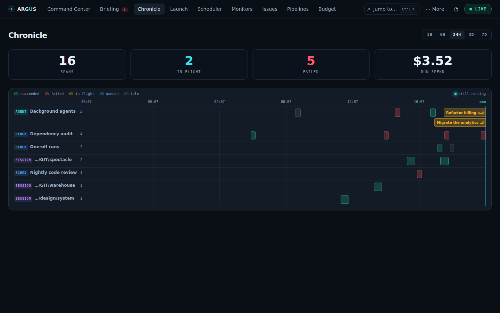

**Purpose:** a swimlane timeline that merges **scheduler runs**, **background
agents**, and **sessions** into a single windowed view — see a day of activity
in one glance, spot overlaps, and click into anything.

**What you see:**

- A **time-window switch** (top-right): **1H / 6H / 24H / 3D / 7D** (default
  24H). This is the zoom — there's no free pan; the window always ends at
  `now` (bold marker on the right edge).
- Four counters: **Spans**, **In flight** (still running), **Failed**, and
  **Run spend** (USD reported by scheduler runs in the window).
- One **swimlane per group**, labeled with a kind badge — `SCHED` (a
  schedule's runs), `AGENT` (background agents), `SESSION` (one lane per
  project) — followed by rows of **span bars** colored by status
  (working/done/failed/queued). Still-running spans render open-ended with a
  pulsing dot at `now`. Hover a bar for label, start→end, status and cost.
- Empty state: _"Nothing happened in this window. Widen it, or launch an
  agent and watch it appear."_

**What you can do:** switch the window; click a span to jump to its source
(e.g. a schedule's card in the Scheduler).

**Where the data comes from:** `GET /api/chronicle?hours=N` (1–336), merging
the scheduler's run records with `~/.claude/jobs/` and
`~/.claude/projects/*/​*.jsonl`.

---

## 4. Launch

_Fire one `claude -p` run right now._ Route: `#/launch`

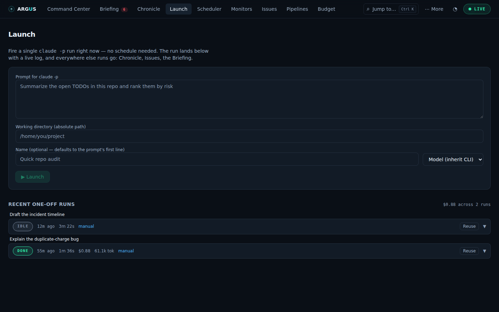

**Purpose:** not everything deserves a schedule. Launch fires a **single
one-off run** — a quick audit, a report, a cleanup — straight from the
dashboard: prompt, working directory, go. No schedule object is created and
nothing recurs.

**The form:**

- **Prompt for `claude -p`** and a **working directory** (absolute path,
  must exist) — the only two required fields; **▶ Launch** stays disabled
  until both are filled.
- **Name** (optional) — how the run is titled everywhere; left empty it
  defaults to the prompt's first line (ellipsized at 60 chars).
- **Model** — inherit the CLI default, pick an alias (Opus / Sonnet / Haiku),
  or type a custom model id; passed to the agent as `--model`.

After a launch the form keeps the **working directory and model** and clears the
prompt and name, so firing several prompts at one repo does not mean retyping an
absolute path each time.

**Recent one-off runs** — the last 20 launches, newest first, with a count of how
many are in flight and the total reported cost of the list. Each is titled and
expandable exactly like a schedule's run rows: status pill, relative start time,
duration, cost and tokens once reported, the error or result summary, a link
to the **transcript** in Sessions, and a **live-tailing log** (refreshes every
3s while running). A running launch has a **Cancel** button, and every row has
**Reuse** — it copies that run's prompt, directory, name and model back into
the form for a tweak-and-refire loop.

**Where one-off runs show up:** everywhere runs go. They share the `oneoff`
run bucket (pruned to the same 50-run window a schedule gets), appear as a
single **"One-off runs"** lane in the [Chronicle](#3-chronicle), a failed
launch groups into [Issues](#7-issues) and lands in the
[Briefing](#2-briefing)'s failure digest, and reported cost counts toward the
[Budget](#9-budget) and the Command Center's total spend. They never touch
[Monitors](#6-monitors) — there is no expected slot for a one-off.

**Where the data comes from:** `POST /api/launch` (`202` with the run
record), then the standard run surface — `GET /api/runs?scheduleId=oneoff`,
`GET /api/runs/:id`, `POST /api/runs/:id/cancel`.

---

## 5. Scheduler

_Recurring `claude -p` runs, owned by Argus._ Route: `#/schedules`

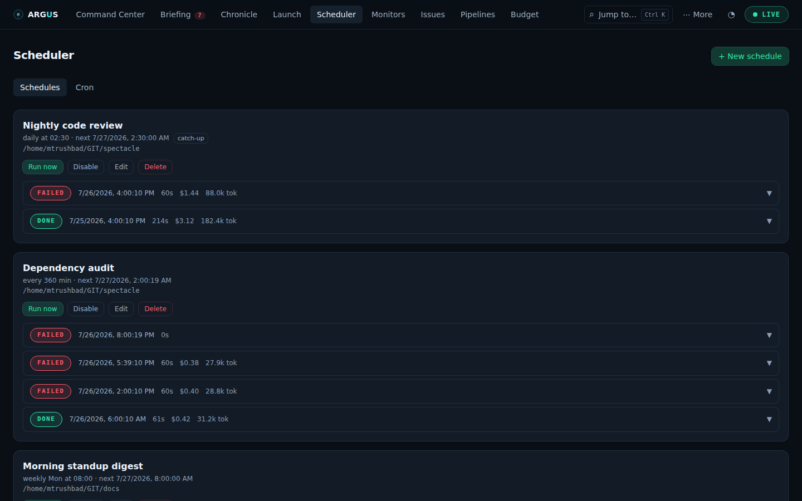

**Purpose:** define headless prompts that Argus fires on a trigger — nightly
audits, periodic report generators, cleanup jobs — then watch their run
history and logs without leaving the page. Two sub-tabs: **Schedules** (this
section) and **Cron** (see [Cron panel](#20-cron-panel)).

**Creating a schedule** — click **+ New schedule**:

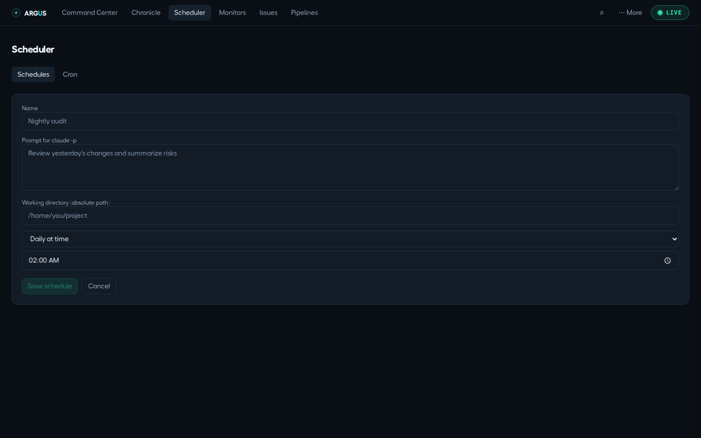

- **Name** — how it appears everywhere (cards, Chronicle, Monitors).
- **Prompt for `claude -p`** — the full prompt the headless agent receives.
- **Working directory** — absolute path the agent runs in.
- **Trigger** — one of: **every N minutes** (interval), **daily at HH:MM**,
  **weekly on a day at HH:MM**, or **windowed** (every N minutes, but only
  between a start and end time on selected weekdays — e.g. "every 30 min,
  09:00–13:00, Mon–Fri"). Overlap policy defaults to _skip if still running_.
- **Catch up a missed run on recovery** — off by default. Normally a slot
  only fires within a short grace window (a few minutes), so if the machine
  was asleep or Argus wasn't running when a slot came due, that slot is
  silently skipped and the schedule waits for the next one. Tick this and the
  missed slot fires **once**, as soon as Argus is back — anacron-style. Only
  the most recent missed slot is run: an every-15-minutes schedule that
  slept through the night catches up with one run, not thirty. Ideal for
  "morning briefing"-type dailies on a laptop; leave it off for jobs where a
  stale run is worse than no run.
- **Save schedule** stays disabled until name, prompt and working directory
  are filled.

**The summary strip** above the list answers "is my scheduler healthy?"
without reading a card: how many schedules exist, how many are **failing** or
**paused**, how many runs reached a verdict in the last 24 hours and how many of
those failed, and which schedule fires **next**, with a live countdown. The
failing and paused counts are buttons — press one to filter the list to exactly
those schedules, press it again (or **Show all**) to go back. A count with
nothing behind it is not shown at all, so anything visible there is worth
reading.

**What each schedule card shows:** a state badge — **failing**, **running**,
**paused**, **healthy** or **never run** — then the humanised trigger ("every
6h", "daily at 02:30"), a countdown to the next firing, when it last ran, the
median duration of the runs listed below, and a **catch-up** chip when
missed-run recovery is on. Below that the working directory, and the **last five
runs** — status pill, relative start time (hover for the exact instant),
duration, cost and tokens if reported, and a `manual` tag on run-now firings —
with a `3/5 passed` ratio beside them.

A schedule that has failed **more than once in a row** says so in a red band,
with the first line of the most recent error, because one failure is already
visible in the row below and a streak is a different problem. A **paused**
schedule says "will not fire" rather than showing a countdown to a slot it will
ignore, and one with no history at all explains how to test it without waiting
for a slot.

**What you can do:**

- **Run now** — fire immediately, regardless of the trigger.
- **Enable / Disable** — pause the trigger without deleting anything.
- **Edit** / **Delete** (with confirm).
- **Expand a run** to see its error or result summary, a link to the full
  **transcript** in Sessions, and a **live-tailing log** (refreshes every 3s
  while running). A running run has a **Cancel** button.

**Where the data comes from:** Argus's own state —
`~/.claude/argus/schedules.json` and run records under `~/.claude/argus/runs/`
via `GET/POST /api/schedules`, `PUT/DELETE /api/schedules/:id`,
`POST /api/schedules/:id/run`, `GET /api/runs`, `POST /api/runs/:id/cancel`.

---

## 6. Monitors

_A dead-man's switch over your schedules._ Route: `#/monitors`

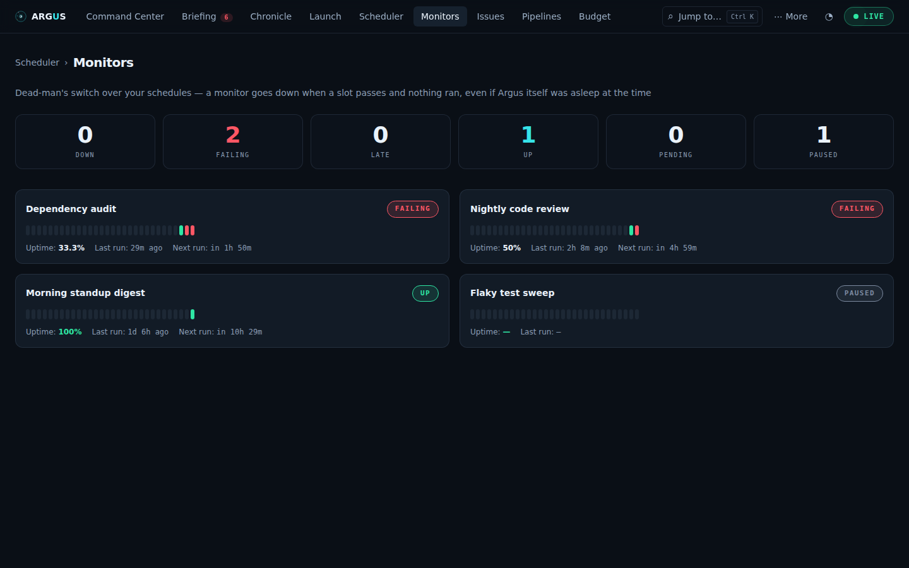

**Purpose:** answer "did my schedules actually run?" — not "what did Argus
launch," but "did the expected slot pass with nothing landing," which also
catches the case where **Argus itself was asleep** at fire time. Every
schedule you create gets a monitor automatically; there's nothing to author
here.

**What you see:**

- A six-tile summary in escalation order: **Down / Failing / Late / Up /
  Pending / Paused**. Any tile with a non-zero count is a **filter** — press
  "2 Down" to narrow the list to just those two, press it again or **Show all**
  to restore. An empty tile is inert: pressing it could only blank the list.
- One **monitor card** per schedule: its name (links back to the Scheduler),
  a status pill, a **heartbeat bar** of the last 30 runs (one tick per run,
  colored by outcome), and a stats line — **uptime %** (succeeded vs failed
  over the last 30), **last run** time, and either the **next** expected time
  or, when late/down, the slot that was **expected** and missed.
- Cards that are `down` or `failing` get a red border so they jump out.

**Status meanings:** `up` — last expected slot ran; `late` — a slot is
overdue but within grace (10% of the trigger period, clamped 5–60 min);
`down` — a slot passed grace with no run; `failing` — runs happen on time but
the latest one failed; `pending` — no run yet; `paused` — the schedule is
disabled.

**Alerts — the switch actually pages you.** Detection alone isn't enough for
a page you don't have open, so the server re-checks every monitor on its
scheduler tick (~30s) and pushes an alert the moment one **transitions**:

- **Monitor down** — a slot passed its grace with no covering run.
- **Monitor failing** — runs are landing on time, but the latest one failed.
- **Monitor recovered** — a down/failing monitor came back up (a catch-up
  run, a fixed prompt, the next slot succeeding…).

Each alert reaches you three ways: an **in-app toast** (bottom-right, any
tab), a **native OS notification** if you've granted the browser permission
(Argus asks once), and a **webhook POST** when `ARGUS_WEBHOOK_URL` is set —
the same JSON channel that already carries run/pipeline failures, so one
Slack/mail bridge covers everything. Only observed transitions alert: on a
fresh server boot the first check is a silent baseline, so restarting Argus
never replays a storm of already-known-down alerts (the Briefing tab is the
place that shows current bad state).

**What you can do:** the tab itself is deliberately read-only — fix problems
in the Scheduler or Issues tabs.

**Where the data comes from:** `GET /api/monitors`, derived on every read
from schedules + run records (no separate state to go stale); alerts arrive
as `monitors:alert` frames on `/ws`.

---

## 7. Issues

_Failed runs grouped by root cause._ Route: `#/issues`

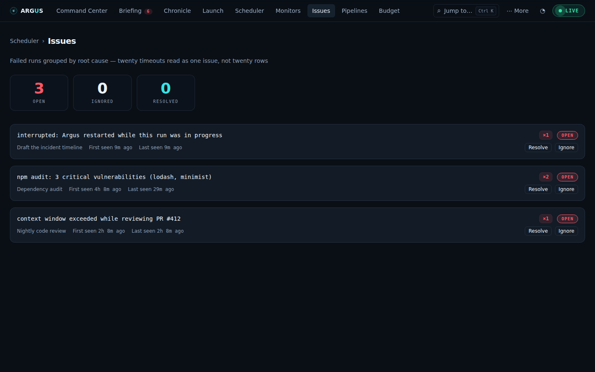

**Purpose:** Sentry-style grouping — twenty timeouts read as **one issue with
×20**, not twenty rows. Each distinct failure fingerprint (normalized error)
becomes one card.

**What you see:**

- Summary tiles: **Open / Ignored / Resolved** — each a filter for its own
  subset, so two open issues among thirty resolved ones are one click away.
- One **issue card** per fingerprint: the error title (monospace), an
  **×N occurrence badge**, a state badge, which schedules it affects, and
  first/last-seen times. Open issues get a red border.
- Expanding a card loads its **occurrences** — per-run time, schedule name,
  and the exact error text (up to the latest 50).

**What you can do (the triage lifecycle):**

- **Resolve** — mark it fixed. If a _newer_ failure with the same fingerprint
  arrives later, the issue **auto-reopens** — resolved means "fixed going
  forward", not "hide forever".
- **Ignore** — mute it (known-noisy failures). Stays ignored until you reopen.
- **Reopen** — available on resolved/ignored issues; drops the triage record.

**Where the data comes from:** `GET /api/issues` +
`GET /api/issues/:fingerprint`, derived from run records on every read; only
your triage decisions persist (`~/.claude/argus/issues.json`).

---

## 8. Pipelines

_Author multi-phase, human-gated agent flows._ Route: `#/pipelines`

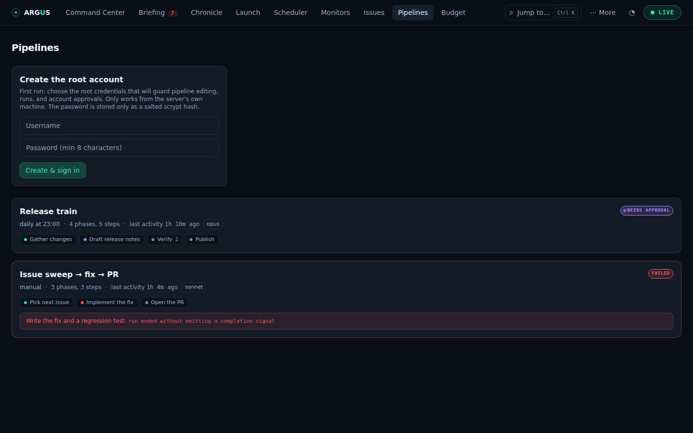

**Purpose:** define pipelines — ordered **phases**, each with a working
directory and one or more **steps** (a step = one `claude -p` run with its own
prompt) — then launch them manually or on a trigger and watch them on the
[Command Center](#1-command-center). A phase can be **gated**: the pipeline
pauses there until a human approves or revises.

**What you see:** one card per pipeline, and the card says where its latest run
got to: the trigger, phase and step counts, when it last did anything, the spend
of that run, the model, a **paused** badge when disabled, and a live status pill.
Under that, **one chip per phase** coloured by state — so which phase is running,
which is waiting on you and which failed is answerable without leaving the list.
A failed run names the step and the first line of its reason. A pipeline that has
never run still shows its phases, greyed, because that is what it is going to do.

When you're **signed out**, the **Login** panel appears here (see
[Users & sign-in](#10-users--sign-in)) — viewing is open, but every mutating
action requires a signed-in, root-approved account.

**The pipeline form** (+ New pipeline / Edit):

- **Name**, **trigger** (manual — i.e. no trigger — or interval / daily /
  weekly / windowed), **overlap policy** (skip if running / allow overlap),
  and a pipeline-default **model** (Opus, Sonnet, Haiku, custom, or inherit
  the CLI default).
- An ordered list of **phases** — each with a name, a working directory, and
  a **"Requires human approval (gated)"** checkbox.
- Inside each phase, ordered **steps** — each with a name, an optional
  per-step **model override**, and its prompt. Reorder or remove phases and
  steps freely; **Save** stays disabled until every phase has a name, cwd and
  at least one complete step.

**What you can do (signed in):**

- **Run now** — start an instance (hidden while one is running unless overlap
  is allowed).
- **Stop / Stop all (N)** — abort active instances (with confirm).
- **Enable / Disable**, **Edit**, **Delete** (with confirm).
- Approving/revising a **gated phase** happens on the Command Center, inline
  on the paused row.

**How steps complete:** the Stop-hook and gate-hook installed by Setup let
each spawned agent signal "step finished" / "needs input" back to Argus
(`POST /api/instances/:id/signal`, authenticated by a per-instance token —
this is the one instance endpoint that doesn't need a login).

**Where the data comes from:** `~/.claude/argus/pipelines.json` and instance
records under `~/.claude/argus/instances/` via `GET/POST /api/pipelines`,
`PUT/PATCH/DELETE /api/pipelines/:id`, `POST /api/pipelines/:id/start`,
`GET /api/overview`, `POST /api/instances/:id/{approve,revise,abort}`.

---

## 9. Budget

_Spend guardrails over every unattended dollar._ Route: `#/budget`

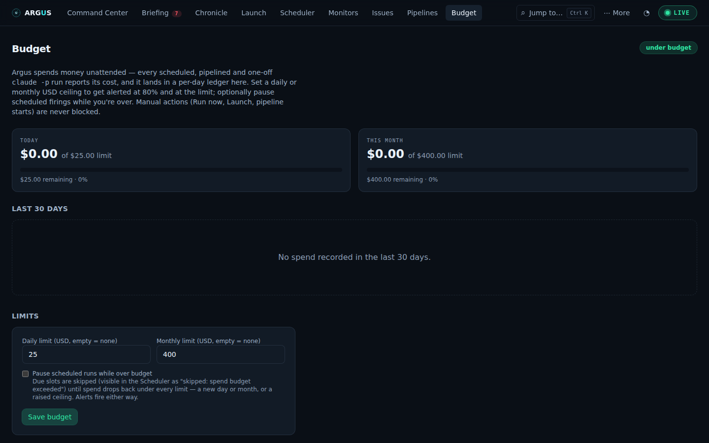

**Purpose:** Argus's whole point is spending your API credits while you're
not looking — schedules, pipelines and one-off launches all report what each
run cost. The Budget tab turns those reports into a **per-day ledger** and
lets you put a ceiling on it: get alerted when you approach or cross a limit,
and optionally **pause scheduled firings** until you're back under.

**What you see:**

- A **state pill** (top right): `no limits set` / `under budget` /
  `approaching limit` (≥ 80% of any limit) / `over budget`.
- **Today** and **This month** cards: spent so far, the limit, a colored
  progress bar (green → amber at 80% → red at the limit), and the remaining
  or overage amount. Both windows follow your local calendar, like schedule
  triggers do.
- On **This month**, a **projection**: what the month is on course to cost at the
  rate it has been going, and — when a monthly limit is set and the rate would
  cross it — roughly which day. The rate is the plain mean over elapsed days
  (hover for it), not a trend fit: it is the arithmetic you would do yourself,
  which makes it the arithmetic you can check. A month with no spend yet gets no
  projection rather than a confident `$0.00`.
- **Last 30 days** — a spend bar chart; hover a bar for the day's dollars and run
  count. When a **daily** limit is set, it is drawn as a dashed line across the
  chart and any day that broke it is red, with a count underneath. The last bar
  is today, ringed to say so — a partly-finished day should not read as a quiet
  one.
- **Limits** — the config form: a daily USD limit, a monthly USD limit
  (either may be empty = no limit), and the hard-stop checkbox.

**The hard stop** ("Pause scheduled runs while over budget"): while any limit
is exceeded, due schedule slots are **skipped** instead of fired — each skip
is recorded as a `skipped` run ("skipped: spend budget exceeded") so the
Scheduler shows exactly what didn't happen, and the slot still counts as
covered for [Monitors](#6-monitors) (a budget pause is not an outage). Firing
resumes by itself the moment spend drops under every limit — a new day, a new
month, or a raised ceiling. **Manual actions are never blocked**: Run now,
Launch and pipeline starts always work — a human clicking a button is its own
authorization.

**Alerts:** the server re-checks the budget on its scheduler tick (~30s) and
pushes a transition alert the moment the state changes — **Budget warning**
(crossed 80%), **Budget exceeded** (crossed a limit; the alert says whether
scheduled runs are paused), **Budget back under limit**. Each reaches you the
same three ways as monitor alerts: in-app toast, native OS notification (if
granted), and an `ARGUS_WEBHOOK_URL` POST (`budget.warning` /
`budget.exceeded` / `budget.cleared`). Only observed transitions alert — a
restart never replays a known-exceeded state.

**How spend is counted:** each completed run's cost (reported by the
`claude -p` result envelope) is folded into the day it ended, at the same
exactly-once point that feeds the all-time totals — so scheduled, manual,
one-off and pipeline-step runs all count, and the ledger survives run-record
pruning. Runs that report no cost (older CLIs, crashed spawns) add nothing.

**Where the data comes from:** Argus-owned `~/.claude/argus/budget.json`
(limits) and `~/.claude/argus/spend.json` (ledger) via `GET /api/budget` and
`PUT /api/budget`; alerts arrive as `budget:alert` frames on `/ws`.

---

## 10. Users & sign-in

_Who may run and edit pipelines._ Route: `#/users` (root only) + the login
panel on the Pipelines tab

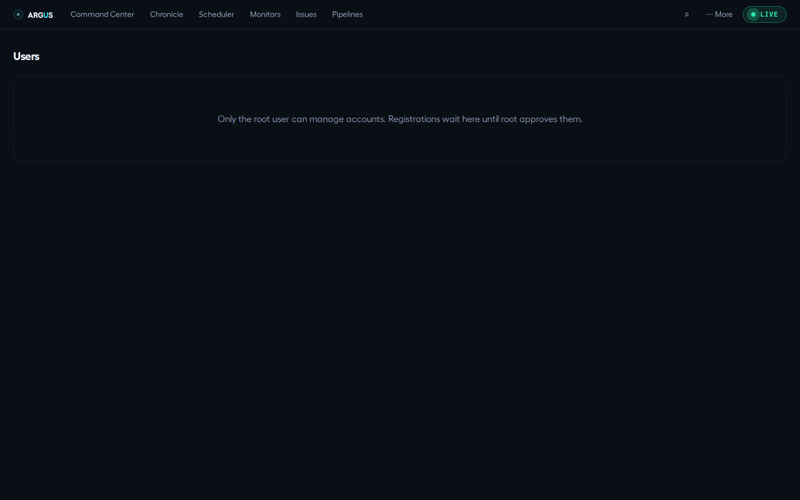

**Purpose:** Argus's mutating pipeline surface is account-gated with a
two-role model: **root** (the first account, manages users) and **members**
(can run/edit pipelines once approved).

**The three auth flows** (all on the Pipelines tab's panel):

1. **First launch — create the root account.** On an unconfigured server the
   panel offers a one-time root bootstrap (username + password, min 8 chars).
   This is **localhost-only**, enforced server-side. The password is stored
   only as a salted scrypt hash — never plaintext.
2. **Login** — username + password; the session is an HttpOnly cookie. Sign
   out from the same panel (your username + **Sign out** appear when
   authenticated).
3. **Request an account** — anyone on the machine can register; the account
   lands **pending** until root approves it.

**The Users tab** (visible in ⋯ More only to root): all accounts, **pending
first** — each with username, role, and an "awaiting approval" tag. Root can
**Approve** or **Reject** a pending registration, and **Remove** an active
member (never yourself). Non-root visitors see only an explanatory notice
(that's the screenshot above).

**Forgot the root password?** Delete `~/.claude/argus/auth.json` on the
machine running Argus and bootstrap again.

**Where the data comes from:** `GET /api/auth/status`,
`POST /api/auth/{setup,login,register,logout}`, `GET /api/users`,
`POST /api/users/:username/{approve,reject}`; state in
`~/.claude/argus/auth.json`.

---

## 11. Search

_Full-text across all transcripts._ Route: `#/search` (the 🔍 in the nav)

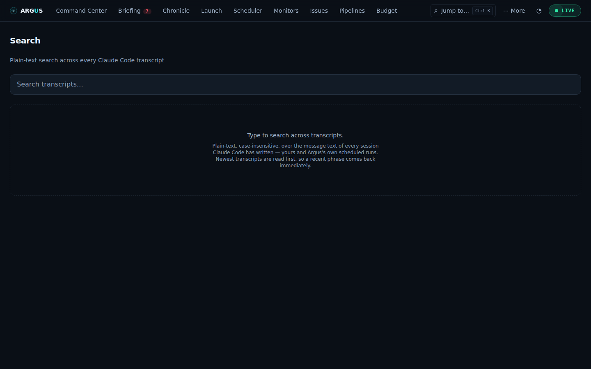

**Purpose:** find any text anywhere in your session history — a phrase, a
file name, an error message — when you don't remember which session it was in.

**What you see:** a search box; as you type (debounced ~300ms), a match count and
results. Each result shows a role badge (user/assistant), the project, the
session's short id, and a **snippet centered on the match** with your terms
highlighted.

The count is honest about being a cap. The scan reads newest transcripts first and
stops at 100 matches, so a common word never reads your whole history — when it
stops early the line reads **"first 100 matches — narrow the query"** rather than
"100 matches", which would be a number you could reasonably take literally.

**How to use it:** just type — case-insensitive substring matching, not fuzzy. For
finding a pipeline, schedule or session _by name_, `⌘K` is the better tool; this
one is for text inside a conversation. Click a result to open that transcript.

**Where the data comes from:** `GET /api/search?q=`, scanning every
`~/.claude/projects/<project>/<session>.jsonl` per query.

---

## 12. Agents

_The status board for background jobs._ Route: `#/agents`

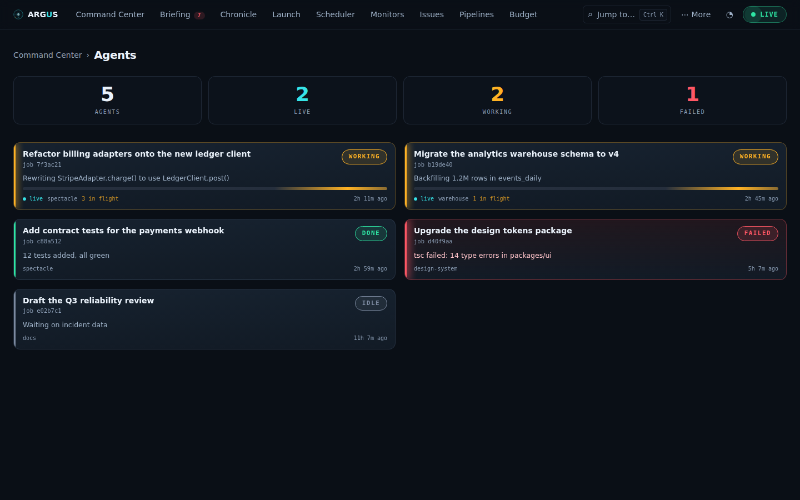

**Purpose:** the at-a-glance board for all background Claude Code jobs.

**What you see:**

- A **summary row**: total agents, how many are **live**, **working**, and
  **failed**.
- A grid of **agent cards**: name, short id, a color-coded status pill
  (`working / done / failed / idle / queued`), a pulsing green **live** dot if
  it's running right now, the current detail line, a result box when there's
  finished output, and a footer — folder, tempo, and last-update time.

**How to use it:** scan colors to triage — green pulse = running now, red =
failed. **Click any card** to open that agent's [Detail](#13-agent-detail).

**Where the data comes from:** `GET /api/agents`, merging
`~/.claude/jobs/<short>/state.json` with `~/.claude/daemon/roster.json`
(an agent is "live" only if it's an active worker in the roster).

---

## 13. Agent Detail

_Single-agent deep dive + timeline._ Route: `#/agent/<short>`

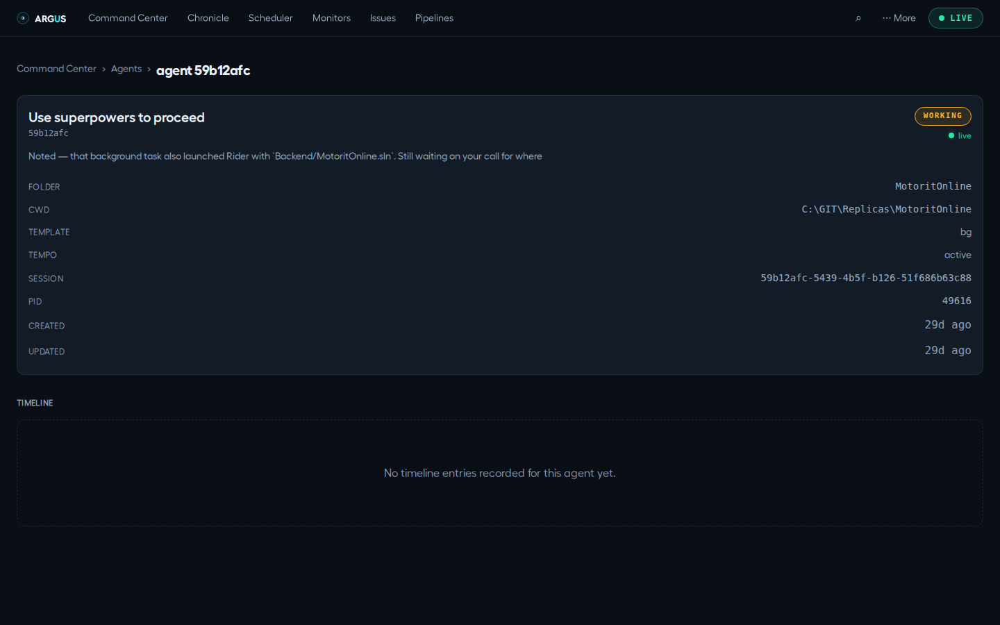

**Purpose:** everything about one agent, including the chronological trail of
how it got to its current state. A card click on Agents lands here.

**What you see:**

- A **metadata card**: name, short id, status pill, live dot, current
  detail/result text, and the full field list — folder, full CWD, template,
  tempo, session id, PID, task counts, and created/updated timestamps as
  relative times.
- A **timeline**: every recorded state transition, newest first, with a
  status-colored dot, pill, timestamp and optional detail line; long entries
  get a "Show details" expander. Agents that predate timeline capture show an
  honest "no timeline entries recorded" note instead.

**How to use it:** read the timeline bottom-to-top to follow the agent's life
story. Use the breadcrumb to go back to Agents.

**Where the data comes from:** `GET /api/agents/:short/timeline`, reading
`~/.claude/jobs/<short>/timeline.jsonl`. Works even for agents no longer in
the main list.

---

## 14. Sessions

_Browse & read transcripts._ Route: `#/sessions`

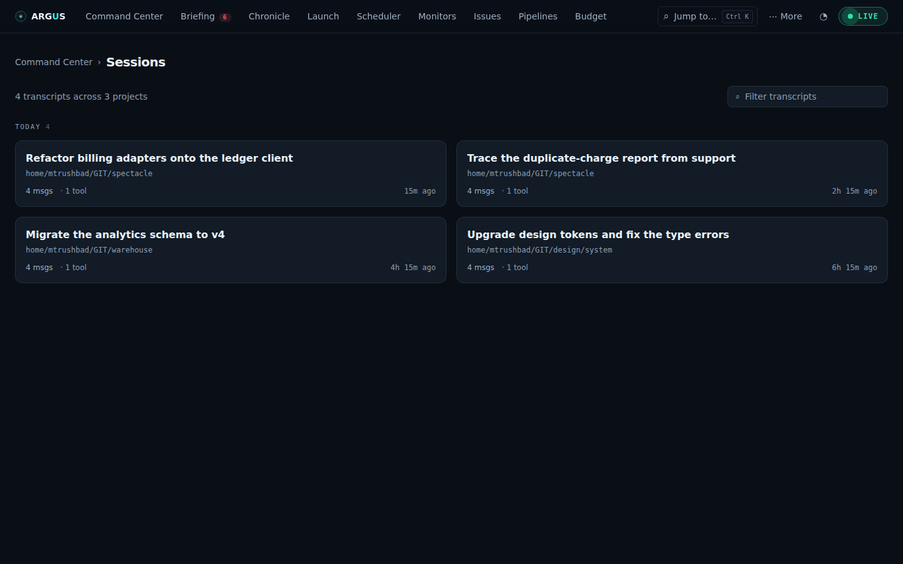

**Purpose:** read the actual conversation transcripts of your Claude Code
sessions across all projects.

**What you see:** a count of transcripts and the projects they span, then cards
**grouped by day** — Today, Yesterday, the weekday within the last week, the date
beyond it — each with a title (from the first user prompt or AI-generated),
project, message count, tool-use count, the model used, and last-activity time.
A transcript with no usable timestamp lands in a trailing "Undated" group rather
than being dropped.

**Filter transcripts** (top-right) searches titles, project paths and model names
with the same fuzzy subsequence matching the command palette uses, so `ftm` finds
"Fix the migration". While you are filtering, the day headings step aside and
results come back in relevance order, freshest first among equal matches.

**Clicking a card opens the transcript:**

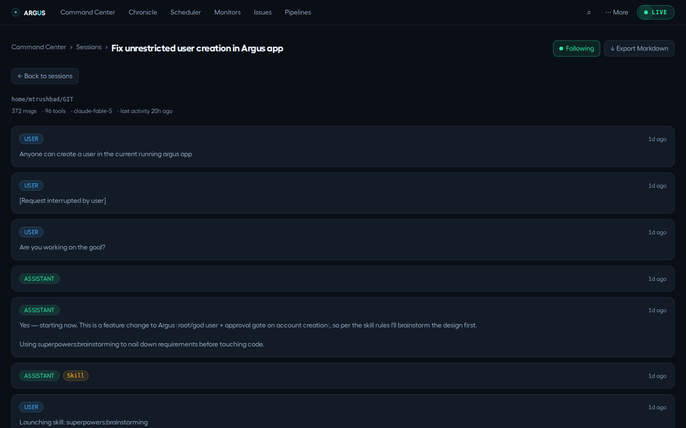

- The full message stream in order — each message with a role pill
  (user/assistant), a tool badge where a tool was invoked, a red error badge
  on failed steps, and a timestamp.
- **Following** (top-right): auto-scrolls to the newest message as a live
  session grows — Argus doubles as a live viewer for running sessions.
- **Export Markdown**: download the whole transcript as a `.md` file.
- **Back to sessions** returns to the list.

**Where the data comes from:** `GET /api/sessions` and
`GET /api/sessions/:project/:id`, reading
`~/.claude/projects/<encoded-project>/<session-id>.jsonl`.

---

## 15. Activity

_Global prompt feed._ Route: `#/activity`

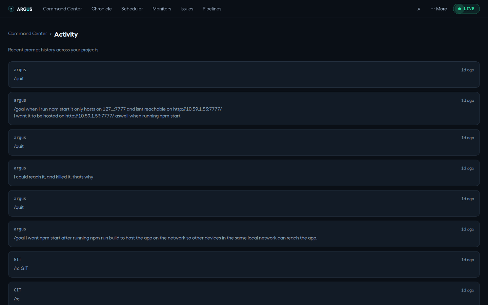

**Purpose:** a single chronological stream of recent prompts issued across
**all** projects and sessions — your "what have I been doing lately" firehose.

**What you see:** a newest-first list; each row shows the project name, a
relative timestamp, and the prompt text (truncated to ~240 chars). Read-only.

**Where the data comes from:** `GET /api/activity`, reading
`~/.claude/history.jsonl` (most recent ~100 entries).

---

## 16. Projects

_Working-directories overview._ Route: `#/projects`

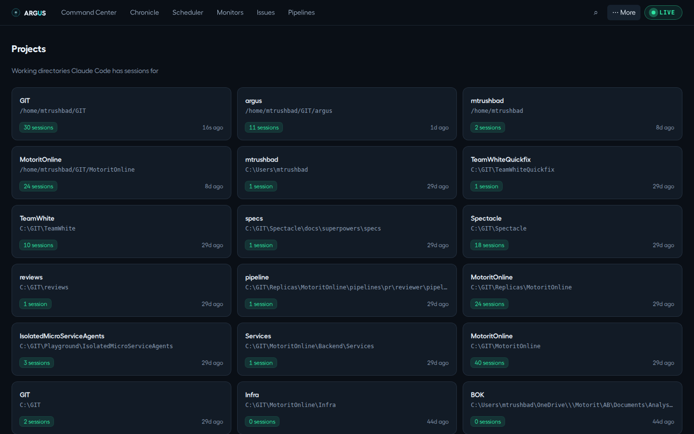

**Purpose:** a directory-level roll-up — every folder Claude Code has worked
in, with how much activity each has.

**What you see:** a grid of project cards — short folder name, the full
decoded path, a **session-count** badge, and last-activity time. Paths from
other operating systems (e.g. a Windows `C:\GIT\…` history read on Linux)
decode correctly — Argus keys off the encoded names, not absolute paths.

**How to use it:** see which repos are most active and when each was last
touched. Informational only — drill into content via Sessions or Search.

**Where the data comes from:** `GET /api/projects`, scanning
`~/.claude/projects/` subdirectories.

---

## 17. Stats

_Usage analytics._ Route: `#/stats`

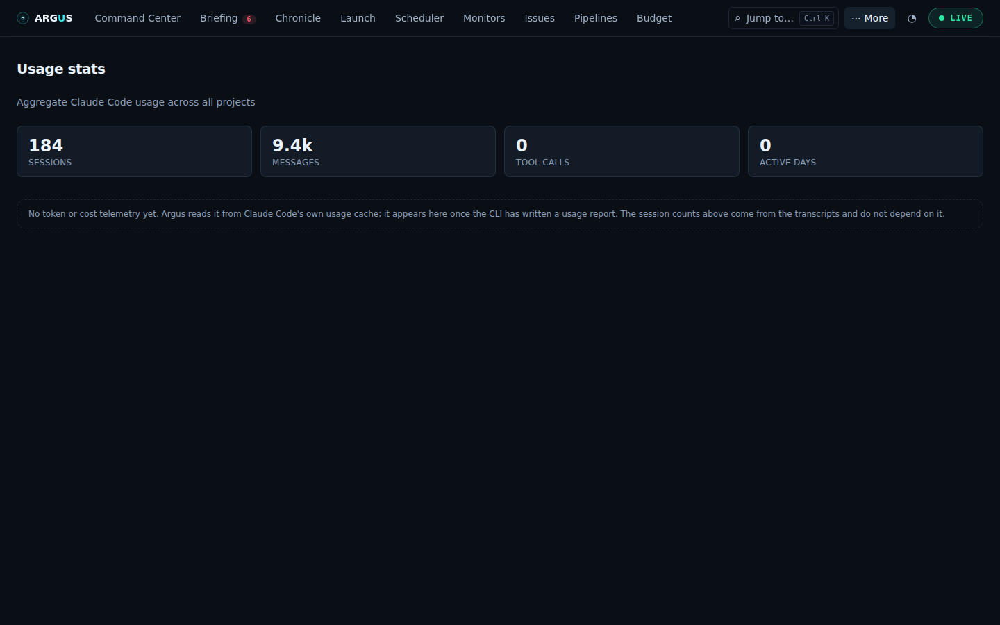

**Purpose:** aggregate usage analytics across all your Claude Code activity.

**What you see:**

- **Headline cards in two groups.** Sessions, messages, tool calls and active
  days come from the transcripts Argus reads itself; tokens, cache reads and
  models used come from Claude Code's own usage telemetry. When the second group
  is absent — a fresh install, or a CLI version whose cache shape this build does
  not parse — it says so in one line instead of rendering four zeros beside real
  numbers, because "0 tokens across 184 sessions" is not a measurement. Total
  cost, longest session and first-session date appear when the CLI reports them.
- **By-model breakdown:** tokens per model with an
  input/output/cache-read/cache-creation split, sorted by volume.
- **Activity-by-hour:** 24 bars showing when you work.
- **Recent daily activity:** a last-30-days table of per-day volume.

**Where the data comes from:** `GET /api/stats`, reading the pre-computed
`~/.claude/stats/stats-cache.json` (shape varies by CLI version; secondary
metrics appear only if present).

---

## 18. Inventory

_Installed extensions catalog._ Route: `#/inventory`

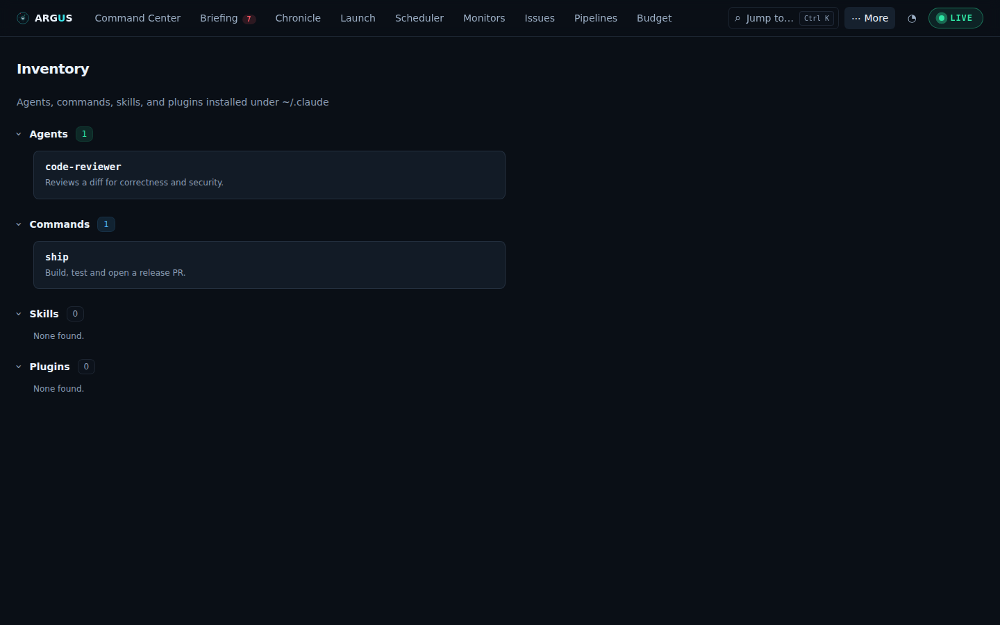

**Purpose:** see everything installed into your Claude Code environment — the
agents, commands, skills, and plugins available to you.

**What you see:** four collapsible, color-accented sections with count badges —
**Agents**, **Commands**, **Skills**, **Plugins** (with marketplace and
version) — each item showing its name and description from frontmatter.

**How to use it:** a reference catalog — "what do I have and what does each
do." No install/remove actions.

**Where the data comes from:** `GET /api/inventory`, reading
`~/.claude/agents/`, `commands/`, `skills/`, and
`plugins/installed_plugins.json`.

---

## 19. Tasks

_Task-queue workspace inventory._ Route: `#/tasks`

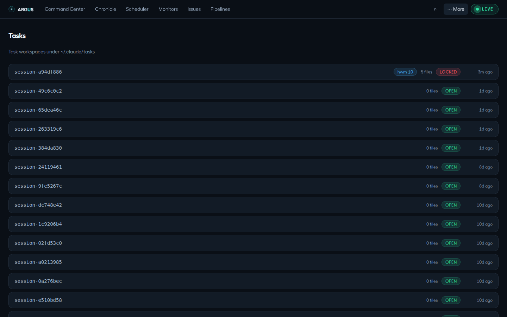

**Purpose:** a low-level view of Claude Code's internal task directories (the
in-session task queue's working folders) — mostly diagnostic.

**What you see:** one row per task workspace — its id, a **highwatermark**
badge (progress marker) if present, the file count, a **lock status** (red =
locked/in use, green = open), and last-updated time. Read-only.

**Where the data comes from:** `GET /api/tasks`, scanning
`~/.claude/tasks/<id>/` for `.lock` / `.highwatermark` files.

---

## 20. Cron panel

_An honest empty state, by design._ Found under **Scheduler → Cron** sub-tab
(there is deliberately no `#/cron` route).

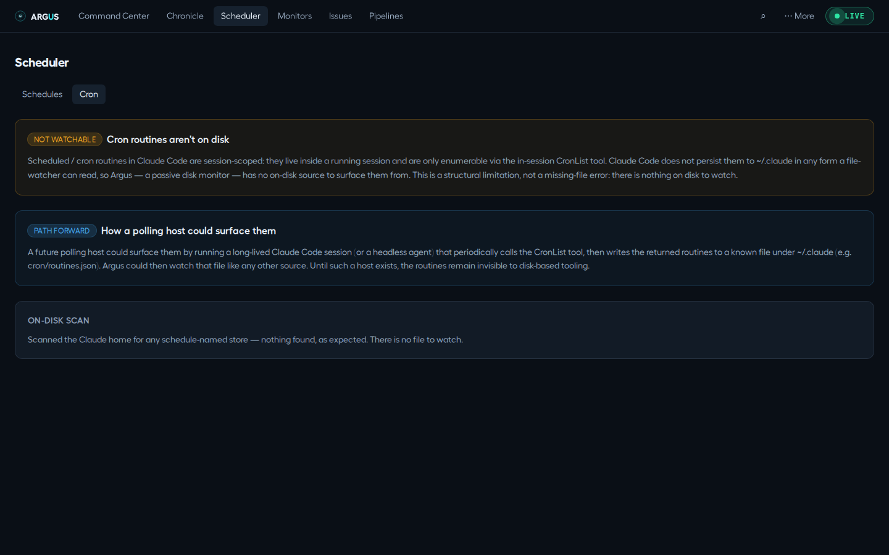

**Purpose:** explain why Claude Code's **native cron routines** can't be shown
as a live table — and what would be needed to surface them.

**What you see:**

- A **"not watchable"** panel: cron routines are session-scoped — they live
  inside a running Claude session, enumerable only via the in-session
  `CronList` tool, and are never persisted under `~/.claude`. A pure
  file-watcher fundamentally cannot see them.
- A **"path forward"** panel: a polling host could publish them to a file
  (e.g. `cron/routines.json`) that Argus would then watch like any source.
- An **on-disk scan**: Argus name-matches anything schedule-related under
  `~/.claude` and lists candidates as hints — usually "nothing found, as
  expected."

Don't confuse this with **Argus's own Scheduler** (section 5), which is fully
on-disk and fully supported — this panel is only about Claude Code's
harness-managed routines.

**Where the data comes from:** `GET /api/cron`, returning
`{ available: false, reason, howTo }` plus filename hints.

---

## 21. Flight Recorder

_Any run, replayed as a scrubbable timeline._ Route: `#/run/<runId>` (and
`#/run/<runId>/<ms>` for a specific moment)

**Purpose:** a transcript is a JSONL wall — thousands of lines where the one
that matters looks exactly like the ones that don't. The Flight Recorder is the
same information as a **recording**: every tool call, file diff, token burst
and cost tick placed on one time axis, with a playhead you can drag.

**How to get there:** expand any run row (Scheduler, Launch, Issues
occurrences) and click **▶ replay**.

**What you see:**

- **Totals** — tool calls, file edits, errors, tokens, cost for the whole run.
- **Lane strips** — one density band per lane (Agent, Tools, Files,
  Tokens & cost) showing _where_ the activity was. Dense stretches read as
  solid; quiet stretches read as gaps. A vertical line marks the playhead.
- **The scrubber** — a range slider over the run's full duration. Its
  accessible value announces both the clock position and the event under the
  playhead.
- **The event list** — a 41-row window that follows the playhead. Click any
  row to seek to it.
- **The now panel** — the one event you are parked on, in full: the command,
  the message, the error body, the file path with `+added / −removed`, the
  token burst and running spend.

**What you can do:**

- **Play / pause** at 1×, 5×, 20× or 100×. Playback stops at the end rather
  than looping.
- **Step** to the previous/next event. A cluster of events sharing one instant
  is stepped over in one press, so the clock always moves.
- **Jump to failure** — on a failed run, lands on the _errored tool call_, not
  the terminal "it failed" marker. Keyboard: `f`.
- **Copy link to moment** — the URL carries the scrubber position, so a link
  to a recording is a link to minute four of it.
- Keyboard throughout: `space` play/pause, `←`/`→` step, `f` jump to failure.

**Honest limits, stated in the UI:**

- **Cost is apportioned, not measured.** The CLI reports one `total_cost_usd`
  for the whole run; per-event dollars are that figure split by token share.
  The view says so under the track.
- **Long runs are trimmed.** Past 2,000 events the earliest ones are dropped
  (the end of a run is where failures live). Offsets stay absolute, so the
  track simply starts partway in — and says that it did.
- **No transcript, no timeline.** A skipped run, a run with no session, or a
  pruned transcript gets an empty state that explains which of those it is.

**Where the data comes from:** `GET /api/runs/:id/recording`, derived on every
read from the run record plus `projects/<project>/<sessionId>.jsonl`. Nothing
is persisted — the transcript stays the source of truth.

---

## 22. Watchtower

_Learned envelopes, and the runs that leave them._ Route: `#/watchtower`
(`g w`)

**Purpose:** Monitors answer "did it run". Issues answer "did it fail".
Neither catches the run that **succeeded**, took nine minutes instead of two,
and burned four dollars instead of forty cents. Watchtower learns what each
schedule — and each pipeline _phase_ — normally costs, and flags the runs that
leave that envelope.

**What you see:**

- Four counters: **Envelopes** (warm and judging), **Warming up**,
  **Anomalies** (last 14 days), **Critical**.
- **Anomalies** first, because they are the news. Each states the multiple in
  words — "3.2× median cost ($0.42 vs $0.13 over 24 runs)" — with a
  **▶ replay this run** link straight into the
  [Flight Recorder](#21-flight-recorder), and the robust z-score in a tooltip
  for anyone who wants it.
- **Learned envelopes** second, because they are the evidence: per unit of
  work, the median and 5th–95th percentile of duration, cost and tokens, drawn
  as a bar with the median marked, plus how many samples it was learned from.

**What you can do:**

- **Reset baseline** — "learn from here". Runs before that moment stop
  counting for that key. Use it after a deliberate change (a new model, a
  bigger prompt) that makes the old envelope wrong.
- **Restore full history** — undo the reset.
- Filter anomalies to **Critical** only.

**How it decides — and why it is quiet:**

- **Envelopes learn from successful runs only.** A crash that died in two
  seconds is not evidence about how long the work takes. Failures are still
  _judged_ against the envelope; they just don't shape it.
- **A z-score and a ratio must both agree.** Robust z alone fires constantly
  on tight distributions — a schedule that always costs $0.01 has near-zero
  spread, so $0.012 is "twenty sigma". Requiring a real multiple too means
  anything flagged is something you would also call unusual.
- **Identical samples report no z at all.** When every run is the same to the
  penny the spread is exactly zero and z is undefined, not enormous. Those
  cases fall back to the ratio and say `zScore: null` rather than claiming a
  precision the data doesn't support.
- **Nothing fires before 8 successful runs.** A median of three runs is a
  rumour. The envelope is shown while it warms, with the shortfall on the card.
- **Both directions matter.** A run that finished in a tenth of the usual time
  usually did a tenth of the usual work.

**Where it shows up elsewhere:** critical anomalies become
[Briefing](#2-briefing) attention items (warn-level ones appear in the digest
under "Ran, but not the way it usually runs"), the Command Center strip gains
an **anomalies** count, and every newly-observed anomaly fires a toast, a bell
entry and the `anomaly.detected` webhook.

**Where the data comes from:** `GET /api/watchtower`, derived on every read
from run records. The only persisted state is your reset markers
(`~/.claude/argus/watchtower.json`).

---

## 23. Autopsy

_An automatic postmortem for every failed run._ Appears on the
[Flight Recorder](#21-flight-recorder) for any failed run, and its verdict
shows up on [Issues](#7-issues).

**Purpose:** a failed run leaves an error string and a transcript. Turning
those into "what actually went wrong, where, and what to change" is work
somebody does by hand at 9am, badly, for the third time this week. Autopsy runs
the same pass automatically, bounded, and attaches the answer to the run.

**What you see** (on the run's recorder page, above the track):

- A **failure class** from a small closed taxonomy — Ambiguous prompt, Missing
  context, Tool error, Permission denied, Environment, Timeout, Rate limit,
  Model declined, Bad output format, Infrastructure, Unclassified.
- A **confidence** figure. Low confidence is shown, not hidden: an invisible
  caveat is not a caveat.
- **One paragraph** of prose explaining what happened. Not a bulleted plan.
- **Where it went wrong**, quoting the timeline line it is claiming about, with
  a **▶ scrub to 61.0s** control that moves the playhead there — so the claim is
  checkable against the track immediately below it.
- A **proposed prompt**, in full, with one line on what it changes.
- What the postmortem itself **cost**, so the feature is never invisible spend.

**What you can do:**

- **Analyse this failure** / **Re-analyse** — run the pass now (admin).
- **Relaunch with fix** — fire the proposed prompt **once, as a one-off**
  (admin). Your schedule is never edited. A model's rewrite of a prompt that
  spends money unattended is a suggestion, not a migration; the UI says so next
  to the button.

**Automatic behaviour and its bounds:**

- Runs that failed in the last 24 hours get a postmortem automatically, **one
  per scheduler tick**. A machine back from a week asleep drains its backlog
  over minutes rather than as a spend spike, newest failure first.
- Older failures are left for the on-demand button.
- A pass that itself fails is **recorded as failed** with the reason, so the run
  is not retried forever and you can see it was attempted.
- Every pass is metered into the same spend ledger real runs use, refuses to
  start while the budget hard stop is in force, is killed at 90 seconds, and is
  capped on output. Set `ARGUS_ANALYSIS=off` to disable all of it;
  `ARGUS_ANALYSIS_MODEL` picks the model (a cheap one by default).

**Issues get smarter too.** With postmortems available, Issues clusters
_differently-worded_ errors that are the same problem — "registry request timed
out contacting mirror" and "…contacting upstream proxy" become one row marked
**2 wordings merged**, carrying the shared failure class. Two errors with
_different_ known classes never merge, however alike the words. With no
postmortems, grouping is exactly the string-fingerprint behaviour it has always
been.

**Where the data comes from:** `GET /api/runs/:id/autopsy`,
`POST /api/runs/:id/autopsy`, `POST /api/runs/:id/relaunch`. Postmortems live in
`~/.claude/argus/autopsies.json` (capped at 200).

---

## 24. Verdict

_Was the output any good?_ Declared on a schedule (Scheduler → **Score the
output against a rubric**) or a pipeline phase; shown on the run's
[Flight Recorder](#21-flight-recorder) page and trended on
[Watchtower](#22-watchtower).

**Purpose:** exit code 0 means the process ended. It does not mean the work was
any good, and for an agent that is exactly the gap — a run can succeed loudly
while producing a summary that misses the point. A **rubric** lets you say what
good means for this unit of work, and each completed run's output is scored
against it by a bounded judge pass.

**Opt-in, always.** No rubric, no scoring, no cost, no UI. A schedule without
one behaves exactly as before.

**Writing a rubric** (in the schedule form):

- **What does good look like here?** — one sentence, in your words.
- **Criteria** — each has an `id`, a label and an optional weight. The **id
  keys the history**: rename a label freely, change an id and the trend starts
  over. Ids are slugified as you type, so you can't enter one the server would
  reject.
- **Regression threshold** (optional) — a run scoring below it **opens an
  issue**, even though the process exited fine. Leave it empty to measure
  without ever failing anything.
- **Auto-approve this gate at** (gated pipeline phases only) — see below.

**What you see on a run:**

- The overall score out of 10, next to the bar it is judged against — a number
  with no threshold beside it means nothing.
- The **per-criterion breakdown**, which is the actionable part: "7.3" tells
  you nothing, "coverage 8, actionable 4" tells you which half was missed.
- One sentence of summary, and what the scoring pass cost.

**What you see on the schedule card** ([Scheduler](#5-scheduler)): a sparkline
and the latest score, beside the health badge — so quality sits next to
liveness, where the decision about a schedule is actually made. It appears only
once the schedule declares a rubric and something has been scored; Verdict is
opt-in per definition, and an empty sparkline on every card would advertise the
feature at the cost of the page.

**What you see on Watchtower** (**Quality trends**): a bar sparkline per unit of
work, the latest score, and its **delta against the median of everything
before it** — one noisy judgement should not read as a collapse, and one good
run after a bad week should not read as a recovery. Runs below the bar are
drawn red.

**How the number is arrived at, and why you can trust it:**

- The **overall score is computed from your weights**, not taken from the
  model. A judge that scores every criterion 3/10 will still cheerfully hand
  back an 8 overall if you ask it for one.
- A score for a criterion your rubric never mentioned is **dropped**. A judge
  that invents a criterion is not evidence about your rubric.
- Scores are clamped to 0–10, and labels come from your rubric, not the answer.
- A response that scores none of your criteria is a **failure, not a zero**.

**Gates that open themselves.** A gated phase with a rubric may declare
**auto-approve at N**. When every judged step of the phase scores at least N,
the gate passes unattended. Two properties matter and hold: a gate with **no
verdict yet waits** (silence is not approval), and a gate whose verdict came
back _below_ the bar waits for a human, forever. Auto-approval only ever skips
the wait for work that has already been judged good — and it is the phase's
**worst** step that decides, not the average, because averaging lets one
excellent step carry a bad one through the gate you set to catch it.

**Bounds:** completed runs under a rubric are judged automatically, **one per
scheduler tick**, newest first, skipping anything older than 24 hours. Every
pass shares the same guardrails as [Autopsy](#23-autopsy) — one at a time,
90-second timeout, metered into the spend ledger, refused under the budget hard
stop, and switched off entirely by `ARGUS_ANALYSIS=off`.

**Where the data comes from:** `GET /api/runs/:id/verdict`,
`POST /api/runs/:id/verdict` (admin), `GET /api/verdicts`. Scores live in
`~/.claude/argus/verdicts.json`; rubrics live on the schedule or pipeline
definition.

---

## 25. Sentinel

_Incidents, escalation, and a diagnostic that proposes but never acts._ Route:
`#/sentinel` (`g n`)

**Purpose:** Monitors, Issues and Watchtower each raise a _signal_. None of them
holds the state that makes a signal answerable — who saw it, when it was
acknowledged, whether it escalated, what was found. An **incident** is that
state: one object per ongoing problem, which assembles its own timeline as the
problem develops.

**What opens an incident** (deliberately narrow — mirroring every open issue
here would just make a second inbox):

- a monitor going **down** (critical) or **failing** (warning),
- an issue you had marked **resolved** failing again — a regression, not
  routine noise,
- a **critical** Watchtower anomaly.

**What you see per incident:** status and severity, how long it has been open,
a live **escalates in…** countdown, every link that leads somewhere useful
(the monitor, the issue, **▶ replay the run**), and the **timeline** — opened,
escalated, acknowledged, diagnosed, noted, resolved, reopened — each entry
attributed to Sentinel or to the person who did it.

**What you can do** (admin):

- **Acknowledge** — stops the escalation clock and records who stopped it.
- **Resolve** — by hand. If the condition is still live, the next check
  **reopens** it and says so in the timeline rather than silently undoing you.
- **Note** — anything worth the next person knowing.
- **Diagnose** — dispatch the read-only diagnostic (below).

**Escalation and quiet hours** (Policy panel):

- **Levels** — by default: notify, then escalate after 30 unacknowledged
  minutes. Up to five levels.
- **Quiet hours** — a local-clock window (wrapping past midnight is the normal
  case and is handled). Inside it, **the bell is silent but the record still
  lands**: the timeline, the incident list and the escalation clock all carry
  on. Dropping the record instead would leave the morning view with a hole
  exactly where the night's problems were. Criticals can be set to ring anyway.

**The diagnostic — read-only by construction.** "Read-only" here is not a
permission setting a model could talk its way past: everything the pass may
consider is **inlined into the prompt** (the incident, its timeline, the recent
runs of the affected work), so it is never asked to go and look and has nothing
to look with. What comes back is a **finding** and a **proposal**, rendered as
"Proposed, not done". Executing it is your click, always. An incident-response
system that can also change things is one that can cause them.

Auto-dispatch on open is available (**Diagnose new incidents automatically**)
and **off by default** — spawning agents is never the default. One diagnostic
per tick, only for freshly-opened incidents, sharing the same bounds as
[Autopsy](#23-autopsy) and [Verdict](#24-verdict).

**Where the data comes from:** `GET /api/sentinel`,
`PUT /api/sentinel/policy`, `POST /api/incidents/:id/{ack,resolve,note,diagnose}`.
Incidents live in `~/.claude/argus/incidents.json` — they _persist_, so a
restart resumes mid-incident rather than re-opening everything — and the policy
in `~/.claude/argus/sentinel.json`.

---

## 26. Weave

_Pipelines as a typed graph: fan-out, fan-in, retries, artifacts._ Authored on
[Pipelines](#8-pipelines); rendered on the [Command Center](#1-command-center).

**Purpose:** a pipeline used to be a list — phase 1, then 2, then 3. Real work
branches: plan once, then build and test in parallel, then ship when both are
done. Weave makes the dependency graph explicit.

**Every pipeline you already have keeps working, unchanged.** A definition where
no phase declares `needs` is _linear_, and each phase implicitly waits for the
one before it. That is not a compatibility shim — it is the degenerate shape of
the general rule, so the executor has no separate linear path that could drift.

**Declaring the graph** (per phase, in the pipeline definition):

- **`needs: ["plan"]`** — the phase ids this one waits for. Declaring `needs`
  on _any_ phase makes the whole graph explicit: phases without it become
  roots, rather than silently inheriting a predecessor. A mixed reading would
  make the same definition mean two things depending on where you looked.
- **`retry: { attempts, backoffSeconds, retryOn }`** — see below.
- **`produces: "plan"`** — publish this phase's payload as an artifact.

**Cycles and dangling edges are rejected when you save**, naming the phases
involved. Without that check, a bad graph is not an error — it is an instance
that starts and then simply never finishes.

**What you see:** when a pipeline actually branches, its card draws a **graph**:
one column per stage, phases that can run together stacked in a column, and each
phase listing what it waits for. A linear pipeline draws no graph — one column
per phase says "graph" and shows nothing the phase pills didn't. An instance
that carries no dependency information at all also draws nothing: absent edges
mean _unknown_, not _parallel_.

**How branches behave:**

- Both branches of a fan-out start together; a fan-in waits for **every**
  dependency, not the first one to finish.
- A gate in one branch does **not** stop the other. The board points at the
  gate, because that is what needs a human.
- A failed branch does not terminalize the instance while a sibling is still
  running — that would render a stopped pipeline with a live process still
  writing into it. The failure is recorded on the phase; the instance settles to
  failed once nothing is left that could progress.
- **Revise** touches only the phase you revised; a sibling that is legitimately
  running is not silently aborted. **Abort** stops everything.

**Retries.** A phase may declare `attempts`, a `backoffSeconds` that doubles
each time (capped at an hour), and which failures are worth retrying:

- `spawn` — the process never started,
- `exit-code` — it exited non-zero,
- `signal` — the agent _reported_ failure.

The default is `["spawn", "exit-code"]`, and the omission is deliberate: an
agent that signalled failure has considered the work and reported on it, so
re-running the same prompt mostly just spends the money twice. Retries are
_scheduled_ (a timestamp on the phase) rather than held in a timer, so a backoff
survives a restart. A **revise** resets the retry budget — otherwise a phase
that had exhausted its retries could never be revised again.

**Artifacts.** A phase with `produces: "plan"` publishes its payload; any later
phase can interpolate `{{artifacts.plan}}` in a step prompt. The older
`{{previous.payload}}` still works and means "my dependency's payload" — which
for a linear pipeline is exactly what it always meant. A phase with two
dependencies has no single "previous", which is why such phases should name
artifacts. An unknown artifact interpolates to nothing rather than leaving a
literal `{{artifacts.foo}}` in the prompt, which the model would try to make
sense of.

**The journal.** Every instance keeps an append-only history at
`~/.claude/argus/journals/<id>.jsonl` — started, phase started, step spawned,
signalled, failed, retry scheduled, retrying, revised, ended. The instance file
is _state_ and is rewritten in place, so it can tell you a phase failed but
never that it failed, retried, failed again and was revised. Read it at
`GET /api/instances/:id/journal`. It is evidence, never the source of truth: a
missing or corrupt journal costs you the history, never the pipeline.

---

## 27. Ledger

_Where the money went, where it is going, and what a change would do about it._
Route: `#/budget`, below the spend chart.

**Purpose:** [Budget](#9-budget) answers "how much, and am I near the cap?". The
Ledger answers the three questions after that: **which work** costs the money,
**where the month lands** at this pace, and **what would change** if a slice
moved to a cheaper model.

**The rule the whole feature is built on: nothing here invents a number.**
There is no embedded price list. Every figure is summed, median-ed or
extrapolated from runs this machine actually made. The cost of that discipline
is that some questions have no answer, and the panels say so out loud rather
than returning a plausible zero.

### Where it went

Spend over the last **30 days**, grouped by one of four dimensions:

- **Schedule** — per named schedule; one-off launches group as _One-off runs_.
- **Agent** — per worker that actually ran. For a pipeline that is one _phase_,
  so this is the view that says which part of a pipeline costs the money;
  everything else groups as its schedule.
- **Pipeline** — per pipeline (step runs roll up into their pipeline).
- **Project** — per working directory.
- **Model** — per model, with runs that pinned nothing shown as _CLI default_,
  which is a real answer rather than a gap.

Each row carries its dollar total, its **share** of the window, its **cost per
run** and its token count. Past the twelfth slice the tail folds into a single
`N more` row rather than being dropped — a total that does not add up is worse
than a long tail you cannot itemise. The footer reports how many costed runs
fell **outside** the grouping (a schedule run has no pipeline), so the totals
can be checked against the chart above.

Runs that reported no cost are not counted at all. A schedule that has never
fired shows nothing here, which is why the empty state says so.

### Forecast

A projection of **month-end spend**, with the band and the sample count beside
it rather than a single confident figure:

- The daily rate is a **median**, not a mean, so one runaway backfill day does
  not set the trend for the rest of the month.
- **Today is excluded** from the rate. A partial day drags the median down all
  morning and would make the projection sag and recover on a daily cycle.
- The band is the 20th–80th percentile day projected forward, so it widens when
  your days are erratic and narrows when they are not.
- **Confidence** is derived from that spread — it is a statement about how well
  this history extrapolates, not about how right the number is.
- Under **three full days** there is no projection at all, only a note saying
  why. Three points can be extrapolated into any figure you like. Between three
  and ten days the note adds _treat as indicative_.

If a monthly limit is set, the note says whether the projection lands inside or
over it, and the figure turns red when it is over.

### What if…

Every slice has a **what if…** action: _move this work to `haiku` — what
happens?_ The answer compares the slice's own median cost per run against what
the target model **has actually cost on this machine**, extrapolated over the
slice's observed run rate.

- If the target model has **never run here**, the simulator refuses: _no runs on
  "haiku" to compare against_. It will not quote a price list, because a saving
  computed from a price table looks identical to a measured one and is wrong the
  week the prices change.
- Both sides use medians, so one expensive outlier does not decide whether a
  migration looks worthwhile.
- The quality half follows the same rule. If both models have
  [Verdict](#24-verdict) scores, the median difference is reported with its
  sample count. If either does not, the answer is **"unmeasured — not zero"**,
  because "nobody has measured" is the true answer far more often than "no
  difference".

A complete answer reads like _`haiku` on Nightly triage saves $41.00/mo at −0.2
Verdict_ — the trade, priced, with both halves measured.

### The policy ladder

A budget limit used to be a cliff: under it, everything runs; over it, nothing
does. The ladder lets spending **graduate**. Add steps to your budget config,
each a ratio of a limit and an action:

| Action      | Effect                                                     |
| ----------- | ---------------------------------------------------------- |
| `warn`      | Runs proceed; the run records that it ran under a warning. |
| `downgrade` | Scheduled runs move to the step's `model` (requires one).  |
| `defer`     | Scheduled slots are skipped; **manual runs still work**.   |
| `stop`      | Scheduled runs stop.                                       |

Steps are stored sorted by threshold, so the ladder reads top-to-bottom as it
engages and you cannot express "stop at 0.9, warn at 1.0" and be surprised.

Two rules matter when several steps match:

- The **highest** matching step wins, not the first. With warn@0.8 /
  downgrade@0.9 / stop@1.0, a run at 105% must be _stopped_ — a first-match
  reading would only have warned it.
- **Both windows are checked** and the more severe verdict applies, because a
  day that is fine inside a month that is not should still be governed by the
  month.

Only **scheduled** runs are governed. A run you fire by hand is a decision you
have already made; the ladder does not second-guess it. The hard `stop` from
[Budget](#9-budget) still blocks everything, ladder or not.

**Every affected run records what happened to it** — `budgetAction` and, for a
downgrade, `modelDowngradedFrom`. So "why did Tuesday's run use Haiku?" is
answerable from the run record itself, rather than by correlating timestamps
against a policy that has since been edited. When a step is in force, the Ledger
shows a panel naming it and what it is doing.

**Where the data comes from:** `argus/runs/` for attribution and the what-if,
`argus/spend.json` for the forecast, `argus/budget.json` for the ladder, and
`argus/verdicts.json` for the quality half. Nothing new is written — the Ledger
is entirely derived.

---

## 28. The Vault

_The store that remembers what the JSON files are forced to forget._ Surfaces
on [Stats](#17-stats), [Search](#11-search) and [Chronicle](#3-chronicle).

**Purpose:** Argus prunes. Run records keep the newest 50 per schedule, the
spend ledger keeps a year of days, transcripts age out. That retention is
correct for files a human might open, and wrong for the question _"how did this
schedule behave last quarter?"_ The Vault ingests every run, alert, cost tick
and Verdict score into a local database and answers the long-horizon questions
from there.

**Zero configuration.** The engine is SQLite, built into Node 22 — no package to
install, no native build, no server to run. The database lives at
`~/.claude/argus/vault.sqlite` and appears the first time Argus ticks.

**It is a cache, never the source.** Every ingest is idempotent, the JSON files
stay authoritative for anything they still hold, and where the two disagree the
file wins. A Vault that is missing, corrupt, disabled or unavailable degrades
the long views to their JSON-only behaviour and breaks nothing. If the file is
ever unreadable, Argus moves it aside and starts a fresh one rather than
refusing to boot — the only cost is history the JSON files no longer hold, and
the alternative is every page broken until a human notices.

### What it changes

- **Stats gains a quarter view.** Runs, failures, success rate, median
  duration, cost, tokens and median Verdict score per calendar quarter, for as
  far back as the Vault goes. A quarter nothing scored shows `—`, not `0.0`:
  unmeasured is not the same as terrible.
- **Chronicle reaches further.** The window picker gains **90d** and **1y**.
  Past 14 days the JSON files no longer have the answer, so those windows are
  filled in from the Vault, with live records winning the merge.
- **Search gains a second index.** A **Run history · indexed** section above the
  transcript results, answering from every run and alert Argus has recorded —
  including the ones since pruned. Full-text, prefix-matching, and fast because
  it is indexed rather than scanned.
- **OpenTelemetry export.** `GET /api/vault/otel?days=30` returns OTLP/JSON
  spans for your collector. One span per run; a pipeline's phases share a trace.

### Related terms

Search expands your query with terms that **co-occur with it in this machine's
own history** — search `backoff` and it may also search `quarantine`, because
your runs mention them together. Expanded results arrive tagged **related**, and
the terms used are printed above the results, so an expansion is always visible
and auditable.

This is not an embedding model, and the UI never calls it one. It is term
co-occurrence over your own corpus: frequent among the documents your query
matched, rare across everything else. For a body of your own runs that is both
cheaper and more useful than a general model of English — it knows your
vocabulary, which is the vocabulary you are searching in.

### What it shows about itself

Under the quarter table: how many runs, events and scores the Vault holds, how
large it is, and — the number that says whether the feature is earning its keep
— **how many runs it is keeping that the JSON files have already pruned**.

A store that quietly stopped ingesting looks exactly like a quiet month, which
is why the panel reports its own state rather than only its contents. When the
Vault is unavailable it says so, and why, in place of the table.

### Turning it off

`ARGUS_VAULT=off` disables it entirely. Every long view degrades cleanly: Stats
drops the quarter table with an explanation, Chronicle's long windows return
whatever the JSON files still hold, Search falls back to transcripts only, and
the OTLP export returns an empty document. Nothing errors, and no other feature
notices.

**Where the data comes from:** ingested on each scheduler tick from
`argus/runs/`, `argus/incidents.json`, `argus/verdicts.json`, `argus/spend.json`
and the Watchtower's derived anomalies. The Vault writes only to its own
database file.

---

## 29. Omnibar

_Say what you want; read exactly what would change; then confirm._ Lives inside
the [command palette](#global-ui) — `⌘K`, then type a sentence.

**Purpose:** the palette is already the fastest way to _go_ somewhere. The
Omnibar makes it the fastest way to _change_ something, without giving up the
thing that makes a control plane trustworthy — that you can see what is about to
happen before it does.

### How it behaves

Type two words and the palette does what it always did: fuzzy-jump. Type a
sentence — three words and twelve characters is the threshold — and it offers to
interpret it instead.

- **`↵` when nothing matched** compiles the sentence.
- **`⌘↵` at any time** compiles it even when commands did match, so a phrase that
  happens to fuzzy-match is not stuck.
- **`esc`** leaves intent mode and returns to the list. A second `esc` closes the
  palette. Losing a typed sentence to a stray keypress is a real cost.

The threshold is deliberately conservative in both directions. "nightly triage"
must stay a search, because jumping is what the palette is for and a planning
pass costs real money; "pause everything touching Spectacle" should be
recognisable without learning a prefix character.

### The preview is the whole feature

Compiling shows an explicit table: for every change, what it touches, what it is
now, and what it becomes.

```
schedule disable   Nightly triage      enabled → disabled
schedule disable   Dependency audit    enabled → disabled
```

Nothing has happened at this point. **Apply** applies all of it; **Cancel**
applies none of it. There is no third path.

Three properties make that trustworthy rather than merely reassuring:

- **The verbs are a closed set.** Disable or enable a schedule, resolve or ignore
  an issue, abort a live pipeline instance, set the daily or monthly budget.
  That is the whole vocabulary, and the server drops anything outside it. The
  planner cannot invent a capability Argus does not already expose.
- **The targets must already exist.** Every id is checked against live state, and
  every label, `before` and `after` you read is computed by the server from the
  real record — never supplied by the model. A plan cannot describe itself
  misleadingly, and an invented schedule name is dropped before you see it.
- **What executes is the plan, not the sentence.** Confirming sends the plan's
  id. The sentence is never re-interpreted, so the list you approved is the list
  that runs.

**Warnings** appear under the plan and never block it: a target that was
dropped, a verb that was not understood, a change that would be a no-op. They
are information about how your sentence was read.

### Questions are answered, not planned

"When did the nightly triage last run?" is a question, and routing a question
through a confirm step would be theatre. Those come back as an inline answer
with deep links into the app. Links are in-app routes only.

### All of it or none of it

Argus's state lives in several independent files, so a true cross-file
transaction is not available — and claiming one would be the dishonest move.
What you get instead is a compensating transaction, with four outcomes it will
tell you apart:

| Outcome         | What happened                                                                             |
| --------------- | ----------------------------------------------------------------------------------------- |
| **applied**     | Every change is in effect.                                                                |
| **stale**       | Nothing was attempted — live state no longer matches the preview.                         |
| **expired**     | Nothing was attempted — the plan was over five minutes old, or already run.               |
| **rolled-back** | One change failed; the earlier ones were reversed. Nothing is in effect.                  |
| **partial**     | A change failed **and** a reversal failed. Some changes are in effect; go and check them. |

`partial` is reported loudly and named exactly, because it is the only case
where a human has to go and look. Aborting a pipeline is the one action with no
inverse — a killed process does not come back — so a plan containing an abort
can only ever be unwound up to that point, and says so.

A plan is **single-use** and expires after five minutes. Plans are not persisted:
a confirmation surviving a restart would land against state nobody has looked at
since.

### Safety

Both planning and executing sit behind the **admin login**, like every other
mutation. Planning spawns a bounded `claude -p` pass through the same runner
Autopsy and Verdict use — one at a time, ninety-second timeout, output capped,
metered into the spend ledger, and refused outright while the budget hard stop
is in force.

A note on trust: your sentence, and the catalogue it is compiled against, both
contain text Argus did not author — an issue title is whatever a failing run
printed. That text reaching the planner is fine by construction, because a
planner cannot do anything except propose verbs from the closed set against ids
that already exist, and you read the result before it happens. The confirm step
is not a formality; it is the security model.

**Where the data comes from:** schedules, open issues, live instances and the
budget config, read fresh for each pass. Pending plans are held in memory only.

---

## 30. Constellation

_N machines, one lens._ Route: `#/fleet`.

**Purpose:** Argus watches one `~/.claude`. Anyone running it on a laptop and a
build box runs it twice and reads it twice, and the questions that span both —
_what is failing anywhere, what am I spending in total_ — have no home.
Constellation gives them one.

**Single-machine stays zero-config.** With no peers configured nothing here
runs: Argus makes no outbound requests, publishes no summary, and answers no
federation endpoint. The page shows one machine and says so, rather than
implying a fleet is missing.

### Pairing

Pairing is **mutual and secret-based**, and there is no server involved.

1. On machine A: **Fleet → Mint a pairing secret**. It is shown once.
2. On machine A: add machine B — its name, its Argus URL, and that secret.
3. On machine B: add machine A — its URL, and **the same secret**.

Each side only answers to pairings it holds, which is what makes step 3 part of
the protocol rather than a nicety. A secret is 64 hex characters and is never
readable back through the API once stored.

### Fleet-wide views

Command Center, Chronicle, Issues and Budget each gain a **machine picker** once
you have a peer. Pick a machine and the page shows that machine instead, with a
banner naming it, dating its figures and linking to its own Argus.

Peer mode is **read-only by construction**. There is no approve or revise on a
peer's board, no triage on a peer's issues, no limits form on a peer's budget —
those are mutations on a machine this one does not own, and a button that would
either fail or need a second control plane is worse than no button. The link out
is the honest affordance.

Each view also adapts to what a summary can actually carry. Chronicle shows a
**list** rather than its packed timeline, because a timeline drawn from a
sampled forty runs would show gaps that mean _not sent_ and read as _nothing
happened_ — the one thing a timeline must never say.

**In solo mode none of this appears.** No picker, no banner, no extra request:
with one machine the four pages are byte-for-byte the pages they were before
federation existed.

### What crosses the wire

Headline counts — monitors down and failing, open issues, live and gated
pipelines, runs and failures today, spend today and this month, the version, the
worst open incident — plus a **bounded facet list per fleet-wide view**: at most
twelve live pipelines, twelve open issues (loudest first), forty recent runs,
and the budget's limits. Every string is clamped.

> **A revision of an earlier, stricter choice.** The first version of this
> feature sent counts only. Counts cannot make four views fleet-wide, and a
> fleet page that can only say "seven issues somewhere" is a worse product than
> one that names them.

What makes it safe is not the absence of detail but who receives it: a machine
you paired with by hand, over a channel sealed with a secret you carried between
the two. Within that, the bounds hold and three fields never travel at all —
**prompts, working directories and session ids**, the ones certain to contain
something written for one machine's eyes. To open a run you open that machine's
own Argus, which is where it belongs.

Every exchange is **encrypted and signed end-to-end** with keys derived from the
pairing secret — AES-256-GCM for confidentiality, HMAC-SHA256 over the whole
envelope for integrity, and a timestamp and nonce so a captured response cannot
be replayed to freeze a peer at a healthy moment. TLS on top is an improvement,
not a requirement, which matters because "set up certificates between your
laptop and your build box" is the step at which a feature like this stops being
used.

### Reading the fleet

Each machine gets a card: its counts, its spend, its version, and its status.

| Status          | Meaning                                                                                               |
| --------------- | ----------------------------------------------------------------------------------------------------- |
| **paired**      | Answering, and the answer verified.                                                                   |
| **pending**     | Added, not yet reached.                                                                               |
| **stale**       | Last answer is over five minutes old — the figures shown are that old.                                |
| **unpaired**    | Reachable, but the pairing did not verify. Usually a secret typed into one machine and not the other. |
| **unreachable** | No answer at all.                                                                                     |

_unpaired_ and _unreachable_ are kept apart deliberately: a mismatched secret
and a dead machine are different problems and want different fixes.

A machine that goes quiet **keeps its last card, marked stale**, rather than
vanishing. "Last known, ten minutes ago" is information; an empty space is not.

**Fleet totals say what they are made of.** Every aggregate is labelled _from N
of M machines_, and when some are not reporting it says the figures are lower
bounds. Silently summing whatever happens to be reachable is how "spend is fine"
becomes wrong on the day a machine goes quiet — which is exactly the day it
matters.

### This machine's name

A name you choose, shown to peers. The machine's **identity** is a random id
minted locally on first use — not your hostname, not a MAC address — so nothing
about this computer travels to a peer that you did not type in yourself.

### Safety

- **Reading the fleet is open**, like every other read. **Pairing, unpairing and
  renaming are admin-gated**, like every other mutation.
- **Refuse-to-boot extends to federation.** Argus already refuses to bind an
  exposed port without `ARGUS_TOKEN`. It now equally refuses to start with a
  peer configured over a non-loopback URL and no pairing secret — that would be
  an unauthenticated summary exchange in both directions. A security promise
  that covers the original feature and not the new one is the promise people
  rely on and the one that is quietly false.
- **The peer endpoint authenticates itself** rather than using the shared
  `ARGUS_TOKEN`. Otherwise pairing would only work by handing every peer the
  token that unlocks the whole control plane — one shared bearer granting
  everything, instead of a per-pair secret granting one read. An unpaired caller
  gets a `401` that reveals nothing: not the machine's id, not its label, not
  whether any pairing exists.
- Peers and their secrets live in `~/.claude/argus/peers.json`, mode `0600`,
  like the admin credentials.

**Practical note:** a peer has to be able to reach this machine, which means
binding beyond loopback (`ARGUS_HOST`), setting `ARGUS_TOKEN`, and listing the
peer-facing hostname in `ARGUS_ALLOWED_HOSTS`. Running the fleet over a private
network — a VPN or a tailnet — is the intended shape.

**Where the data comes from:** each machine's own schedules, monitors, issues,
instances, incidents and spend, summarised per request and never stored. Peers
are polled once per scheduler tick, with a four-second timeout and no retries.

---

## Quick mental model

| Tab                 | Answers the question                       | Source                                      |
| ------------------- | ------------------------------------------ | ------------------------------------------- |
| **Command Center**  | How are my pipelines doing right now?      | `argus/pipelines.json` + `argus/instances/` |
| **Chronicle**       | What ran when, across everything?          | runs + jobs + transcripts, merged           |
| **Launch**          | Fire one `claude -p` run right now         | `argus/runs/` (the `oneoff` bucket)         |
| **Scheduler**       | What fires on a timer, and how did it go?  | `argus/schedules.json` + `argus/runs/`      |
| **Monitors**        | Did the expected runs actually land?       | derived from schedules + runs               |
| **Issues**          | Why are runs failing, grouped by cause?    | derived from runs + `argus/issues.json`     |
| **Pipelines**       | What multi-phase flows are defined?        | `argus/pipelines.json`                      |
| **Budget**          | How much am I spending — and cap it        | `argus/budget.json` + `argus/spend.json`    |
| **Users**           | Who may run/edit pipelines?                | `argus/auth.json`                           |
| **Search**          | Where did I say/see _that_?                | all `projects/*/*.jsonl`                    |
| **Agents**          | What's running / done / failed right now?  | `jobs/*/state.json` + `daemon/roster.json`  |
| **Detail**          | How did _this_ agent get here?             | `jobs/<short>/timeline.jsonl`               |
| **Sessions**        | What was actually said in a conversation?  | `projects/*/*.jsonl`                        |
| **Activity**        | What have I prompted lately, everywhere?   | `history.jsonl`                             |
| **Projects**        | Which folders are active, and when?        | `projects/*/`                               |
| **Stats**           | What's my usage / cost / token spend?      | `stats/stats-cache.json`                    |
| **Inventory**       | What's installed and available?            | `agents/ commands/ skills/ plugins/`        |
| **Tasks**           | What task workspaces exist / are locked?   | `tasks/<id>/`                               |
| **Cron panel**      | Why can't I see native cron routines?      | none (session-scoped)                       |
| **Flight Recorder** | What was it doing at minute four?          | run record + `projects/*/<session>.jsonl`   |
| **Ledger**          | Where did the money go, and where next?    | `argus/runs/` + `argus/spend.json`          |
| **The Vault**       | What happened last quarter, and last year? | `argus/vault.sqlite` (a rebuildable cache)  |
| **Omnibar**         | Say it, see the exact changes, confirm     | schedules + issues + instances + budget     |

_Screenshots in this guide live in [`docs/screenshots/`](screenshots/) and
were captured from a live instance. To refresh them after a UI change, run the
app and re-capture at 1440×900._
