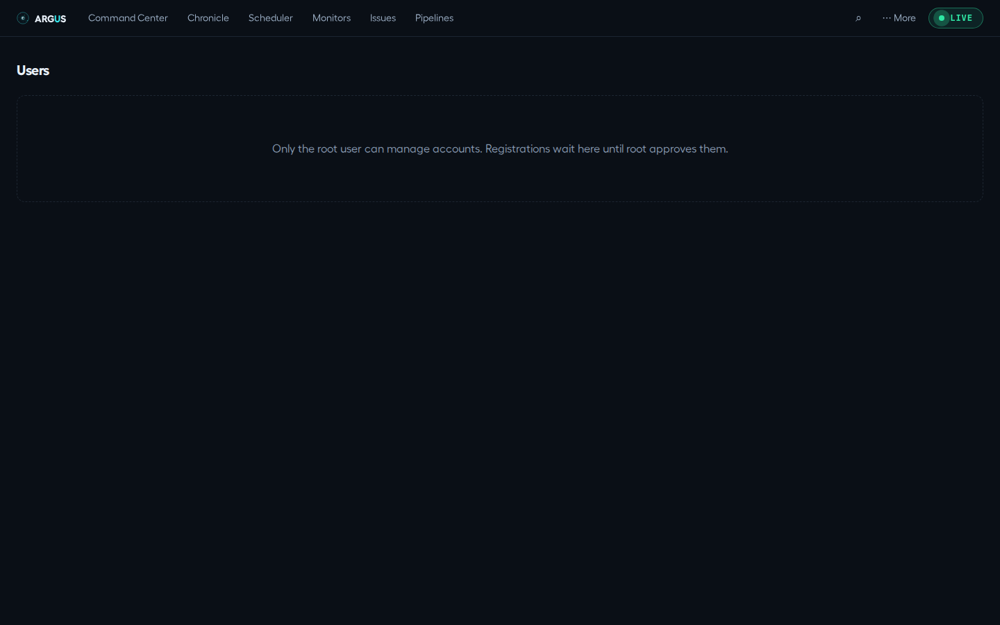

# Accounts and multiple machines

[Documentation](../README.md) · [Feature guides](../guides/README.md)

Manage approved accounts and pair Argus instances for summary views.

## Before you start

Access to the host for first-account bootstrap. Fleet pairing needs another running Argus instance and an explicit trust relationship.

## Try it

1. Open **Pipelines** and create the first root account from the local host if no accounts exist.
2. Sign in before editing or starting pipelines; later member registrations need root approval.
3. As root, open **More → Users** to review pending accounts.
4. For multiple machines, open **More → Fleet** and follow pairing on the two instances.
5. Review what the fleet shares before adding a remote peer, and configure authenticated network access using [operations](../reference/operations.md).

**Expected result:** Pipeline operations use an approved account, and each fleet peer is an explicitly paired instance.

## On this page

- [Users & sign-in](#users--sign-in)
- [Constellation](#constellation)

## Users & sign-in

_Who may run and edit pipelines._ Route: `#/users` (root only) + the login
panel on the Pipelines tab

**Purpose:** Argus's mutating pipeline surface is account-gated with a
two-role model: **root** (the first account, manages users) and **members**
(can run/edit pipelines once approved).

**The three auth flows** (all on the Pipelines tab's panel):

1. **First launch — create the root account.** On an unconfigured server the
   panel offers a one-time root bootstrap (username + password, min 8 chars).
   This is **localhost-only**, enforced server-side. The password is stored
   only as a salted scrypt hash — never plaintext.
2. **Login** — username + password; the session is an HttpOnly cookie. Sign
   out from the same panel (your username + **Sign out** appear when
   authenticated).
3. **Request an account** — anyone on the machine can register; the account
   lands **pending** until root approves it.

**The Users tab** (visible in ⋯ More only to root): all accounts, **pending
first** — each with username, role, and an "awaiting approval" tag. Root can
**Approve** or **Reject** a pending registration, and **Remove** an active
member (never yourself). Non-root visitors see only an explanatory notice
(that's the screenshot above).

**Account recovery:** current accounts live in `~/.claude/argus/users.json`, with salted scrypt password hashes. Legacy `auth.json` can be migrated into that store. Deleting only the legacy file does not reset current users. Preserve both files and follow the [operations guidance](../reference/operations.md#backup-and-restore) before attempting host-level recovery.

**Where the data comes from:** `GET /api/auth/status`,
`POST /api/auth/{setup,login,register,logout}`, `GET /api/users`,
`POST /api/users/:username/{approve,reject}`; state in
`~/.claude/argus/users.json` (legacy `auth.json` is migration input).

## Constellation

_N machines, one lens._ Route: `#/fleet`.

**Purpose:** Argus watches one `~/.claude`. Anyone running it on a laptop and a
build box runs it twice and reads it twice, and the questions that span both —
_what is failing anywhere, what am I spending in total_ — have no home.
Constellation gives them one.

**Single-machine stays zero-config.** With no peers configured nothing here
runs: Argus makes no outbound requests, publishes no summary, and answers no
federation endpoint. The page shows one machine and says so, rather than
implying a fleet is missing.

### Pairing

Pairing is **mutual and secret-based**, and there is no server involved.

1. On machine A: **Fleet → Mint a pairing secret**. It is shown once.
2. On machine A: add machine B — its name, its Argus URL, and that secret.
3. On machine B: add machine A — its URL, and **the same secret**.

Each side only answers to pairings it holds, which is what makes step 3 part of
the protocol rather than a nicety. A secret is 64 hex characters and is never
readable back through the API once stored.

### Fleet-wide views

Command Center, Chronicle, Issues and Budget each gain a **machine picker** once
you have a peer. Pick a machine and the page shows that machine instead, with a
banner naming it, dating its figures and linking to its own Argus.

Peer mode is **read-only by construction**. There is no approve or revise on a
peer's board, no triage on a peer's issues, no limits form on a peer's budget —
those are mutations on a machine this one does not own, and a button that would
either fail or need a second control plane is worse than no button. The link out
is the honest affordance.

Each view also adapts to what a summary can actually carry. Chronicle shows a
**list** rather than its packed timeline, because a timeline drawn from a
sampled forty runs would show gaps that mean _not sent_ and read as _nothing
happened_ — the one thing a timeline must never say.

**In solo mode none of this appears.** No picker, no banner, no extra request:
with one machine the four pages are byte-for-byte the pages they were before
federation existed.

### What crosses the wire

Headline counts — monitors down and failing, open issues, live and gated
pipelines, runs and failures today, spend today and this month, the version, the
worst open incident — plus a **bounded facet list per fleet-wide view**: at most
twelve live pipelines, twelve open issues (loudest first), forty recent runs,
and the budget's limits. Every string is clamped.

> **A revision of an earlier, stricter choice.** The first version of this
> feature sent counts only. Counts cannot make four views fleet-wide, and a
> fleet page that can only say "seven issues somewhere" is a worse product than
> one that names them.

What makes it safe is not the absence of detail but who receives it: a machine
you paired with by hand, over a channel sealed with a secret you carried between
the two. Within that, the bounds hold and three fields never travel at all —
**prompts, working directories and session ids**, the ones certain to contain
something written for one machine's eyes. To open a run you open that machine's
own Argus, which is where it belongs.

Every exchange is **encrypted and signed end-to-end** with keys derived from the
pairing secret — AES-256-GCM for confidentiality, HMAC-SHA256 over the whole
envelope for integrity, and a timestamp and nonce so a captured response cannot
be replayed to freeze a peer at a healthy moment. TLS on top is an improvement,
not a requirement, which matters because "set up certificates between your
laptop and your build box" is the step at which a feature like this stops being
used.

### Reading the fleet

Each machine gets a card: its counts, its spend, its version, and its status.

| Status          | Meaning                                                                                               |
| --------------- | ----------------------------------------------------------------------------------------------------- |
| **paired**      | Answering, and the answer verified.                                                                   |
| **pending**     | Added, not yet reached.                                                                               |
| **stale**       | Last answer is over five minutes old — the figures shown are that old.                                |
| **unpaired**    | Reachable, but the pairing did not verify. Usually a secret typed into one machine and not the other. |
| **unreachable** | No answer at all.                                                                                     |

_unpaired_ and _unreachable_ are kept apart deliberately: a mismatched secret
and a dead machine are different problems and want different fixes.

A machine that goes quiet **keeps its last card, marked stale**, rather than
vanishing. "Last known, ten minutes ago" is information; an empty space is not.

**Fleet totals say what they are made of.** Every aggregate is labelled _from N
of M machines_, and when some are not reporting it says the figures are lower
bounds. Silently summing whatever happens to be reachable is how "spend is fine"
becomes wrong on the day a machine goes quiet — which is exactly the day it
matters.

### This machine's name

A name you choose, shown to peers. The machine's **identity** is a random id
minted locally on first use — not your hostname, not a MAC address — so nothing
about this computer travels to a peer that you did not type in yourself.

### Safety

- **Fleet reads use the normal network authentication rules**: a configured
  shared token requires its credential or an authenticated account session.
  **Pairing, unpairing and renaming additionally require an approved account.**
- **Refuse-to-boot extends to federation.** Argus already refuses to bind an
  exposed port without `ARGUS_TOKEN`. It now equally refuses to start with a
  peer configured over a non-loopback URL and no pairing secret — that would be
  an unauthenticated summary exchange in both directions. A security promise
  that covers the original feature and not the new one is the promise people
  rely on and the one that is quietly false.
- **The peer endpoint authenticates itself** rather than using the shared
  `ARGUS_TOKEN`. Otherwise pairing would only work by handing every peer the
  token that unlocks the whole control plane — one shared bearer granting
  everything, instead of a per-pair secret granting one read. An unpaired caller
  gets a `401` that reveals nothing: not the machine's id, not its label, not
  whether any pairing exists.
- Peers and their secrets live in `~/.claude/argus/peers.json`, mode `0600`,
  like the admin credentials.

**Practical note:** a peer has to be able to reach this machine, which means
binding beyond loopback (`ARGUS_HOST`), setting `ARGUS_TOKEN`, and listing the
peer-facing hostname in `ARGUS_ALLOWED_HOSTS`. Running the fleet over a private
network — a VPN or a tailnet — is the intended shape.

**Where the data comes from:** each machine's own schedules, monitors, issues,
instances, incidents and spend, summarised per request and never stored. Peers
are polled once per scheduler tick, with a four-second timeout and no retries.
