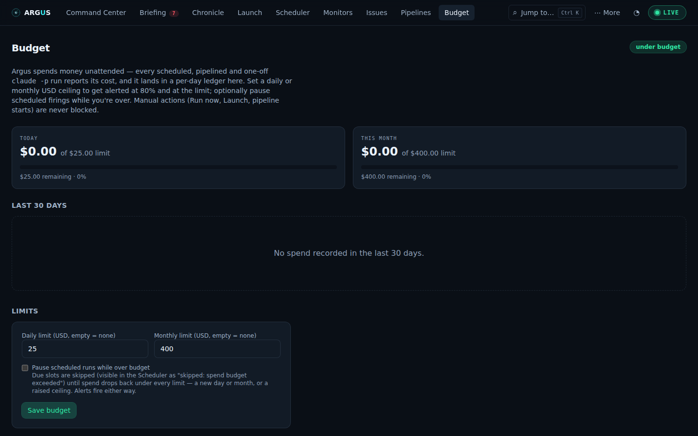
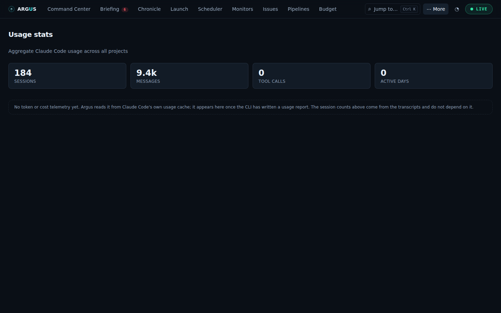

# Budgets, spending and long-term history

[Documentation](../README.md) · [Feature guides](../guides/README.md)

Understand measured spend, set limits, compare options and inspect retained history.

## Before you start

Run records with available cost or token data. Runtime pricing gaps remain unknown; they do not become zero.

## Try it

1. Open **Budget** and inspect today and this month before setting limits.
2. Set daily/monthly limits and choose whether automated firings should stop over budget. Read the exceptions below: manual actions and unpriced calls do not establish a universal monetary cap.
3. Inspect **Ledger** breakdowns and forecasts inside Budget. A forecast is an estimate.
4. Open **More → Stats** for usage trends and the **Vault** status for retained history.
5. Use Chronicle or Search to inspect records behind aggregates when you need an explanation.

**Expected result:** Measured spend, estimated spend, unknown cost and forecasts are distinguishable.

## On this page

- [Budget](#budget)
- [Stats](#stats)
- [Ledger](#ledger)
- [The Vault](#the-vault)

## Budget

_Spend guardrails over every unattended dollar._ Route: `#/budget`

**Purpose:** Argus's whole point is spending your API credits while you're
not looking — schedules, pipelines and one-off launches all report what each
run cost. The Budget tab turns those reports into a **per-day ledger** and
lets you put a ceiling on it: get alerted when you approach or cross a limit,
and optionally **pause scheduled firings** until you're back under.

**What you see:**

- A **state pill** (top right): `no limits set` / `under budget` /
  `approaching limit` (≥ 80% of any limit) / `over budget`.
- **Today** and **This month** cards: spent so far, the limit, a colored
  progress bar (green → amber at 80% → red at the limit), and the remaining
  or overage amount. Both windows follow your local calendar, like schedule
  triggers do.
- On **This month**, a **projection**: what the month is on course to cost at the
  rate it has been going, and — when a monthly limit is set and the rate would
  cross it — roughly which day. The rate is the plain mean over elapsed days
  (hover for it), not a trend fit: it is the arithmetic you would do yourself,
  which makes it the arithmetic you can check. A month with no spend yet gets no
  projection rather than a confident `$0.00`.
- **Last 30 days** — a spend bar chart; hover a bar for the day's dollars and run
  count. When a **daily** limit is set, it is drawn as a dashed line across the
  chart and any day that broke it is red, with a count underneath. The last bar
  is today, ringed to say so — a partly-finished day should not read as a quiet
  one.
- **Limits** — the config form: a daily USD limit, a monthly USD limit
  (either may be empty = no limit), and the hard-stop checkbox.

**The hard stop** ("Pause scheduled runs while over budget"): while any limit
is exceeded, due schedule slots are **skipped** instead of fired — each skip
is recorded as a `skipped` run ("skipped: spend budget exceeded") so the
Scheduler shows exactly what didn't happen, and the slot still counts as
covered for [Monitors](health-and-quality.md#monitors) (a budget pause is not an outage). Firing
resumes by itself the moment spend drops under every limit — a new day, a new
month, or a raised ceiling. **Manual actions are never blocked**: Run now,
Launch and pipeline starts always work — a human clicking a button is its own
authorization.

**Alerts:** the server re-checks the budget on its scheduler tick (~30s) and
pushes a transition alert the moment the state changes — **Budget warning**
(crossed 80%), **Budget exceeded** (crossed a limit; the alert says whether
scheduled runs are paused), **Budget back under limit**. Each reaches you the
same three ways as monitor alerts: in-app toast, native OS notification (if
granted), and an `ARGUS_WEBHOOK_URL` POST (`budget.warning` /
`budget.exceeded` / `budget.cleared`). Only observed transitions alert — a
restart never replays a known-exceeded state.

**How spend is counted:** each completed run's cost (reported by the
runtime's result envelope) is folded into the day it ended, at the same
exactly-once point that feeds the all-time totals — so scheduled, manual,
one-off and pipeline-step runs all count, and the ledger survives run-record
pruning. Runs that report no cost (older CLIs, crashed spawns) add nothing.

**Where the data comes from:** Argus-owned `~/.claude/argus/budget.json`
(limits) and `~/.claude/argus/spend.json` (ledger) via `GET /api/budget` and
`PUT /api/budget`; alerts arrive as `budget:alert` frames on `/ws`.

## Stats

_Usage analytics._ Route: `#/stats`

**Purpose:** aggregate usage analytics across all your Claude Code activity.

**What you see:**

- **Headline cards in two groups.** Sessions, messages, tool calls and active
  days come from the transcripts Argus reads itself; tokens, cache reads and
  models used come from Claude Code's own usage telemetry. When the second group
  is absent — a fresh install, or a CLI version whose cache shape this build does
  not parse — it says so in one line instead of rendering four zeros beside real
  numbers, because "0 tokens across 184 sessions" is not a measurement. Total
  cost, longest session and first-session date appear when the CLI reports them.
- **By-model breakdown:** tokens per model with an
  input/output/cache-read/cache-creation split, sorted by volume.
- **Activity-by-hour:** 24 bars showing when you work.
- **Recent daily activity:** a last-30-days table of per-day volume.

**Where the data comes from:** `GET /api/stats`, reading the pre-computed
`~/.claude/stats/stats-cache.json` (shape varies by CLI version; secondary
metrics appear only if present).

## Ledger

_Where the money went, where it is going, and what a change would do about it._
Route: `#/budget`, below the spend chart.

**Purpose:** [Budget](#budget) answers "how much, and am I near the cap?". The
Ledger answers the three questions after that: **which work** costs the money,
**where the month lands** at this pace, and **what would change** if a slice
moved to a cheaper model.

**The rule the whole feature is built on: nothing here invents a number.**
There is no embedded price list. Every figure is summed, median-ed or
extrapolated from runs this machine actually made. The cost of that discipline
is that some questions have no answer, and the panels say so out loud rather
than returning a plausible zero.

### Where it went

Spend over the last **30 days**, grouped by one of four dimensions:

- **Schedule** — per named schedule; one-off launches group as _One-off runs_.
- **Agent** — per worker that actually ran. For a pipeline that is one _phase_,
  so this is the view that says which part of a pipeline costs the money;
  everything else groups as its schedule.
- **Pipeline** — per pipeline (step runs roll up into their pipeline).
- **Project** — per working directory.
- **Model** — per model, with runs that pinned nothing shown as _CLI default_,
  which is a real answer rather than a gap.

Each row carries its dollar total, its **share** of the window, its **cost per
run** and its token count. Past the twelfth slice the tail folds into a single
`N more` row rather than being dropped — a total that does not add up is worse
than a long tail you cannot itemise. The footer reports how many costed runs
fell **outside** the grouping (a schedule run has no pipeline), so the totals
can be checked against the chart above.

Runs that reported no cost are not counted at all. A schedule that has never
fired shows nothing here, which is why the empty state says so.

### Forecast

A projection of **month-end spend**, with the band and the sample count beside
it rather than a single confident figure:

- The daily rate is a **median**, not a mean, so one runaway backfill day does
  not set the trend for the rest of the month.
- **Today is excluded** from the rate. A partial day drags the median down all
  morning and would make the projection sag and recover on a daily cycle.
- The band is the 20th–80th percentile day projected forward, so it widens when
  your days are erratic and narrows when they are not.
- **Confidence** is derived from that spread — it is a statement about how well
  this history extrapolates, not about how right the number is.
- Under **three full days** there is no projection at all, only a note saying
  why. Three points can be extrapolated into any figure you like. Between three
  and ten days the note adds _treat as indicative_.

If a monthly limit is set, the note says whether the projection lands inside or
over it, and the figure turns red when it is over.

### What if…

Every slice has a **what if…** action: _move this work to `haiku` — what
happens?_ The answer compares the slice's own median cost per run against what
the target model **has actually cost on this machine**, extrapolated over the
slice's observed run rate.

- If the target model has **never run here**, the simulator refuses: _no runs on
  "haiku" to compare against_. It will not quote a price list, because a saving
  computed from a price table looks identical to a measured one and is wrong the
  week the prices change.
- Both sides use medians, so one expensive outlier does not decide whether a
  migration looks worthwhile.
- The quality half follows the same rule. If both models have
  [Verdict](health-and-quality.md#verdict) scores, the median difference is reported with its
  sample count. If either does not, the answer is **"unmeasured — not zero"**,
  because "nobody has measured" is the true answer far more often than "no
  difference".

A complete answer reads like _`haiku` on Nightly triage saves $41.00/mo at −0.2
Verdict_ — the trade, priced, with both halves measured.

### The policy ladder

A budget limit used to be a cliff: under it, everything runs; over it, nothing
does. The ladder lets spending **graduate**. Add steps to your budget config,
each a ratio of a limit and an action:

| Action      | Effect                                                     |
| ----------- | ---------------------------------------------------------- |
| `warn`      | Runs proceed; the run records that it ran under a warning. |
| `downgrade` | Scheduled runs move to the step's `model` (requires one).  |
| `defer`     | Scheduled slots are skipped; **manual runs still work**.   |
| `stop`      | Scheduled runs stop.                                       |

Steps are stored sorted by threshold, so the ladder reads top-to-bottom as it
engages and you cannot express "stop at 0.9, warn at 1.0" and be surprised.

Two rules matter when several steps match:

- The **highest** matching step wins, not the first. With warn@0.8 /
  downgrade@0.9 / stop@1.0, a run at 105% must be _stopped_ — a first-match
  reading would only have warned it.
- **Both windows are checked** and the more severe verdict applies, because a
  day that is fine inside a month that is not should still be governed by the
  month.

Only **scheduled** runs are governed. A run you fire by hand is a decision you
have already made; the ladder does not second-guess it. The hard `stop` from
[Budget](#budget) still blocks everything, ladder or not.

**Every affected run records what happened to it** — `budgetAction` and, for a
downgrade, `modelDowngradedFrom`. So "why did Tuesday's run use Haiku?" is
answerable from the run record itself, rather than by correlating timestamps
against a policy that has since been edited. When a step is in force, the Ledger
shows a panel naming it and what it is doing.

**Where the data comes from:** `argus/runs/` for attribution and the what-if,
`argus/spend.json` for the forecast, `argus/budget.json` for the ladder, and
`argus/verdicts.json` for the quality half. Nothing new is written — the Ledger
is entirely derived.

## The Vault

_The store that remembers what the JSON files are forced to forget._ Surfaces
on [Stats](#stats), [Search](sessions-and-inventory.md#search) and [Chronicle](monitoring.md#chronicle).

**Purpose:** Argus prunes. Run records keep the newest 50 per schedule, the
spend ledger keeps a year of days, transcripts age out. That retention is
correct for files a human might open, and wrong for the question _"how did this
schedule behave last quarter?"_ The Vault ingests every run, alert, cost tick
and Verdict score into a local database and answers the long-horizon questions
from there.

**Zero configuration.** The engine is SQLite, built into Node 22 — no package to
install, no native build, no server to run. The database lives at
`~/.claude/argus/vault.sqlite` and appears the first time Argus ticks.

**It is a cache, never the source.** Every ingest is idempotent, the JSON files
stay authoritative for anything they still hold, and where the two disagree the
file wins. A Vault that is missing, corrupt, disabled or unavailable degrades
the long views to their JSON-only behaviour and breaks nothing. If the file is
ever unreadable, Argus moves it aside and starts a fresh one rather than
refusing to boot — the only cost is history the JSON files no longer hold, and
the alternative is every page broken until a human notices.

### What it changes

- **Stats gains a quarter view.** Runs, failures, success rate, median
  duration, cost, tokens and median Verdict score per calendar quarter, for as
  far back as the Vault goes. A quarter nothing scored shows `—`, not `0.0`:
  unmeasured is not the same as terrible.
- **Chronicle reaches further.** The window picker gains **90d** and **1y**.
  Past 14 days the JSON files no longer have the answer, so those windows are
  filled in from the Vault, with live records winning the merge.
- **Search gains a second index.** A **Run history · indexed** section above the
  transcript results, answering from every run and alert Argus has recorded —
  including the ones since pruned. Full-text, prefix-matching, and fast because
  it is indexed rather than scanned.
- **OpenTelemetry export.** `GET /api/vault/otel?days=30` returns OTLP/JSON
  spans for your collector. One span per run; a pipeline's phases share a trace.

### Related terms

Search expands your query with terms that **co-occur with it in this machine's
own history** — search `backoff` and it may also search `quarantine`, because
your runs mention them together. Expanded results arrive tagged **related**, and
the terms used are printed above the results, so an expansion is always visible
and auditable.

This is not an embedding model, and the UI never calls it one. It is term
co-occurrence over your own corpus: frequent among the documents your query
matched, rare across everything else. For a body of your own runs that is both
cheaper and more useful than a general model of English — it knows your
vocabulary, which is the vocabulary you are searching in.

### What it shows about itself

Under the quarter table: how many runs, events and scores the Vault holds, how
large it is, and — the number that says whether the feature is earning its keep
— **how many runs it is keeping that the JSON files have already pruned**.

A store that quietly stopped ingesting looks exactly like a quiet month, which
is why the panel reports its own state rather than only its contents. When the
Vault is unavailable it says so, and why, in place of the table.

### Turning it off

`ARGUS_VAULT=off` disables it entirely. Every long view degrades cleanly: Stats
drops the quarter table with an explanation, Chronicle's long windows return
whatever the JSON files still hold, Search falls back to transcripts only, and
the OTLP export returns an empty document. Nothing errors, and no other feature
notices.

**Where the data comes from:** ingested on each scheduler tick from
`argus/runs/`, `argus/incidents.json`, `argus/verdicts.json`, `argus/spend.json`
and the Watchtower's derived anomalies — plus **monitor and budget transitions,
archived as they happen**. Those two are the only signals Argus produces that
are otherwise never written down: both are derived per tick, diffed in memory,
sent to the bell, and gone. The Vault writes only to its own database file.
