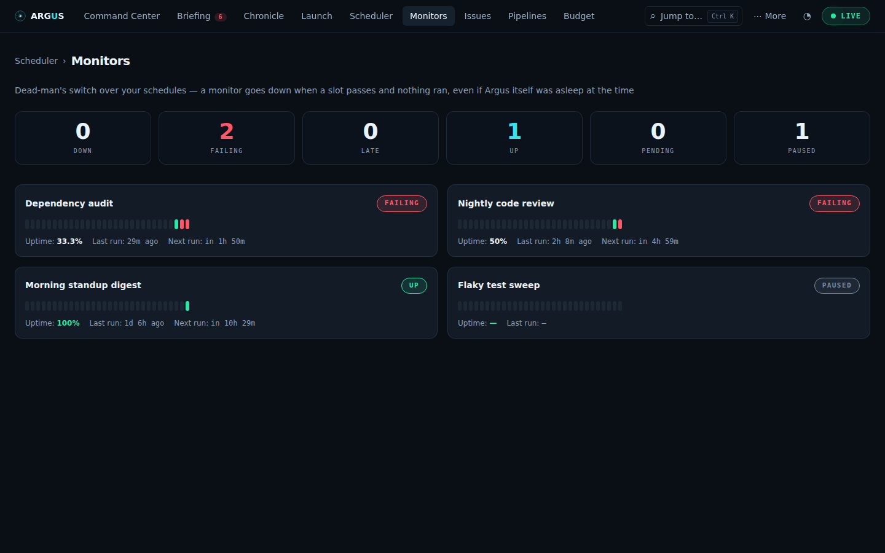
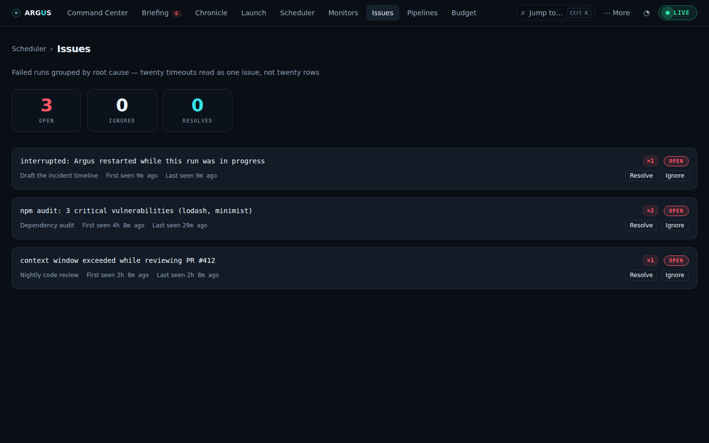

# Health, failures, quality and incidents

[Documentation](../README.md) · [Feature guides](../guides/README.md)

Check whether expected work ran, diagnose failures, and assess outputs.

## Before you start

Saved schedules and run history. Learned envelopes need sufficient history; model analysis needs a configured, authenticated analysis runtime. Some incident actions require account login.

## Try it

1. Open **Health → Monitors** to check whether expected schedule slots landed.
2. Open **Health → Watchtower** to compare run shape with learned history. Insufficient history is not a healthy verdict.
3. Open **Issues**, inspect a failure group and follow its run link. Resolve or ignore only after reviewing the cause.
4. In **Flight Recorder**, compare the observed failure with **Autopsy** and **Verdict** analysis. A model explanation or score is not proof the task succeeded.
5. Open **More → Sentinel** for an incident, acknowledge it, record findings, and resolve it after checking the underlying condition.

**Expected result:** You can distinguish a missing run, a failed run, an unusual run, a quality judgment and an incident.

## On this page

- [Monitors](#monitors)
- [Issues](#issues)
- [Watchtower](#watchtower)
- [Autopsy](#autopsy)
- [Verdict](#verdict)
- [Sentinel](#sentinel)

## Monitors

_A dead-man's switch over your schedules._ Route: `#/health` — the **Monitors**
half of the Health tab (`g m`); its other half is
[Watchtower](#watchtower). (`#/monitors` still lands here.)



**Purpose:** answer "did my schedules actually run?" — not "what did Argus
launch," but "did the expected slot pass with nothing landing," which also
catches the case where **Argus itself was asleep** at fire time. Every
schedule you create gets a monitor automatically; there's nothing to author
here.

**What you see:**

- A six-tile summary in escalation order: **Down / Failing / Late / Up /
  Pending / Paused**. Any tile with a non-zero count is a **filter** — press
  "2 Down" to narrow the list to just those two, press it again or **Show all**
  to restore. An empty tile is inert: pressing it could only blank the list.
- One **monitor card** per schedule: its name (links back to the Scheduler),
  a status pill, a **heartbeat bar** of the last 30 runs (one tick per run,
  colored by outcome), and a stats line — **uptime %** (succeeded vs failed
  over the last 30), **last run** time, and either the **next** expected time
  or, when late/down, the slot that was **expected** and missed.
- Cards that are `down` or `failing` get a red border so they jump out.

**Status meanings:** `up` — last expected slot ran; `late` — a slot is
overdue but within grace (10% of the trigger period, clamped 5–60 min);
`down` — a slot passed grace with no run; `failing` — runs happen on time but
the latest one failed; `pending` — no run yet; `paused` — the schedule is
disabled.

**Alerts — the switch actually pages you.** Detection alone isn't enough for
a page you don't have open, so the server re-checks every monitor on its
scheduler tick (~30s) and pushes an alert the moment one **transitions**:

- **Monitor down** — a slot passed its grace with no covering run.
- **Monitor failing** — runs are landing on time, but the latest one failed.
- **Monitor recovered** — a down/failing monitor came back up (a catch-up
  run, a fixed prompt, the next slot succeeding…).

Each alert reaches you three ways: an **in-app toast** (bottom-right, any
tab), a **native OS notification** if you've granted the browser permission
(Argus asks once), and a **webhook POST** when `ARGUS_WEBHOOK_URL` is set —
the same JSON channel that already carries run/pipeline failures, so one
Slack/mail bridge covers everything. Only observed transitions alert: on a
fresh server boot the first check is a silent baseline, so restarting Argus
never replays a storm of already-known-down alerts (the Briefing tab is the
place that shows current bad state).

**What you can do:** the tab itself is deliberately read-only — fix problems
in the Scheduler or Issues tabs.

**Where the data comes from:** `GET /api/monitors`, derived on every read
from schedules + run records (no separate state to go stale); alerts arrive
as `monitors:alert` frames on `/ws`.

## Issues

_Failed runs grouped by root cause._ Route: `#/issues`



**Purpose:** Sentry-style grouping — twenty timeouts read as **one issue with
×20**, not twenty rows. Each distinct failure fingerprint (normalized error)
becomes one card.

**What you see:**

- Summary tiles: **Open / Ignored / Resolved** — each a filter for its own
  subset, so two open issues among thirty resolved ones are one click away.
- One **issue card** per fingerprint: the error title (monospace), an
  **×N occurrence badge**, a state badge, which schedules it affects, and
  first/last-seen times. Open issues get a red border.
- Expanding a card loads its **occurrences** — per-run time, schedule name,
  and the exact error text (up to the latest 50).

**What you can do (the triage lifecycle):**

- **Resolve** — mark it fixed. If a _newer_ failure with the same fingerprint
  arrives later, the issue **auto-reopens** — resolved means "fixed going
  forward", not "hide forever".
- **Ignore** — mute it (known-noisy failures). Stays ignored until you reopen.
- **Reopen** — available on resolved/ignored issues; drops the triage record.

**Where the data comes from:** `GET /api/issues` +
`GET /api/issues/:fingerprint`, derived from run records on every read; only
your triage decisions persist (`~/.claude/argus/issues.json`).

## Watchtower

_Learned envelopes, and the runs that leave them._ Route:
`#/health/watchtower` — the **Watchtower** half of the Health tab, beside
[Monitors](#monitors). (`#/watchtower` still lands here.)

**Purpose:** Monitors answer "did it run". Issues answer "did it fail".
Neither catches the run that **succeeded**, took nine minutes instead of two,
and burned four dollars instead of forty cents. Watchtower learns what each
schedule — and each pipeline _phase_ — normally costs, and flags the runs that
leave that envelope.

**What you see:**

- Four counters: **Envelopes** (warm and judging), **Warming up**,
  **Anomalies** (last 14 days), **Critical**.
- **Anomalies** first, because they are the news. Each states the multiple in
  words — "3.2× median cost ($0.42 vs $0.13 over 24 runs)" — with a
  **▶ replay this run** link straight into the
  [Flight Recorder](monitoring.md#flight-recorder), and the robust z-score in a tooltip
  for anyone who wants it.
- **Learned envelopes** second, because they are the evidence: per unit of
  work, the median and 5th–95th percentile of duration, cost and tokens, drawn
  as a bar with the median marked, plus how many samples it was learned from.

**What you can do:**

- **Reset baseline** — "learn from here". Runs before that moment stop
  counting for that key. Use it after a deliberate change (a new model, a
  bigger prompt) that makes the old envelope wrong.
- **Restore full history** — undo the reset.
- Filter anomalies to **Critical** only.

**How it decides — and why it is quiet:**

- **Envelopes learn from successful runs only.** A crash that died in two
  seconds is not evidence about how long the work takes. Failures are still
  _judged_ against the envelope; they just don't shape it.
- **A z-score and a ratio must both agree.** Robust z alone fires constantly
  on tight distributions — a schedule that always costs $0.01 has near-zero
  spread, so $0.012 is "twenty sigma". Requiring a real multiple too means
  anything flagged is something you would also call unusual.
- **Identical samples report no z at all.** When every run is the same to the
  penny the spread is exactly zero and z is undefined, not enormous. Those
  cases fall back to the ratio and say `zScore: null` rather than claiming a
  precision the data doesn't support.
- **Nothing fires before 8 successful runs.** A median of three runs is a
  rumour. The envelope is shown while it warms, with the shortfall on the card.
- **Both directions matter.** A run that finished in a tenth of the usual time
  usually did a tenth of the usual work.

**Where it shows up elsewhere:** critical anomalies become
[Briefing](monitoring.md#briefing) attention items (warn-level ones appear in the digest
under "Ran, but not the way it usually runs"), the Command Center strip gains
an **anomalies** count, and every newly-observed anomaly fires a toast, a bell
entry and the `anomaly.detected` webhook.

**Where the data comes from:** `GET /api/watchtower`, derived on every read
from run records. The only persisted state is your reset markers
(`~/.claude/argus/watchtower.json`).

## Autopsy

_An automatic postmortem for every failed run._ Appears on the
[Flight Recorder](monitoring.md#flight-recorder) for any failed run, and its verdict
shows up on [Issues](#issues).

**Purpose:** a failed run leaves an error string and a transcript. Turning
those into "what actually went wrong, where, and what to change" is work
somebody does by hand at 9am, badly, for the third time this week. Autopsy runs
the same pass automatically, bounded, and attaches the answer to the run.

**What you see** (on the run's recorder page, above the track):

- A **failure class** from a small closed taxonomy — Ambiguous prompt, Missing
  context, Tool error, Permission denied, Environment, Timeout, Rate limit,
  Model declined, Bad output format, Infrastructure, Unclassified.
- A **confidence** figure. Low confidence is shown, not hidden: an invisible
  caveat is not a caveat.
- **One paragraph** of prose explaining what happened. Not a bulleted plan.
- **Where it went wrong**, quoting the timeline line it is claiming about, with
  a **▶ scrub to 61.0s** control that moves the playhead there — so the claim is
  checkable against the track immediately below it.
- A **proposed prompt**, in full, with one line on what it changes.
- What the postmortem itself **cost**, so the feature is never invisible spend.

**What you can do:**

- **Analyse this failure** / **Re-analyse** — run the pass now (admin).
- **Relaunch with fix** — fire the proposed prompt **once, as a one-off**
  (admin). Your schedule is never edited. A model's rewrite of a prompt that
  spends money unattended is a suggestion, not a migration; the UI says so next
  to the button.

**Automatic behaviour and its bounds:**

- Runs that failed in the last 24 hours get a postmortem automatically, **one
  per scheduler tick**. A machine back from a week asleep drains its backlog
  over minutes rather than as a spend spike, newest failure first.
- Older failures are left for the on-demand button.
- A pass that itself fails is **recorded as failed** with the reason, so the run
  is not retried forever and you can see it was attempted.
- Every pass is metered into the same spend ledger real runs use, refuses to
  start while the budget hard stop is in force, is killed at 90 seconds, and is
  capped on output. Set `ARGUS_ANALYSIS=off` to disable all of it;
  `ARGUS_ANALYSIS_MODEL` picks the model. Claude defaults to Haiku; other
  runtimes use their CLI default unless overridden. See [analysis selection](../reference/runtimes.md#cost-and-outcome-interpretation).

**Issues get smarter too.** With postmortems available, Issues clusters
_differently-worded_ errors that are the same problem — "registry request timed
out contacting mirror" and "…contacting upstream proxy" become one row marked
**2 wordings merged**, carrying the shared failure class. Two errors with
_different_ known classes never merge, however alike the words. With no
postmortems, grouping is exactly the string-fingerprint behaviour it has always
been.

**Where the data comes from:** `GET /api/runs/:id/autopsy`,
`POST /api/runs/:id/autopsy`, `POST /api/runs/:id/relaunch`. Postmortems live in
`~/.claude/argus/autopsies.json` (capped at 200).

## Verdict

_Was the output any good?_ Declared on a schedule (Scheduler → **Score the
output against a rubric**) or a pipeline phase; shown on the run's
[Flight Recorder](monitoring.md#flight-recorder) page and trended on
[Watchtower](#watchtower).

**Purpose:** exit code 0 means the process ended. It does not mean the work was
any good, and for an agent that is exactly the gap — a run can succeed loudly
while producing a summary that misses the point. A **rubric** lets you say what
good means for this unit of work, and each completed run's output is scored
against it by a bounded judge pass.

**Opt-in, always.** No rubric, no scoring, no cost, no UI. A schedule without
one behaves exactly as before.

**Writing a rubric** (in the schedule form):

- **What does good look like here?** — one sentence, in your words.
- **Criteria** — each has an `id`, a label and an optional weight. The **id
  keys the history**: rename a label freely, change an id and the trend starts
  over. Ids are slugified as you type, so you can't enter one the server would
  reject.
- **Regression threshold** (optional) — a run scoring below it **opens an
  issue**, even though the process exited fine. Leave it empty to measure
  without ever failing anything.
- **Auto-approve this gate at** (gated pipeline phases only) — see below.

**What you see on a run:**

- The overall score out of 10, next to the bar it is judged against — a number
  with no threshold beside it means nothing.
- The **per-criterion breakdown**, which is the actionable part: "7.3" tells
  you nothing, "coverage 8, actionable 4" tells you which half was missed.
- One sentence of summary, and what the scoring pass cost.

**What you see on the schedule card** ([Scheduler](scheduling.md#scheduler)): a sparkline
and the latest score, beside the health badge — so quality sits next to
liveness, where the decision about a schedule is actually made. It appears only
once the schedule declares a rubric and something has been scored; Verdict is
opt-in per definition, and an empty sparkline on every card would advertise the
feature at the cost of the page.

**What you see on Watchtower** (**Quality trends**): a bar sparkline per unit of
work, the latest score, and its **delta against the median of everything
before it** — one noisy judgement should not read as a collapse, and one good
run after a bad week should not read as a recovery. Runs below the bar are
drawn red.

**How the number is arrived at, and why you can trust it:**

- The **overall score is computed from your weights**, not taken from the
  model. A judge that scores every criterion 3/10 will still cheerfully hand
  back an 8 overall if you ask it for one.
- A score for a criterion your rubric never mentioned is **dropped**. A judge
  that invents a criterion is not evidence about your rubric.
- Scores are clamped to 0–10, and labels come from your rubric, not the answer.
- A response that scores none of your criteria is a **failure, not a zero**.

**Gates that open themselves.** A gated phase with a rubric may declare
**auto-approve at N**. Every relevant run must have a current, ready verdict
matching the rubric and scoring at least N; a best-of-N phase uses its selected
candidate. Missing, failed, stale or below-threshold judgments withhold approval.
The phase's **worst** relevant score decides, not the average.

This applies only to ordinary gates with a confirmed pause cause, never an
agent's `needs-input` question or a pause of unknown cause. A phase configured
to commit knowledge, or carrying staged knowledge, still needs operator review.
A judge score is a rubric rating, not a calibrated probability of correctness.

**Judging how the agent worked (trajectory).** A rubric may add an optional
`trajectory` block. It is **off unless you write it**, and it is declared in the
definition's JSON through the API (the schedule form and the pipeline form have
no fields for it):

```json
{
  "rubric": {
    "goal": "A triage summary that names every new failure.",
    "criteria": [{ "id": "coverage", "label": "Names every new failure" }],
    "trajectory": {
      "criteria": [{ "id": "focus", "label": "Stayed on the task" }],
      "minScore": 6,
      "check": { "holdOn": ["destructive-command", "path"] }
    }
  },
  "autoApprove": { "verdict": 8, "trajectory": 7 }
}
```

- **`criteria`** (optional) — what a judge should score the _path_ on, written
  like output criteria. One extra judge call per run, scored against a timeline
  of the run's first 20 and last 60 events.
- **`minScore`** (optional, needs criteria) — a trajectory score below it is
  marked a regression on the run and in `trajectoryTrends` (API only for now; the
  Quality trends card shows output scores). Unlike an output regression it opens
  no issue.
- **`check.holdOn`** (optional) — signals that, when observed, **hold an
  automated approval** for a person. No model is involved. Choose from
  `repetition`, `errors`, `edit-revert`, `path` and `destructive-command`. This
  is an automation hold only: it does not fail verification, pause the phase or
  change what you can approve yourself, and it is not a verification check (for
  that, see _A verification check on the path_ below).
- **`autoApprove.trajectory`** (optional, gated phases) — the bar for the
  trajectory score. Leave it out and the `verdict` bar applies to it too. It
  needs trajectory criteria.

You must declare criteria, a check or both. With a trajectory declared, a gate
only opens itself when every relevant run also has a usable trajectory judgment:
one that is missing, skipped (no transcript to read), failed, older than the
rubric, or based on a **truncated recording** (the Flight Recorder keeps only the
last 2,000 events) holds the gate, as does an observed held signal or a score
under the bar. A missing or truncated recording is not treated as a clean run: it
simply cannot clear the gate, and you decide.

**The signals are heuristics, not findings.** They are simple counts over what
the Flight Recorder kept, and each has blind spots: shell tricks, aliases and
scripts hide destructive commands, a shell write hides a path escape, a revert
by `git checkout` is invisible, and quoted text such as `echo rm -rf` is a false
positive. Polling counts as repetition. **A zero means "not observed", never
"did not happen"**, and a positive is a prompt to look, not proof of a problem.
The run page shows what was observed and what a check held on; HARNESS §19 has
the exact rules. A trajectory assessment never counts as evidence in the
Knowledge Ledger, and it cannot open a gate that commits knowledge.

**A verification check on the path.** `holdOn` only ever holds an automated
approval. To make a phase _fail verification_ when recorded signal counts exceed
your limits, add a `trajectory` check to the phase's `checks`, beside
`command`, `artifact`, `file`
and `changed-files`. It is declared in the pipeline's JSON through the API, needs
no `rubric`, and uses no model:

```json
{
  "id": "implement",
  "checks": [
    { "kind": "command", "run": "npm test" },
    {
      "kind": "trajectory",
      "thresholds": { "destructive-command": 0, "path": 0, "errors": 5 },
      "requireTranscript": true
    }
  ]
}
```

- **`thresholds`** (required) — for each signal you name, the largest count you
  will accept: a whole number from 0 to 10,000. Name at least one. A run whose
  count goes above a threshold fails the check, even if the recording was
  truncated, because what it kept is real. The counts are: `repetition`, the number
  of distinct non-file tool calls repeated three or more times; `errors`, tool
  calls that errored plus error results with no matching call; `edit-revert`,
  edits that mirror an earlier edit; `path`, file-tool writes outside the working
  directory or to sensitive paths; `destructive-command`, Bash commands matching
  the destructive list.
- **`requireTranscript`** (optional, default off) — what to do when Argus cannot
  tell. If a run has no readable transcript, or the recording was truncated and
  nothing over a threshold showed in what was kept, the thresholds cannot be shown
  to hold. With `requireTranscript` on, the check **fails**. With it off, the check
  is **not evaluated**: it shows as `–` "(not evaluated)" in the review drawer, is
  never counted as passed, and does not fail the phase. A check with no runs to
  look at is treated the same way.

The check looks at the runs behind the phase: the selected candidate's when a
best-of-N candidate was selected, otherwise every step of the attempt; a
candidate being verified is checked on its own run. A not-evaluated check cannot
be cited as evidence in the Knowledge Ledger (a knowledge commit that cites it is
refused). Remember the signals are heuristics, so keep thresholds above what
legitimate work produces: polling and a failing test run both count.

**Bounds:** completed runs under a rubric are judged automatically, with at most
one output judgment and one optional trajectory judgment per scheduler tick,
newest first, skipping anything older than 24 hours. Every
pass shares the same guardrails as [Autopsy](#autopsy) — one at a time,
90-second timeout, metered into the spend ledger, refused under the budget hard
stop, and switched off entirely by `ARGUS_ANALYSIS=off`.

**Where the data comes from:** `GET /api/runs/:id/verdict`,
`POST /api/runs/:id/verdict` (admin), `GET /api/verdicts` (output `trends`
and, separately, `trajectoryTrends`). Scores live in
`~/.claude/argus/verdicts.json`, trajectory judgments among them under the
same 400-record cap; rubrics live on the schedule or pipeline definition.

## Sentinel

_Incidents, escalation, and a diagnostic that proposes but never acts._ Route:
`#/sentinel` (`g n`, or the ⋯ More menu — the Briefing is where a signal is
first seen; Sentinel is where its record lives)

**Purpose:** Monitors, Issues and Watchtower each raise a _signal_. None of them
holds the state that makes a signal answerable — who saw it, when it was
acknowledged, whether it escalated, what was found. An **incident** is that
state: one object per ongoing problem, which assembles its own timeline as the
problem develops.

**What opens an incident** (deliberately narrow — mirroring every open issue
here would just make a second inbox):

- a monitor going **down** (critical) or **failing** (warning),
- an issue you had marked **resolved** failing again — a regression, not
  routine noise,
- a **critical** Watchtower anomaly.

**What you see per incident:** status and severity, how long it has been open,
a live **escalates in…** countdown, every link that leads somewhere useful
(the monitor, the issue, **▶ replay the run**), and the **timeline** — opened,
escalated, acknowledged, diagnosed, noted, resolved, reopened — each entry
attributed to Sentinel or to the person who did it.

**What you can do** (admin):

- **Acknowledge** — stops the escalation clock and records who stopped it.
- **Resolve** — by hand. If the condition is still live, the next check
  **reopens** it and says so in the timeline rather than silently undoing you.
- **Note** — anything worth the next person knowing.
- **Diagnose** — dispatch the read-only diagnostic (below).

**Escalation and quiet hours** (Policy panel):

- **Levels** — by default: notify, then escalate after 30 unacknowledged
  minutes. Up to five levels.
- **Quiet hours** — a local-clock window (wrapping past midnight is the normal
  case and is handled). Inside it, **the bell is silent but the record still
  lands**: the timeline, the incident list and the escalation clock all carry
  on. Dropping the record instead would leave the morning view with a hole
  exactly where the night's problems were. Criticals can be set to ring anyway.

**The diagnostic produces a proposal.** The incident, timeline and recent runs are inlined into its prompt. Its finding and proposed action are rendered as "Proposed, not done"; the proposal is not applied automatically. Inline context does not itself disable CLI tools or prove filesystem isolation: analysis permissions depend on the selected runtime adapter. See [runtime analysis behavior](../reference/runtimes.md#cost-and-outcome-interpretation). Review the proposed action and execution environment before relying on a read-only guarantee.

Auto-dispatch on open is available (**Diagnose new incidents automatically**)
and **off by default** — spawning agents is never the default. One diagnostic
per tick, only for freshly-opened incidents, sharing the same bounds as
[Autopsy](#autopsy) and [Verdict](#verdict).

**Where the data comes from:** `GET /api/sentinel`,
`PUT /api/sentinel/policy`, `POST /api/incidents/:id/{ack,resolve,note,diagnose}`.
Incidents live in `~/.claude/argus/incidents.json` — they _persist_, so a
restart resumes mid-incident rather than re-opening everything — and the policy
in `~/.claude/argus/sentinel.json`.
