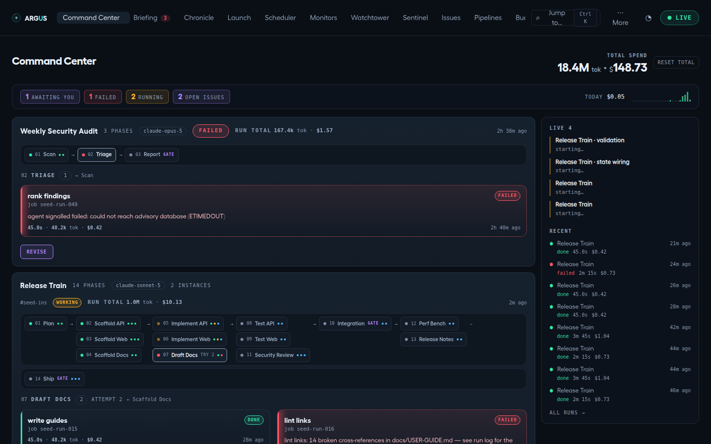
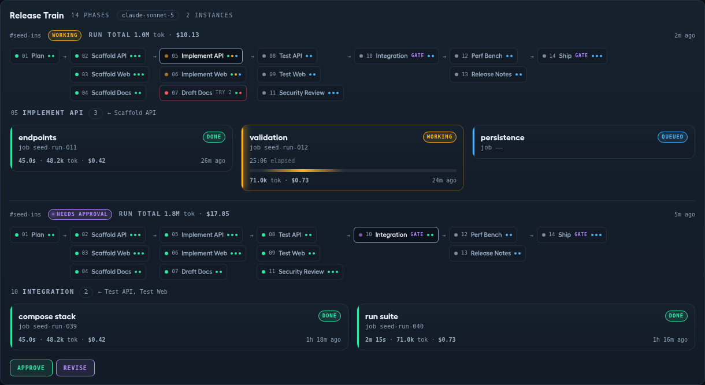
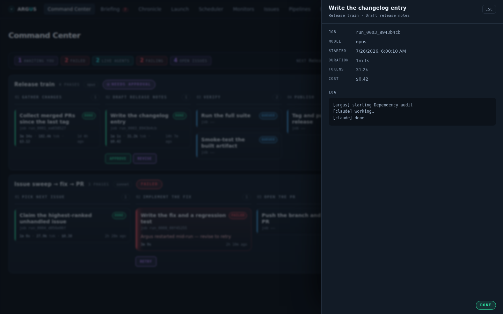
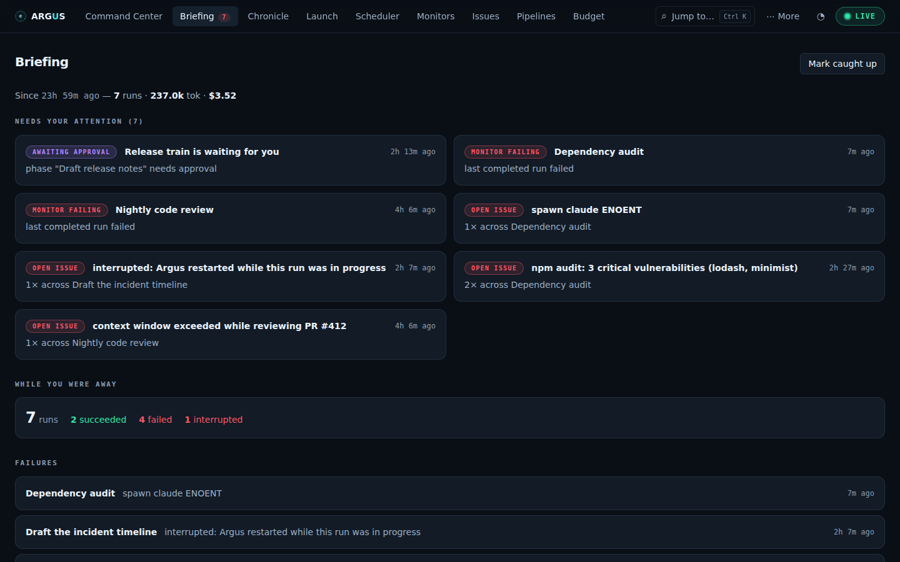
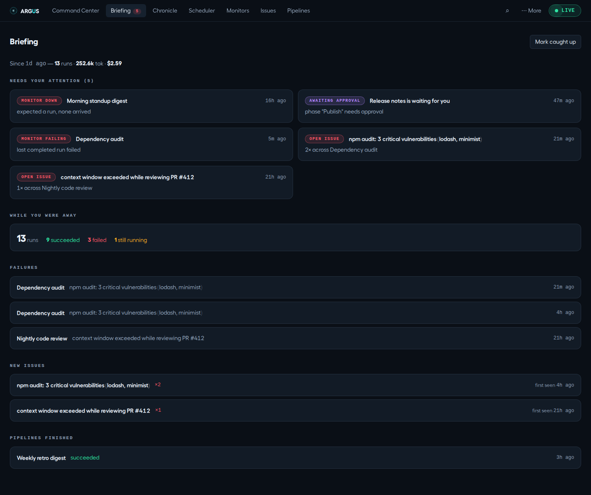
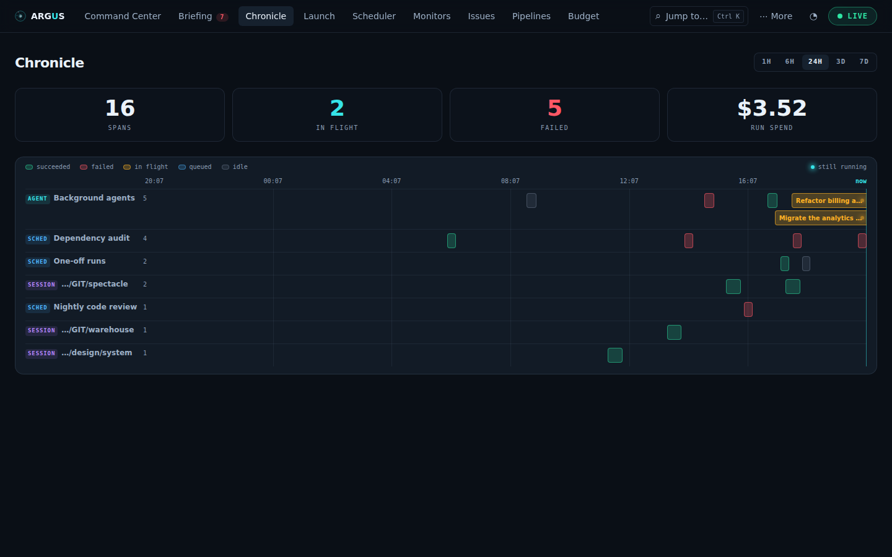
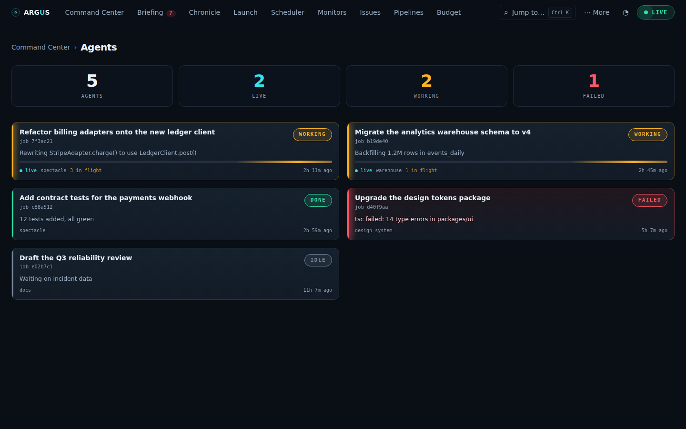
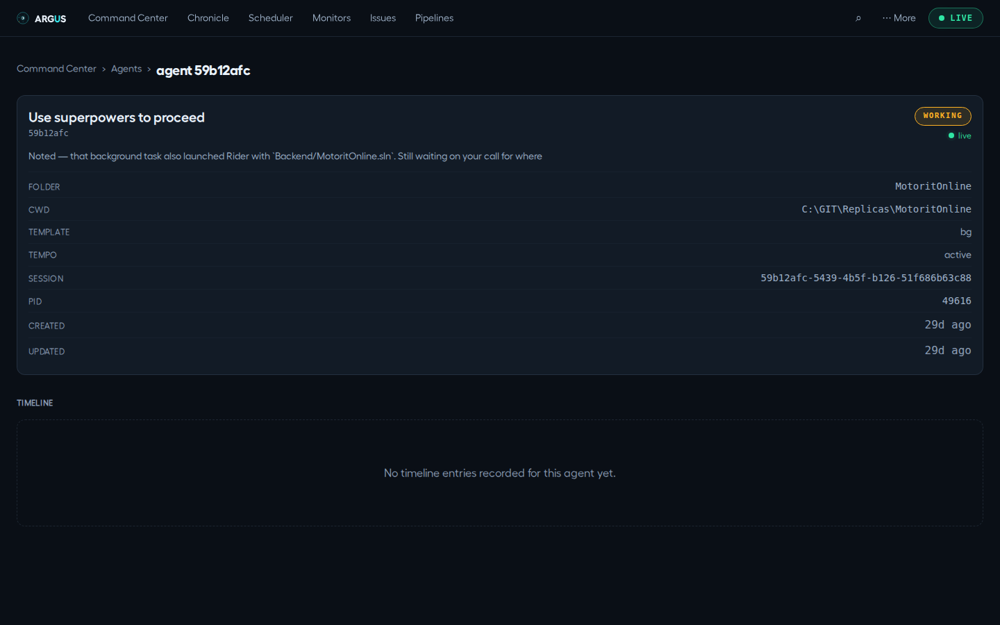

# Monitor runs and review recent work

[Documentation](../README.md) · [Feature guides](../guides/README.md)

See what is running, what needs attention, and the evidence behind a run.

## Before you start

At least one pipeline, schedule or one-off run for run history. The Agents page describes discovered CLI background jobs, not every Argus run.

## Try it

1. Open **Briefing** to review waiting gates, failures and other attention items.
2. Open **Command Center** for pipeline progress; select a phase or step for detail.
3. Open a run link to reach its **Flight Recorder**, then compare activity, final output and exit state.
4. Open **Chronicle** and choose a time window to compare runs with CLI sessions.
5. Mark the Briefing caught up only after reviewing what matters to you. This moves your digest checkpoint.

**Expected result:** You can trace an attention item to its source run and know whether it is running, waiting or settled.

## On this page

- [Command Center](#command-center)
- [Briefing](#briefing)
- [Chronicle](#chronicle)
- [Agents](#agents)
- [Agent Detail](#agent-detail)
- [Flight Recorder](#flight-recorder)

## Command Center

_Pipelines at a glance — the home tab._ Route: `#/command`

**Purpose:** one card per pipeline, attention-first, with a **phase graph**
drawing the whole pipeline's shape and a **focus panel** beside it showing one
phase's step tiles at a time. A phase waiting on you gets a **Review** button
on its row that opens the review drawer — this is the wall you keep open on a
second monitor.

**What you see:**

- A **situation strip** across the top, answering "does anything need me?"
  without reading the board: counts for gates awaiting you, failures, runs in
  flight, live agents, down/failing monitors and open issues — each a link to the
  view that explains it. It shows **only what is true**: a metric with nothing to
  report is omitted rather than drawn as a grey zero, and when there is genuinely
  nothing it says so. On the right: the next scheduled firing with a live
  countdown, today's spend against your daily limit as a bar, and a 24-hour
  histogram of run outcomes (failures stacked in red over successes).
- A **live activity rail** down the right: **Live** shows what is running right
  now, including scheduled runs and one-off launches that have no card on the board. Pipeline steps can show current tool activity; batch schedule/one-off invocations do not provide the same per-tool stream. **Recent** lists the last
  completed runs with outcome, duration and cost. On a narrow screen it moves
  below the board.
- A **card per pipeline**: name, phase count, the pipeline's **model chip**
  (e.g. `fable`, `opus`), an aggregated **status pill** (`awaiting approval`
  wins over `failed` over `working`…), the latest run's **Σ cost** (tokens +
  USD, including superseded revise attempts), and a freshness stamp.
- Under the header, the **phase graph**: one numbered node per phase carrying
  its status dot, name, a `gate` marker, a `try N` marker after a retry or
  revise, and one mini-dot per step (a `done/total` count once dots stop being
  countable). **Stages** — phases that can run at the same time — are rows,
  read top to bottom; the chain that continues stays in the left lane and
  branches that end the run hang to its right. When the stages are too wide
  for the card (a fan-out of many parallel phases), the graph turns sideways:
  stages become columns read left to right, and the parallel phases stack as
  one column. An edge that skips a stage runs down a lane of its own, so it
  never crosses a node. Every dependency is a drawn
  edge, so a fan-out reads as a fan-out and a join as a join: the path that
  ran is the green thread, a branch that was decided against is dashed, and a
  phase nothing depends on ends with a small terminator. A **route
  condition** sits as a label on the edge it governs, carrying the value
  alone (`verdict = "approved"`) — the phase that decides it is the line the
  label sits on. A skipped phase shows a hollow dot and a struck name.
  Hovering a node shows its full name, what the phase waits for and the
  conditions on it.
  The graph is scaled to fit the width of its tile (down to 60%) and scrolls in both
  directions beyond that. It **follows the run**: the running phase (or the
  middle of several running together) is kept centred, and the view glides
  to the next phase as the run moves on — the first and last phase centre
  too. Scrolling the graph yourself, or clicking a node, stops following;
  **Follow** (top-right of the tile) resumes it. **1:1** shows the graph at
  full size and **Fit** goes back. Edges with more graph beyond them fade out.
- Beside the graph (below it on a narrow card), the **focus panel**: one
  phase's **step tiles** — step name, `job <runId>`, a status pill, the
  failure reason if it failed, a live activity line and animated sweep bar
  while working, and a per-step meter — duration, tokens, dollars (e.g.
  `2m 19s · 23.5k tok · $1.09`). Its header names what the phase waited for
  (`←`) and where its routes lead (`→`), each with the condition it needs. By
  default the focus **follows the action** — the gate awaiting you, else the
  failure, else the live work, else the next phase up — so an untouched board
  always shows the detail that matters right now.
- If two instances of one pipeline run concurrently, the card splits into
  labeled sub-sections, one per instance, each with its own graph and focus.
- **Total spend** (top-right): the all-time board total. **Reset total** is a
  two-click armed confirm — the reset is irreversible.

**What you can do:**

- **Review** a gated phase that's awaiting you. The button opens the **review
  drawer**: the agent's closing note, the phase's structured result and Argus's
  own checks when it declared any, and every file the phase left in its
  artifact directory. The closing note renders as a document (it is the
  agent's last message, which is markdown); on a failed phase the one-line
  reason sits above it, and the rest of what the runtime handed the Stop hook
  — session id, transcript path, background tasks and the like — waits behind
  a **Raw payload** toggle. A `.md` artifact renders as a document; any other
  text file shows raw; a binary shows its size. The file a check required is badged
  **required** and opens first. `⌘K` → "review" reaches the same drawer
  without finding the card first, and `#/command/<instanceId>` deep-links to
  it — that is the link `argus tail` prints beside a waiting gate.
- **Approve** (green, in the drawer) continues the pipeline with exactly what
  is shown. **Revise** (labeled **Retry** after a crash-restart) asks for a
  note — your revision — and **Send** restarts the phase with it appended to
  the agent's prompt; that attempt's files are discarded. Nothing in the drawer
  edits an artifact: the note is how you change the outcome. Approve and Revise
  live in the drawer and nowhere else on the board.
- Both actions require a signed-in, approved account (see
  [Users & sign-in](administration.md#users--sign-in)); looking is open to everyone, and the
  server answers 401 to a decision unless you're authenticated. From a terminal,
  `argus approve` / `argus revise` do the same (see [`argus tail`](terminal.md#argus-tail)).
- **Click a phase node** to pin that phase's steps into the focus panel —
  every step of every phase is one click away; the edges into and out of the
  pinned node light up; click it again to return to following the action.

_A pinned phase: the graph keeps the whole pipeline ambient while the focus
panel shows the steps being asked about._

- **Click a step's name** to open its drawer, over the board rather than away
  from it: the run id, model, start time, duration, tokens, cost, the failure
  reason if it failed, a link to the transcript, **Cancel run** while it is
  still going, and the run log — tailing live while the step works.
- A tile that has just changed status flashes briefly, so a transition you
  weren't watching for doesn't pass unnoticed.

_A step's drawer opens over the board, so inspecting one run doesn't cost you the
view of the other eleven._

**Cost semantics:** a metric appears once at least one run reports it via the
runtime's result envelope; steps still running (or predating cost capture)
show nothing. Money spent on a retried phase still counts toward the row Σ.

**Where the data comes from:** `GET /api/overview` (re-fetched on the
`pipelines:changed` WS ping), `GET /api/insight` for the situation strip,
`GET /api/runs` for the rail, `GET /api/runs/:id` for the drawer's log,
`GET /api/totals` + `POST /api/totals/reset`, gate actions
`POST /api/instances/:id/approve` / `/revise`, and
`POST /api/runs/:id/cancel`.

## Briefing

_The "while you were away" digest — read this first after time away._
Route: `#/briefing`

**Purpose:** Argus exists so agents can run unattended — which means you're
usually not looking when things happen. The Briefing answers the two questions
you'd otherwise tour four tabs for: **what needs me right now**, and **what
happened since I last caught up**.

**The attention badge:** the Briefing tab shows a red count chip in the nav
bar whenever something needs you (visible from any tab). The count is the
number of attention cards below.

**Needs your attention** — state-now cards, most severe first, each
deep-linking to the tab where you act on it:

- **Monitor down** (→ Monitors): a schedule's expected run never arrived —
  the dead-man's switch fired.
- **Awaiting approval** (→ Pipelines): a gated pipeline phase is paused
  waiting for you to review it.
- **Monitor failing** (→ Monitors): the schedule runs, but its last completed
  run failed.
- **Open issue** (→ Issues): an unresolved failure group, with its occurrence
  count and affected schedules.

**While you were away** — everything below is scoped to the window since your
last acknowledgement (or the last 24 h if you've never acknowledged; capped at
7 days):

- The header line totals the window: **runs · tokens · cost**.
- A run-outcome strip: succeeded / failed / interrupted / cancelled / skipped
  / still running counts.
- **Failures** — the windowed failed runs (schedule, first error line, when),
  newest first.
- **New issues** — failure groups whose _first_ occurrence is inside the
  window, i.e. genuinely new breakage, not an old known issue recurring.
- **Pipelines finished** — instances that reached a terminal state in the
  window.

**Mark caught up** (top right): stamps now as your acknowledgement point and
resets the window — the digest empties, and tomorrow's briefing starts from
this moment. Attention cards are unaffected (a down monitor stays down until
it actually recovers). The acknowledgement is stored in Argus-owned
`~/.claude/argus/briefing.json`.

**All caught up:** when nothing needs attention and nothing ran in the
window, the tab says so and gets out of the way.

**Where the data comes from:** `GET /api/briefing` (a pure derivation over
runs + schedules + issue triage + pipeline instances; re-fetched on the
`schedules:changed`, `pipelines:changed`, `issues:changed` and
`briefing:changed` WS pings), `POST /api/briefing/ack`.

## Chronicle

_Everything that ran, on one timeline._ Route: `#/chronicle`

**Purpose:** a swimlane timeline that merges **scheduler runs**, **background
agents**, and **sessions** into a single windowed view — see a day of activity
in one glance, spot overlaps, and click into anything.

**What you see:**

- A **time-window switch** (top-right): **1H / 6H / 24H / 3D / 7D** (default
  24H). This is the zoom — there's no free pan; the window always ends at
  `now` (bold marker on the right edge).
- Four counters: **Spans**, **In flight** (still running), **Failed**, and
  **Run spend** (USD reported by scheduler runs in the window).
- One **swimlane per group**, labeled with a kind badge — `SCHED` (a
  schedule's runs), `AGENT` (background agents), `SESSION` (one lane per
  project) — followed by rows of **span bars** colored by status
  (working/done/failed/queued). Still-running spans render open-ended with a
  pulsing dot at `now`. Hover a bar for label, start→end, status and cost.
- Empty state: _"Nothing happened in this window. Widen it, or launch an
  agent and watch it appear."_

**What you can do:** switch the window; click a span to jump to its source
(e.g. a schedule's card in the Scheduler).

**Where the data comes from:** `GET /api/chronicle?hours=N` (1–336), merging
the scheduler's run records with `~/.claude/jobs/` and
`~/.claude/projects/*/​*.jsonl`.

## Agents

_The status board for background jobs._ Route: `#/agents`

**Purpose:** the at-a-glance board for all background Claude Code jobs.

**What you see:**

- A **summary row**: total agents, how many are **live**, **working**, and
  **failed**.
- A grid of **agent cards**: name, short id, a color-coded status pill
  (`working / done / failed / idle / queued`), a pulsing green **live** dot if
  it's running right now, the current detail line, a result box when there's
  finished output, and a footer — folder, tempo, and last-update time.

**How to use it:** scan colors to triage — green pulse = running now, red =
failed. **Click any card** to open that agent's [Detail](#agent-detail).

**Where the data comes from:** `GET /api/agents`, merging
`~/.claude/jobs/<short>/state.json` with `~/.claude/daemon/roster.json`
(an agent is "live" only if it's an active worker in the roster).

## Agent Detail

_Single-agent deep dive + timeline._ Route: `#/agent/<short>`

**Purpose:** everything about one agent, including the chronological trail of
how it got to its current state. A card click on Agents lands here.

**What you see:**

- A **metadata card**: name, short id, status pill, live dot, current
  detail/result text, and the full field list — folder, full CWD, template,
  tempo, session id, PID, task counts, and created/updated timestamps as
  relative times.
- A **timeline**: every recorded state transition, newest first, with a
  status-colored dot, pill, timestamp and optional detail line; long entries
  get a "Show details" expander. Agents that predate timeline capture show an
  honest "no timeline entries recorded" note instead.

**How to use it:** read the timeline bottom-to-top to follow the agent's life
story. Use the breadcrumb to go back to Agents.

**Where the data comes from:** `GET /api/agents/:short/timeline`, reading
`~/.claude/jobs/<short>/timeline.jsonl`. Works even for agents no longer in
the main list.

## Flight Recorder

_Any run, replayed as a scrubbable timeline._ Route: `#/run/<runId>` (and
`#/run/<runId>/<ms>` for a specific moment)

**Purpose:** a transcript is a JSONL wall — thousands of lines where the one
that matters looks exactly like the ones that don't. The Flight Recorder is the
same information as a **recording**: every tool call, file diff, token burst
and cost tick placed on one time axis, with a playhead you can drag.

**How to get there:** expand any run row (Scheduler, Launch, Issues
occurrences) and click **▶ replay**.

**What you see:**

- **Totals** — tool calls, file edits, errors, tokens, cost for the whole run.
- **Lane strips** — one density band per lane (Agent, Tools, Files,
  Tokens & cost) showing _where_ the activity was. Dense stretches read as
  solid; quiet stretches read as gaps. A vertical line marks the playhead.
- **The scrubber** — a range slider over the run's full duration. Its
  accessible value announces both the clock position and the event under the
  playhead.
- **The event list** — a 41-row window that follows the playhead. Click any
  row to seek to it.
- **The now panel** — the one event you are parked on, in full: the command,
  the message, the error body, the file path with `+added / −removed`, the
  token burst and running spend.

**What you can do:**

- **Play / pause** at 1×, 5×, 20× or 100×. Playback stops at the end rather
  than looping.
- **Step** to the previous/next event. A cluster of events sharing one instant
  is stepped over in one press, so the clock always moves.
- **Jump to failure** — on a failed run, lands on the _errored tool call_, not
  the terminal "it failed" marker. Keyboard: `f`.
- **Copy link to moment** — the URL carries the scrubber position, so a link
  to a recording is a link to minute four of it.
- Keyboard throughout: `space` play/pause, `←`/`→` step, `f` jump to failure.

**Honest limits, stated in the UI:**

- **Cost is apportioned, not measured.** The CLI reports one `total_cost_usd`
  for the whole run; per-event dollars are that figure split by token share.
  The view says so under the track.
- **Long runs are trimmed.** Past 2,000 events the earliest ones are dropped
  (the end of a run is where failures live). Offsets stay absolute, so the
  track simply starts partway in — and says that it did.
- **No transcript, no timeline.** A skipped run, a run with no session, or a
  pruned transcript gets an empty state that explains which of those it is.

**Where the data comes from:** `GET /api/runs/:id/recording`, derived on every
read from the run record plus `projects/<project>/<sessionId>.jsonl`. Nothing
is persisted — the transcript stays the source of truth.
