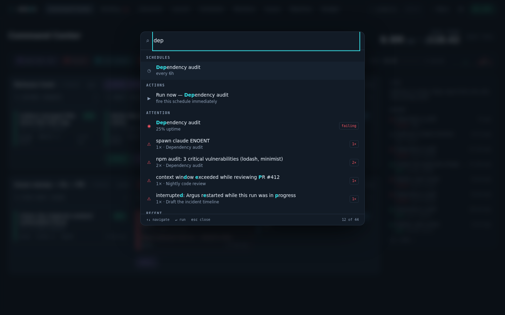
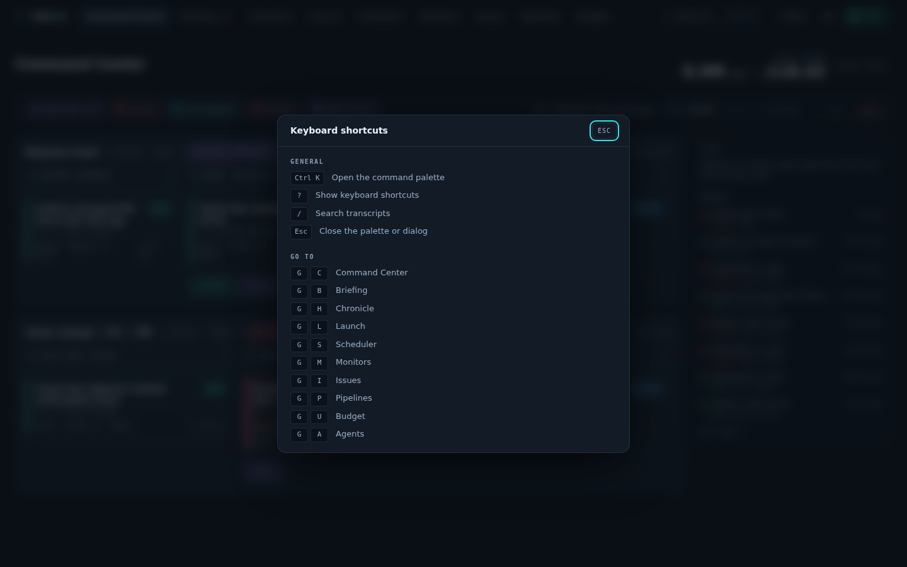

# Navigation and natural-language actions

[Documentation](../README.md) · [Feature guides](../guides/README.md)

Find pages, records and actions from anywhere in Argus.

## Before you start

A running dashboard. Planning a natural-language action can invoke the configured analysis runtime.

## Try it

1. Press **Ctrl K** (Windows/Linux) or **⌘K** (macOS), type a feature name, and select it.
2. Press **?** to see the actual keyboard shortcuts. Use browser Back to return from a detail view.
3. For an Omnibar request, read the proposed changes in its preview before confirming. A preview is not an applied change.
4. If the live dot is disconnected, follow [connection troubleshooting](../reference/operations.md) before judging the data as current.

**Expected result:** You can find the feature you need and distinguish a preview from a completed action.

## On this page

- [Global UI](#global-ui)
- [Omnibar](#omnibar)

## Global UI

Applies to every tab.



_`⌘K` from anywhere: three characters find the schedule, its live monitor
health, the issues it raised, and the action that fires it now._



- **Command palette — `⌘K` / `Ctrl K`.** The fastest way to anything. Type a few
  characters and it fuzzy-matches across every destination, pipeline, schedule,
  failing monitor, open issue, background agent, project and recent transcript —
  "dpa" finds _Dependency audit_, "rt" finds _Release train_. It also carries
  **actions**: open the review of a pipeline waiting at a gate, run a schedule
  now, mark the Briefing caught up. `↑`/`↓` move, `Enter` runs, `Esc` closes; the rows you use
  float to the top next time you open it with an empty query. An action that
  talks to the server keeps the palette open long enough to report a failure
  rather than closing over it. The **Jump to… ⌘K** button in the bar opens the
  same thing.
- **Keyboard shortcuts — `?`.** Lists every binding, and only the ones currently
  available. `g` then a letter jumps: `g c` Command Center, `g b` Briefing,
  `g h` Chronicle, `g l` Launch, `g s` Scheduler, `g m` Monitors, `g i` Issues,
  `g p` Pipelines, `g u` Budget, `g a` Agents. `/` goes to transcript search.
  Single-letter shortcuts never fire while you are typing in a field.
- **The connection pill** (top-right) reflects Argus's link to its own server,
  not the health of your agents. **Green "Live"** = the WebSocket is connected.
  **Red "Offline · retrying in 8s"** = it dropped, with the actual countdown to
  the next attempt and a **Retry** button for when you know you have just fixed
  the server. Reconnects back off to 30s but happen immediately when you return
  to the tab, so coming back never means waiting one out.
- **Notification bell** (top-right): every alert raised _this session_, newest
  first, with an unread count — because a toast lasts eight seconds and most of
  them fire while you are in another tab. Each entry links to the view it is
  about; opening the panel marks them read. For what changed while Argus ran
  without you at all, use [Briefing](monitoring.md#briefing).
- **Navigation** is split by role: the eight **destination** tabs (Command
  Center, Briefing, Chronicle, Scheduler, Pipelines, Health, Issues, Budget)
  sit in the bar; the **⋯ More** menu holds Sentinel and the reference pages
  (Sessions, Stats, Inventory, Fleet, and Users for the root account).
  Scheduler and Health each carry a sub-tab in the hash — **Schedules |
  One-off** and **Monitors | Watchtower** — so a link lands on the half it
  means. Drill-down views (Agents, Detail, Flight Recorder) are reached
  through links, breadcrumbs and the palette; Search through `/` and the
  palette. Old hashes (`#/launch`, `#/monitors`, `#/watchtower`,
  `#/projects`, `#/activity`, `#/tasks`) are rewritten to where their content
  went. On a phone the bar collapses to a **menu** naming your current
  destination, listing every tab at once with its attention badge.
- **Auto-refresh:** the server pushes a "something changed" ping over a
  WebSocket whenever a watched file mutates, and the UI re-fetches. Those
  re-fetches are conditional, so a ping that did not change what you are looking
  at costs a few bytes and repaints nothing. If the socket drops, each tab polls
  on a timer instead; while a fetch is failing the last good values stay on
  screen rather than blanking. You rarely need to refresh the browser.
- **Notifications:** a bottom-right **toast stack** (max 4, auto-dismiss
  after 8s) fires from any tab when a background agent finishes or fails,
  when a **monitor alert** arrives (down / failing / recovered — see
  [Monitors](health-and-quality.md#monitors)), and when a **budget alert** arrives (crossing
  80%, crossing a limit, or dropping back under — see [Budget](budget-and-history.md#budget)).
  If you grant the browser's notification
  permission (asked once), the same events also fire **native OS
  notifications**, so you hear about failures with the tab in the background.
  Everything that toasts is also kept in the bell above.
- **Loading** shows a skeleton shaped like the content that is coming, so the
  layout is settled before it lands. Relative timestamps ("3m ago") keep
  themselves current instead of freezing at first render.
- **When a view breaks**, only that view breaks: it is replaced by a message
  naming it and a **Try again** button, while the nav, the palette and every
  other tab keep working.
- **Routing** is hash-based (`#/command`, `#/agents`, `#/search`…), so tabs
  are bookmarkable and the back button works. An unknown hash lands on the
  Command Center.
- **Setup banner:** startup automatically attempts fixable prerequisite repairs. If **Setup incomplete** remains, inspect the per-runtime check details and use **Apply fixes** for the reported fixable items. A missing CLI or malformed configuration needs investigation. Only runtimes used by the default or saved definitions are required. [Installation and setup](../getting-started/README.md#3-check-the-server-and-setup) explains hook differences; OpenCode completes from its finished run record rather than a command hook.

## Omnibar

_Say what you want; read exactly what would change; then confirm._ Lives inside
the [command palette](#global-ui) — `⌘K`, then type a sentence.

**Purpose:** the palette is already the fastest way to _go_ somewhere. The
Omnibar makes it the fastest way to _change_ something, without giving up the
thing that makes a control plane trustworthy — that you can see what is about to
happen before it does.

### How it behaves

Type two words and the palette does what it always did: fuzzy-jump. Type a
sentence — three words and twelve characters is the threshold — and it offers to
interpret it instead.

- **`↵` when nothing matched** compiles the sentence.
- **`⌘↵` at any time** compiles it even when commands did match, so a phrase that
  happens to fuzzy-match is not stuck.
- **`esc`** leaves intent mode and returns to the list. A second `esc` closes the
  palette. Losing a typed sentence to a stray keypress is a real cost.

The threshold is deliberately conservative in both directions. "nightly triage"
must stay a search, because jumping is what the palette is for and a planning
pass costs real money; "pause everything touching Spectacle" should be
recognisable without learning a prefix character.

### The preview is the whole feature

Compiling shows an explicit table: for every change, what it touches, what it is
now, and what it becomes.

```
schedule disable   Nightly triage      enabled → disabled
schedule disable   Dependency audit    enabled → disabled
```

Nothing has happened at this point. **Apply** applies all of it; **Cancel**
applies none of it. There is no third path.

Three properties make that trustworthy rather than merely reassuring:

- **The verbs are a closed set.** Disable or enable a schedule, resolve or ignore
  an issue, abort a live pipeline instance, set the daily or monthly budget.
  That is the whole vocabulary, and the server drops anything outside it. The
  planner cannot invent a capability Argus does not already expose.
- **The targets must already exist.** Every id is checked against live state, and
  every label, `before` and `after` you read is computed by the server from the
  real record — never supplied by the model. A plan cannot describe itself
  misleadingly, and an invented schedule name is dropped before you see it.
- **What executes is the plan, not the sentence.** Confirming sends the plan's
  id. The sentence is never re-interpreted, so the list you approved is the list
  that runs.

**Warnings** appear under the plan and never block it: a target that was
dropped, a verb that was not understood, a change that would be a no-op. They
are information about how your sentence was read.

### Questions are answered, not planned

"When did the nightly triage last run?" is a question, and routing a question
through a confirm step would be theatre. Those come back as an inline answer
with deep links into the app. Links are in-app routes only.

### All of it or none of it

Argus's state lives in several independent files, so a true cross-file
transaction is not available — and claiming one would be the dishonest move.
What you get instead is a compensating transaction, with four outcomes it will
tell you apart:

| Outcome         | What happened                                                                             |
| --------------- | ----------------------------------------------------------------------------------------- |
| **applied**     | Every change is in effect.                                                                |
| **stale**       | Nothing was attempted — live state no longer matches the preview.                         |
| **expired**     | Nothing was attempted — the plan was over five minutes old, or already run.               |
| **rolled-back** | One change failed; the earlier ones were reversed. Nothing is in effect.                  |
| **partial**     | A change failed **and** a reversal failed. Some changes are in effect; go and check them. |

`partial` is reported loudly and named exactly, because it is the only case
where a human has to go and look. Aborting a pipeline is the one action with no
inverse — a killed process does not come back — so a plan containing an abort
can only ever be unwound up to that point, and says so.

A plan is **single-use** and expires after five minutes. Plans are not persisted:
a confirmation surviving a restart would land against state nobody has looked at
since.

### Safety

Both Omnibar planning and execution require an **approved account login**. Account requirements are route-specific; not every mutating API route requires an account session. See [authentication](../reference/operations.md#authentication-and-browser-access). Planning spawns a bounded analysis pass through the same runner
Autopsy and Verdict use — one at a time, ninety-second timeout, output capped,
metered into the spend ledger, and refused outright while the budget hard stop
is in force.

A note on trust: your sentence, and the catalogue it is compiled against, both
contain text Argus did not author — an issue title is whatever a failing run
printed. That text reaching the planner is fine by construction, because a
planner cannot do anything except propose verbs from the closed set against ids
that already exist, and you read the result before it happens. The confirm step
is not a formality; it is the security model.

**Where the data comes from:** schedules, open issues, live instances and the
budget config, read fresh for each pass. Pending plans are held in memory only.
