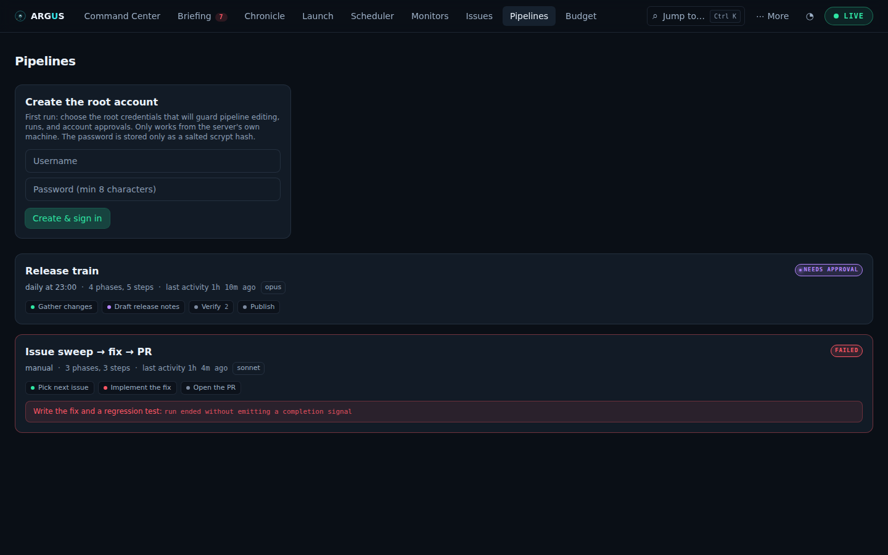
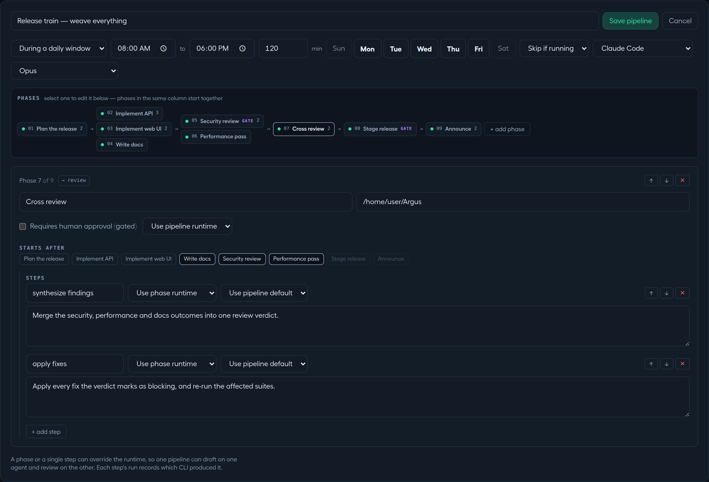

# Pipelines, human gates and advanced execution

[Documentation](../README.md) · [Feature guides](../guides/README.md)

Build a flow from named phases and steps, inspect results, and control progression.

## Before you start

A signed-in root or approved member, a working runtime, and a working directory for each phase. See [accounts](administration.md#users--sign-in).

## Try it

1. Open **Pipelines → New pipeline** and give the flow a name. Start with a manual trigger.
2. Create a phase with a name, an existing working directory and one complete prompt. Set its runtime explicitly for your first pipeline.
3. Add a second phase if needed. Leave the default linear order until the simple flow behaves as expected.
4. Mark a phase **Requires human approval (gated)** when you want to review its completed work before progression.
5. Save, choose **Run now**, and inspect its instance in **Command Center**.
6. At a gate, inspect output, checks and changes. Choose **Approve**, **Revise**, or **Abort** according to the evidence.
7. Inspect the final instance and run records. Editing a definition changes the next instance, not one already started.

**Expected result:** A pipeline instance records the definition it started with. Agent completion, verification and human approval remain separate evidence.

## On this page

- [Pipelines](#pipelines)
- [Weave](#weave)

## Pipelines

_Author multi-phase, human-gated agent flows._ Route: `#/pipelines`

**Purpose:** define pipelines — ordered **phases**, each with a working
directory and one or more **steps** (a step = one headless agent run with its own
prompt) — then launch them manually or on a trigger and watch them on the
[Command Center](monitoring.md#command-center). A phase can be **gated**: the pipeline
pauses there until a human approves or revises.

**What you see:** one card per pipeline, and the card says where its latest run
got to: the trigger, phase and step counts, when it last did anything, the spend
of that run, the model, a **paused** badge when disabled, and a live status pill.
Under that, **one chip per phase** coloured by state — so which phase is running,
which is waiting on you and which failed is answerable without leaving the list.
A failed run names the step and the first line of its reason. A pipeline that has
never run still shows its phases, greyed, because that is what it is going to do.

When you're **signed out**, the **Login** panel appears here (see
[Users & sign-in](administration.md#users--sign-in)) — viewing is open, but every mutating
action requires a signed-in, root-approved account.

**The pipeline form** (+ New pipeline / Edit):

- **Name**, **trigger** (manual — i.e. no trigger — or interval / daily /
  weekly / windowed / **Webhook** / **After pipeline** — see
  [§5 Scheduler](scheduling.md#scheduler) for what the last two do and how the webhook's
  URL and token are shown once saved), **overlap policy** (skip if running /
  allow overlap), a pipeline-default **runtime**, and a runtime-dependent **model** (alias, custom entry, or inherit the CLI default). Model availability comes from the CLI/provider configuration, not the existence of a picker option.
- A **phase rail** — the same stage layout as the Command Center board: one
  chip per phase, phases that start together stacked in one column, gates
  marked, and a red dot on any phase that still needs a field. The rail is the
  whole pipeline at a glance; selecting a chip edits that phase in the panel
  beneath, so a fourteen-phase pipeline is one screen, not fourteen screens of
  stacked inputs.
- The **focus panel** carries the selected phase: name, working directory, a
  **"Requires human approval (gated)"** checkbox, an optional per-phase
  **runtime override** — and **"Starts after"**, where the phase's
  dependencies (`needs`) are edited as toggles. Choices that would create a
  cycle are disabled and say so; the rail re-lays the graph as you click, so a
  fan-out is authored by looking at the fan-out. A pipeline that never touches
  "Starts after" stays linear, exactly as before.
- Inside the phase, ordered **steps** — each with a name, optional per-step
  **runtime / model / effort overrides**, and its prompt. Reorder or remove
  phases and steps freely; **Save** stays disabled until every phase has a
  name, cwd and at least one complete step (the rail marks the incomplete
  ones). Phase features authored via the API — retry policies, published
  artifacts, rubrics, auto-approve — show as badges on the panel and are
  preserved on save.

**What you can do (signed in):**

- **Run now** — start an instance (hidden while one is running unless overlap
  is allowed).
- **Stop / Stop all (N)** — abort active instances (with confirm).
- **Enable / Disable**, **Edit**, **Delete** (with confirm). An instance runs
  the definition it started with — snapshotted onto the instance — so editing
  the pipeline while instances are running or waiting at a gate does not change
  them. Saving such an edit asks first, so you know a fixed prompt lands on the
  _next_ start rather than the one you are watching; renaming, changing the
  trigger or overlap policy, and enabling or disabling save without asking.
- Approving/revising a **gated phase** happens on the Command Center, inline
  on the paused row.

**Reliability:** each card has a **Reliability ▾** disclosure — open it and,
over the trailing 30 days, Argus shows the pipeline's **first-attempt pass
rate** (settled instances where every phase that ran passed on its very first
try) and its **lucky-pass rate** (successful instances that only got there
after a retry or a human revise), a day-by-day sparkline of succeeded vs.
failed instances, and a per-phase table naming each phase's first-try / lucky
/ failed counts and its most common failure class. A rate reads as "—" rather
than 0% when nothing has settled yet in the window — an unproven pipeline is
not the same fact as a broken one. This is Argus grading its own retry loop,
not the agent's output (that's [Verdict](health-and-quality.md#verdict)) or a run's shape
against its own history (that's [Watchtower](health-and-quality.md#watchtower)).

**Memory:** a pipeline can turn on `memory` (via the API — see
[HARNESS.md §13](../HARNESS.md#13-context-and-memory)) to keep a small durable
notes file, `NOTES.md`, that survives from one instance to the next. Off by
default. Once enabled, a step's prompt can read the notes back with
`{{memory}}` and append to them at `$ARGUS_MEMORY_DIR/NOTES.md` — handy for a
pipeline that should remember a decision, a gotcha, or something a previous
run tried and learned from, without re-deriving it every time. Argus trims the
file back to its cap after each instance settles, and never deletes it, even
if the pipeline itself is later deleted.

**Stall detection:** a step's `timeoutSeconds` catches a run that goes on too
long; it does nothing for one that is technically still alive but has stopped
producing any output at all — stuck on a hung command, say. A phase (or a
step) can additionally set a **stall** limit (`stallSeconds`, editable right
beside the timeout field in the phase panel): if that many seconds pass with
no new activity from the step, Argus kills it and fails the phase the same way
it would a timeout, distinguishing the two in the run's record and journal so
you can tell "it ran out of time" from "it went quiet."

**How steps complete:** applicable runtime hooks installed by Setup let agents signal "step finished"; Claude Code also integrates AskUserQuestion pauses. Hook support differs by runtime, with finished-run fallback described below. Signals are sent back to Argus
(`POST /api/instances/:id/signal`, authenticated by a token Argus hands each
run for that run alone — this is the one instance endpoint that doesn't need a
login). By default, a completion requires one unambiguous
`ARGUS_OUTCOME: succeeded` marker in the final message. Missing or conflicting
outcomes are classified as `unverified`. A pipeline (or phase) can declare
`"completion": { "marker": "lenient" }` to accept a markerless completion
**signal**, but failed, blocked and conflicting markers still refuse completion.
Leniency does not apply to run-record recovery.

The marker is the agent's own report, not a check that its work is right. The
Stop hook is preferred; where a finished process did not signal — because its
runtime's hook is best-effort (Codex) or because it has no command hook at all
(OpenCode) — Argus can recover only from a successful run record whose final
message contains one unambiguous `ARGUS_OUTCOME: succeeded`. An OpenCode phase
therefore advances on the next reconcile tick rather than instantly. New run
tokens are bound to the instance, phase, attempt and run, with only their digests
persisted. Legacy instance tokens apply only to launches made before the
upgrade. Reapply Setup's hooks when upgrading to the version 2 hook protocol.
Hook delivery errors and non-2xx responses are written into the run log for
diagnosis.

**Where the data comes from:** `~/.claude/argus/pipelines.json` and instance
records under `~/.claude/argus/instances/` via `GET/POST /api/pipelines`,
`PUT/PATCH/DELETE /api/pipelines/:id`, `POST /api/pipelines/:id/start`,
`GET /api/overview`, `GET /api/instances/:id/phases/:phaseId/{review,artifact}`,
`POST /api/instances/:id/{approve,revise,abort}`,
`GET /api/pipelines/:id/reliability?days=` (the Reliability disclosure; see
[the API reference](../API.md#reliability)); a webhook trigger additionally uses
`POST /api/pipelines/:id/hook-token/rotate` and is fired from outside Argus at
`POST /api/hooks/pipelines/:id`; an after-pipeline trigger is evaluated by the
scheduler tick against `~/.claude/argus/chains.json` (see
[the API reference](../API.md#webhook-and-chained-triggers-v04)).

## Isolation, candidates and configuration analysis

These controls are available in the pipeline form and on its saved card. Start
with one ordinary run, then add isolation and candidates deliberately: each
candidate can invoke a provider and incur cost.

### Choose an isolated workspace

1. In the pipeline form, find **Isolation** beside the default runtime/model.
2. Select **Shared worktree per instance** to share one isolated tree across the
   instance, or **Fresh worktree per attempt** to start attempts separately.
3. In a phase's panel, leave its isolation inherited or choose a phase override.
   **None** opts out and runs in the authored working directory.
4. Save and run against an existing Git repository. Inspect the instance's
   workspace and branch before reviewing changes. Argus keeps the branch and
   removes the managed directory when the instance ends; see the [workspace
   lifecycle](../HARNESS.md#11-workspace-isolation) for exact cleanup behavior.

Worktrees start from the configured base ref (**HEAD** by default); uncommitted
edits in the authored checkout are not copied into the new tree. With default
cleanup, only committed work survives on the retained branch; dirty files are
discarded with the directory. For workflows that leave changes uncommitted for
human review, author `keep: true` through the API before running, for example
`"workspace": { "scope": "instance", "keep": true }`. The form's Isolation
selector does not expose `base` or `keep`; see the reference for those fields and
candidate-specific cleanup. Do not rely on the retained branch to preserve dirty
work.

### Compare candidate runs

1. Give the phase exactly **one step** and select **Fresh worktree per attempt**.
   The form explains these prerequisites when Candidates is disabled.
2. Set **Candidates** to a count from 2 to 8. Choose **First verified wins** to
   stop the other candidates after a qualifying result, or **Cheapest verified
   wins** to finish all candidates and select by the configured cost ordering.
3. Leave each candidate's runtime/model inherited, or set variants for a
   deliberate comparison. Each candidate receives its own worktree/artifact
   directory.
4. Declare meaningful verification checks using the [candidate protocol](../HARNESS.md#12-candidates)
   and [API harness reference](../API.md#harness--capabilities-verification-timeouts).
   A candidate label does not establish output quality without checks.
5. Run and inspect the selected result and the other candidate outcomes. The
   selection is an execution policy, not a model's correctness certificate.

### Analyze model, effort and execution limits

1. On a saved pipeline card, choose **Analyze** while signed in. This requests
   analysis for the phases and may invoke providers.
2. Review the proposed model, effort, timeout or maximum-turn changes and their explanation.
   The allowed fields depend on the runtime; the analysis does not propose a new runtime.
3. Select the proposals you accept and choose **Apply selected**. Analysis does not rewrite step prompts and
   does not save configuration until a proposal is applied.
4. Check the resulting definition before the next start. Existing instances
   continue with the definition they snapshotted.

Exact tuning operations and retained proposals are documented in [API tuning](../API.md#tuning).

## Weave

_Pipelines as a typed graph: fan-out, fan-in, retries, artifacts, routes._
Authored on [Pipelines](#pipelines); rendered on the
[Command Center](monitoring.md#command-center).

**Purpose:** a pipeline used to be a list — phase 1, then 2, then 3. Real work
branches: plan once, then build and test in parallel, then ship when both are
done. Weave makes the dependency graph explicit.

**Every pipeline you already have keeps working, unchanged.** A definition where
no phase declares `needs` is _linear_, and each phase implicitly waits for the
one before it. That is not a compatibility shim — it is the degenerate shape of
the general rule, so the executor has no separate linear path that could drift.

**Declaring the graph** (per phase, in the pipeline definition):

- **`needs: ["plan"]`** — the phase ids this one waits for. Declaring `needs`
  on _any_ phase makes the whole graph explicit: phases without it become
  roots, rather than silently inheriting a predecessor. A mixed reading would
  make the same definition mean two things depending on where you looked.
- **`retry: { attempts, backoffSeconds, retryOn }`** — see below.
- **`produces: "plan"`** — publish this phase's payload as an artifact.
- **`result: { artifact, resultStep?, schema }`** — publish a _validated_
  structured decision other phases can branch on. See **Routing** below.

**Cycles and dangling edges are rejected when you save**, naming the phases
involved. Without that check, a bad graph is not an error — it is an instance
that starts and then simply never finishes. Routes get the same treatment: a
condition on a phase that decides nothing, a field its schema never declares, or
a value its type cannot hold is refused at save time, because an unchecked
condition does not fail loudly — it is simply false forever.

**What you see:** when a pipeline actually branches, its card draws a **graph**:
one column per stage, phases that can run together stacked in a column, and each
phase listing what it waits for. A linear pipeline draws no graph — one column
per phase says "graph" and shows nothing the phase pills didn't. An instance
that carries no dependency information at all also draws nothing: absent edges
mean _unknown_, not _parallel_.

**How branches behave:**

- Both branches of a fan-out start together; a fan-in waits for **every**
  dependency, not the first one to finish.
- A gate pauses the instance's handling of agent outcomes, verification
  results and candidate selection. A sibling process may keep running, but
  incoming completion signals are acknowledged and ignored while the instance
  awaits approval. Already-committed launches and knowledge commits can still
  be recovered for running sibling phases; recovery never opens the waiting
  gate. The board points at the gate that needs a human.
- A failed branch does not terminalize the instance while a sibling is still
  running — that would render a stopped pipeline with a live process still
  writing into it. The failure is recorded on the phase; the instance settles to
  failed once nothing is left that could progress.
- **Revise** touches only the phase you revised; a sibling that is legitimately
  running is not silently aborted. **Abort** stops everything.

**Retries.** A phase may declare `attempts`, a `backoffSeconds` that doubles
each time (capped at an hour), and which failures are worth retrying:

- `spawn` — the process never started,
- `exit-code` — it exited non-zero,
- `signal` — the agent _reported_ failure,
- `unverified` — completion had no valid, unambiguous outcome marker.

When a retry policy is declared, its default failure list is
`["spawn", "exit-code", "unverified"]`. An explicit `retryOn` list replaces
that default, so add `unverified` if marker failures should retry.
The omission of `signal` is deliberate: an agent that signalled failure has
considered the work and reported on it, so
re-running the same prompt mostly just spends the money twice. Retries are
_scheduled_ (a timestamp on the phase) rather than held in a timer, so a backoff
survives a restart. A **revise** resets the retry budget — otherwise a phase
that had exhausted its retries could never be revised again.

**Routing: letting the work decide what happens next.**

A phase can publish a decision, and a dependency can say when it applies. In the
editor that is two controls in the phase panel: **"Publishes a structured
result"** (an artifact name and a short list of typed fields) on the deciding
phase, and a **Routes** row under "starts after" on each phase that depends on
it — `always`, `only if <field> is <value>`, or `otherwise`.

The example the whole feature is built around: `evaluate` decides
`{ "accepted": true|false }`; `publish` needs `evaluate` only if
`accepted is true`; `repair` needs it only if `accepted is false`. When the run
lands on `accepted: true`, `publish` starts and `repair` is **skipped** — not
failed, not idle. A later `report` phase needs both with **accept skipped**
ticked, so it runs after whichever branch actually happened.

- **The value comes from a file, never from prose.** A deciding step is told to
  write its JSON to the path in `ARGUS_RESULT_FILE`, and the stop hook sends
  that parsed value to Argus. `ARGUS_OUTCOME` keeps meaning exactly what it
  meant: whether the run _worked_. An agent that decides "reject" has succeeded.
- **A missing or malformed result fails the phase**, with a reason saying which,
  under the phase's ordinary retry policy. It is never quietly read as one of
  the branches.
- **Groups** make one decision out of several routes: name a group on each edge
  and tick `exclusive` (at most one may match — two is a failure, not a guess),
  `required` (at least one must), or mark one edge `otherwise` as the default
  taken when nothing else matched.
- **A skip travels.** Anything that only depended on a skipped phase is skipped
  too. An instance whose every phase either succeeded or was intentionally
  skipped **succeeds** — half the graph not running is the plan, not a problem.
- **A failure is not a skip.** If a phase fails, its dependents stay pending and
  the instance fails, exactly as before. Only routing skips work.
- **A gate decides last.** A gated deciding phase validates its result when the
  agent finishes and takes its route only when you approve.
- **A decision is taken once.** It is recorded on the instance, and everything
  afterwards — a restart, a revise downstream, an edit to the definition — reads
  the record rather than deciding again. What ran is what the record says ran.

**What you see:** an unrun branch reads as **skipped** — a hollow dot, a struck
name, `skip` — and the phase panel says which decision skipped it and on what
grounds. A conditional chip carries its condition (`if Evaluate: accepted =
true`), and the deciding phase's panel shows the decision in one line: the
artifact, the value, what it selected, what it skipped.

**Artifacts.** A phase with `produces: "plan"` publishes its payload; any later
phase can interpolate `{{artifacts.plan}}` in a step prompt. The older
`{{previous.payload}}` still works and means "my dependency's payload" — which
for a linear pipeline is exactly what it always meant. A phase with two
dependencies has no single "previous", which is why such phases should name
artifacts. An unknown artifact interpolates to nothing rather than leaving a
literal `{{artifacts.foo}}` in the prompt, which the model would try to make
sense of.

**The journal.** Every instance keeps an append-only history at
`~/.claude/argus/journals/<id>.jsonl` — started, phase started, step spawned,
signalled, failed, retry scheduled, retrying, revised, route selected, route
skipped, route failed, ended. The instance file
is _state_ and is rewritten in place, so it can tell you a phase failed but
never that it failed, retried, failed again and was revised. Read it at
`GET /api/instances/:id/journal`. It is evidence, never the source of truth: a
missing or corrupt journal costs you the history, never the pipeline.

## Advanced feature recipes

The form preserves API-authored settings that it does not expose as editable controls. Use the protocol examples in the harness reference for these options:

| Goal                                                      | Recipe                                                                                                                    |
| --------------------------------------------------------- | ------------------------------------------------------------------------------------------------------------------------- |
| Limit CLI capabilities and execution environment          | [Capabilities](../HARNESS.md#3-capability-profiles), [environment policy](../HARNESS.md#4-environment-policy)             |
| Require independently checked results                     | [Completion](../HARNESS.md#2-agent-completion--phase-success), [verification checks](../HARNESS.md#6-verification-checks) |
| Run in a separate git working tree                        | [Workspace isolation](../HARNESS.md#11-workspace-isolation)                                                               |
| Compare multiple attempts and select a verified candidate | [Candidates](../HARNESS.md#12-candidates)                                                                                 |
| Carry bounded outputs and notes between phases            | [Context and memory](../HARNESS.md#13-context-and-memory), [artifacts](../HARNESS.md#5-artifacts)                         |
| Detect a stalled process                                  | [Timeouts](../HARNESS.md#7-timeouts)                                                                                      |
| Inspect recovery and transition integrity                 | [Transitions and recovery](../HARNESS.md#18-transitions-and-recovery)                                                     |
| Assess the execution trajectory                           | [Trajectory signals and judging](../HARNESS.md#19-trajectory-signals-and-judging)                                         |

Start with the [reference pipeline](../HARNESS.md#9-reference-pipeline), then add only the options your task needs. An unenforceable capability, unavailable transcript or incomplete check is not proof of compliance.
