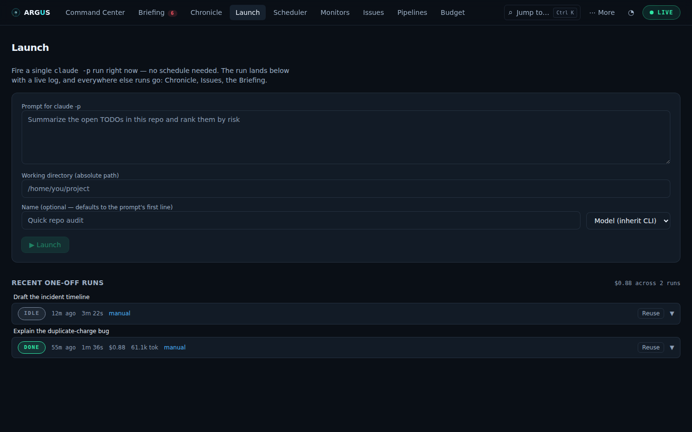
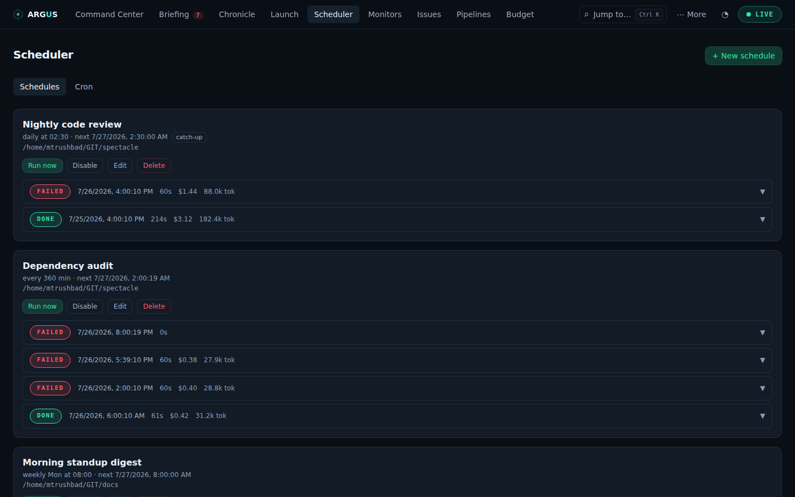
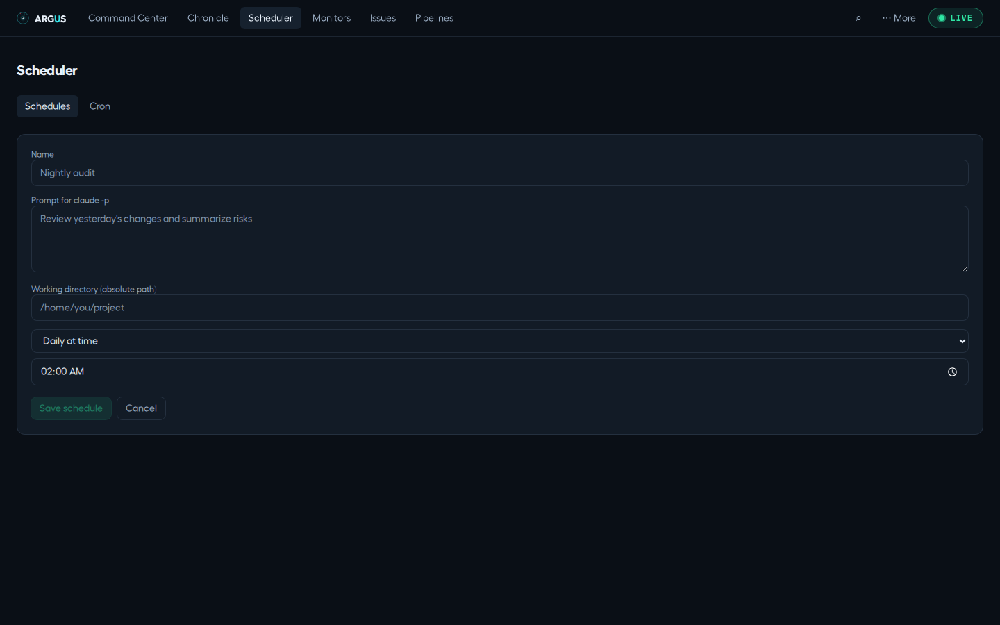

# One-off runs and recurring schedules

[Documentation](../README.md) · [Feature guides](../guides/README.md)

Run one bounded task now, then repeat work on a timer or external trigger.

## Before you start

A working agent CLI and an existing working directory. Follow [your first run](../getting-started/first-run.md) before scheduling repeat work.

## Try it

1. Open **Scheduler → One-off**, select your runtime, working directory and prompt, then launch a small task.
2. Inspect its run record before turning it into repeated work.
3. Open **Scheduler → Schedules**, create a named schedule, and choose a future trigger with the same tested runtime/directory. New schedules are enabled immediately when saved.
4. If you want to pause timed execution while reviewing the definition, use **Disable** after saving. Use **Run now** for a deliberate manual check and inspect its output and cost.
5. Enable the schedule when ready for recurring execution. Disabling future firings and cancelling a current run are separate actions.

**Expected result:** The saved schedule has a visible next firing and a run history. A one-off has no expected recurring slot.

## On this page

- [One-off runs](#one-off-runs)
- [Scheduler](#scheduler)

## One-off runs

_Fire one agent run right now._ Route: `#/schedules/oneoff` — the Scheduler's
**One-off** sub-tab. (`#/launch` still lands here.)

**Purpose:** not everything deserves a schedule. A one-off is a schedule with
no trigger — same form, same run rows, same machinery — so it lives inside the
Scheduler rather than as a tab of its own. It fires a **single
one-off run** — a quick audit, a report, a cleanup — straight from the
dashboard: prompt, working directory, go. No schedule object is created and
nothing recurs.

**The form:**

- **Prompt** (the field is labelled with the runtime you picked — `claude -p`,
  `codex exec`, `opencode run` or `qwen`) and a **working directory** (absolute path,
  must exist) — the only two required fields; **▶ Launch** stays disabled
  until both are filled.
- **Name** (optional) — how the run is titled everywhere; left empty it
  defaults to the prompt's first line (ellipsized at 60 chars).
- **Runtime** — Claude Code, Codex, OpenCode, Qwen Code, or the server default.
  A CLI that isn't on PATH is still offered, marked "not installed", rather than
  hidden: you may be configuring a machine you are about to install it on.
- **Model** — inherit the CLI default, pick an alias, or type a custom model id;
  passed to the agent as `--model`. The alias list follows the runtime (Claude
  Code offers Opus / Sonnet / Haiku; Codex offers its configured default, built-in aliases and `ARGUS_CODEX_MODELS` extras, with custom entry supported; Qwen Code leads with
  whatever `OPENAI_MODEL` names, and OpenCode wants a `<provider>/<model>` id
  from its own config). Switching runtime clears the model, because an alias
  from one means nothing to another.

After a launch the form keeps the **working directory, runtime and model** and
clears the prompt and name, so firing several prompts at one repo does not mean
retyping an absolute path each time.

**Recent one-off runs** — the last 20 launches, newest first, with a count of how
many are in flight and the total reported cost of the list. Each is titled and
expandable exactly like a schedule's run rows: status pill, relative start time,
duration, cost and tokens once reported, the error or result summary, a link
to the **transcript** in Sessions, and a **live-tailing log** (refreshes every
3s while running). A running launch has a **Cancel** button, and every row has
**Reuse** — it copies that run's prompt, directory, name, runtime and model back
into the form for a tweak-and-refire loop.

**Where one-off runs show up:** everywhere runs go. They share the `oneoff`
run bucket (pruned to the same 50-run window a schedule gets), appear as a
single **"One-off runs"** lane in the [Chronicle](monitoring.md#chronicle), a failed
launch groups into [Issues](health-and-quality.md#issues) and lands in the
[Briefing](monitoring.md#briefing)'s failure digest, and reported cost counts toward the
[Budget](budget-and-history.md#budget) and the Command Center's total spend. They never touch
[Monitors](health-and-quality.md#monitors) — there is no expected slot for a one-off.

**Where the data comes from:** `POST /api/launch` (`202` with the run
record), then the standard run surface — `GET /api/runs?scheduleId=oneoff`,
`GET /api/runs/:id`, `POST /api/runs/:id/cancel`.

## Scheduler

_Recurring agent runs, owned by Argus._ Route: `#/schedules`

**Purpose:** define headless prompts that Argus fires on a trigger — nightly
audits, periodic report generators, cleanup jobs — then watch their run
history and logs without leaving the page. Two sub-tabs: **Schedules** (this
section) and **One-off** (see [One-off runs](#one-off-runs)).

**Creating a schedule** — click **+ New schedule**:

- **Name** — how it appears everywhere (cards, Chronicle, Monitors).
- **Prompt** — the full prompt the headless agent receives. The label names
  the runtime the schedule will use.
- **Runtime** — Claude Code, Codex, OpenCode, Qwen Code, or the server default.
- **Working directory** — absolute path the agent runs in.
- **Trigger** — one of: **every N minutes** (interval), **daily at HH:MM**,
  **weekly on a day at HH:MM**, **Webhook**, or **After pipeline** (see below). Windowed triggers are available to pipelines, not schedules.
  Overlap policy defaults to _skip if still running_.
- **Catch up a missed run on recovery** — off by default. Normally a slot
  only fires within a short grace window (a few minutes), so if the machine
  was asleep or Argus wasn't running when a slot came due, that slot is
  silently skipped and the schedule waits for the next one. Tick this and the
  missed slot fires **once**, as soon as Argus is back — anacron-style. Only
  the most recent missed slot is run: an every-15-minutes schedule that
  slept through the night catches up with one run, not thirty. Ideal for
  "morning briefing"-type dailies on a laptop; leave it off for jobs where a
  stale run is worse than no run.
- **Save schedule** stays disabled until name, prompt and working directory
  are filled.

**Webhook and after-pipeline triggers.** Two more trigger kinds, shared with
Pipelines (see [§8](pipelines.md#pipelines)):

- **Webhook** — this schedule fires when something else `POST`s to a URL
  Argus mints for it, not on any clock. Once saved, the trigger editor shows
  the hook's **URL** and **token** (each with a Copy button) and a **Rotate**
  action that invalidates the old token immediately — use it if the token
  ever leaks. The sender authenticates with `Authorization: Bearer <token>`;
  reaching the hook from another machine needs the same non-default
  `ARGUS_HOST`/`ARGUS_TOKEN` setup any remote access to Argus needs (see
  [the API reference](../API.md#security)) — the hook's own token is a separate
  credential from `ARGUS_TOKEN` and does not substitute for it anywhere else.
- **After pipeline** — this schedule fires once a chosen **pipeline**'s
  instance ends, on **succeeded**, **failed**, or **any** outcome. Only
  pipelines can be a chain's source (a schedule's own runs have nothing to
  chain from); this schedule still fires its ordinary prompt, tagged
  `chained` instead of `scheduled` in its run history.

**What counts as a succeeded run.** The process must exit 0 _and_ the CLI's
own result envelope must not report an error (`is_error: true` for Claude
Code, a failed turn for Codex, an error part for OpenCode). A run whose CLI
exited cleanly after saying "Invalid API key" or refusing the prompt is
recorded **failed**, with that message as its error, and reaches failure
notifications and Issues like any other failure. A clean exit whose log has no
envelope to read is still a success — the exit code is the precondition, the
envelope is the verdict.

**The summary strip** above the list answers "is my scheduler healthy?"
without reading a card: how many schedules exist, how many are **failing** or
**paused**, how many runs reached a verdict in the last 24 hours and how many of
those failed, and which schedule fires **next**, with a live countdown. The
failing and paused counts are buttons — press one to filter the list to exactly
those schedules, press it again (or **Show all**) to go back. A count with
nothing behind it is not shown at all, so anything visible there is worth
reading.

**What each schedule card shows:** a state badge — **failing**, **running**,
**paused**, **healthy** or **never run** — then the humanised trigger ("every
6h", "daily at 02:30"), a countdown to the next firing, when it last ran, the
median duration of the runs listed below, and a **catch-up** chip when
missed-run recovery is on. Below that the working directory, and the **last five
runs** — status pill, relative start time (hover for the exact instant),
duration, cost and tokens if reported, and a `manual`/`webhook`/`chained` tag
naming how the run was fired (nothing shown for an ordinary scheduled firing)
— with a `3/5 passed` ratio beside them.

A schedule that has failed **more than once in a row** says so in a red band,
with the first line of the most recent error, because one failure is already
visible in the row below and a streak is a different problem. A **paused**
schedule says "will not fire" rather than showing a countdown to a slot it will
ignore, and one with no history at all explains how to test it without waiting
for a slot.

**What you can do:**

- **Run now** — fire immediately, regardless of the trigger.
- **Enable / Disable** — pause the trigger without deleting anything.
- **Edit** / **Delete** (with confirm).
- **Expand a run** to see its error or result summary, a link to the full
  **transcript** in Sessions, and a **live-tailing log** (refreshes every 3s
  while running). A running run has a **Cancel** button.

**Where the data comes from:** Argus's own state —
`~/.claude/argus/schedules.json` and run records under `~/.claude/argus/runs/`
via `GET/POST /api/schedules`, `PUT/DELETE /api/schedules/:id`,
`POST /api/schedules/:id/run`, `GET /api/runs`, `POST /api/runs/:id/cancel`.
