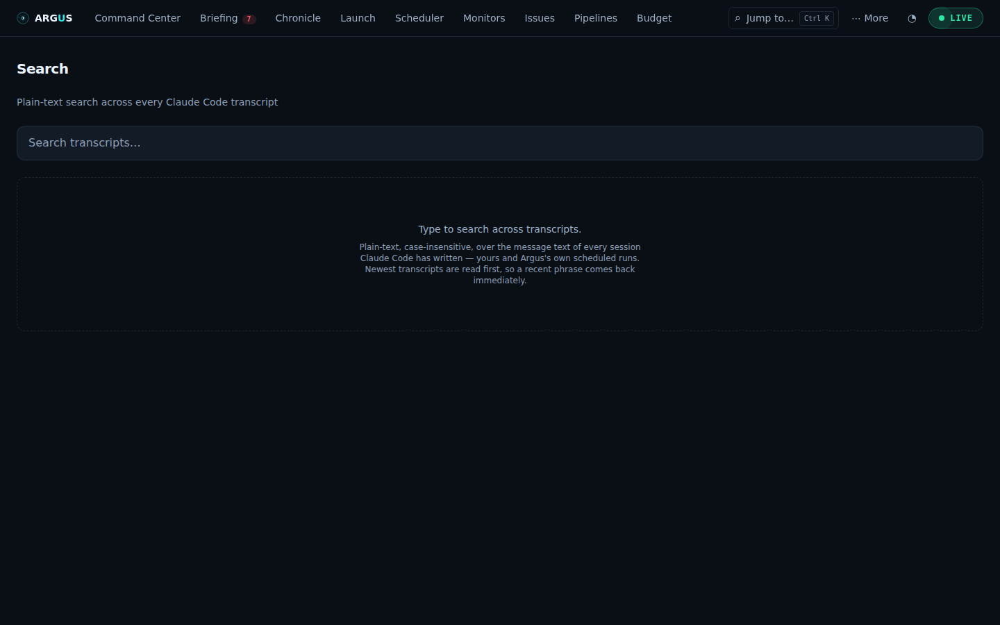
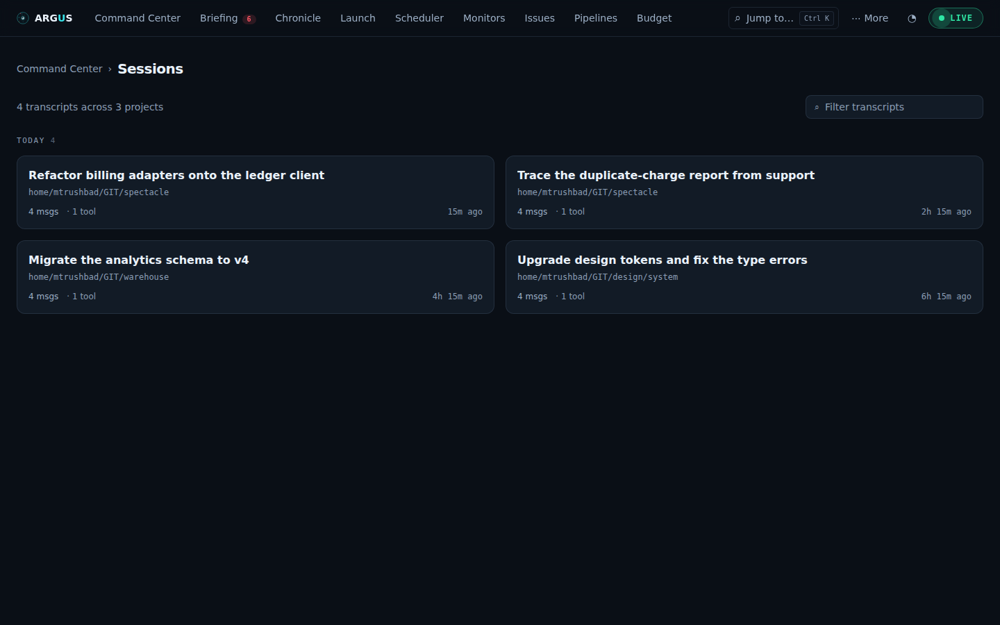
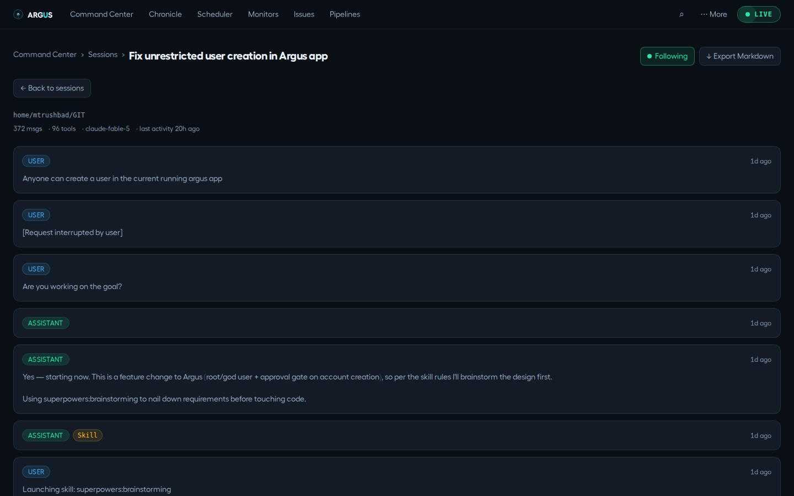
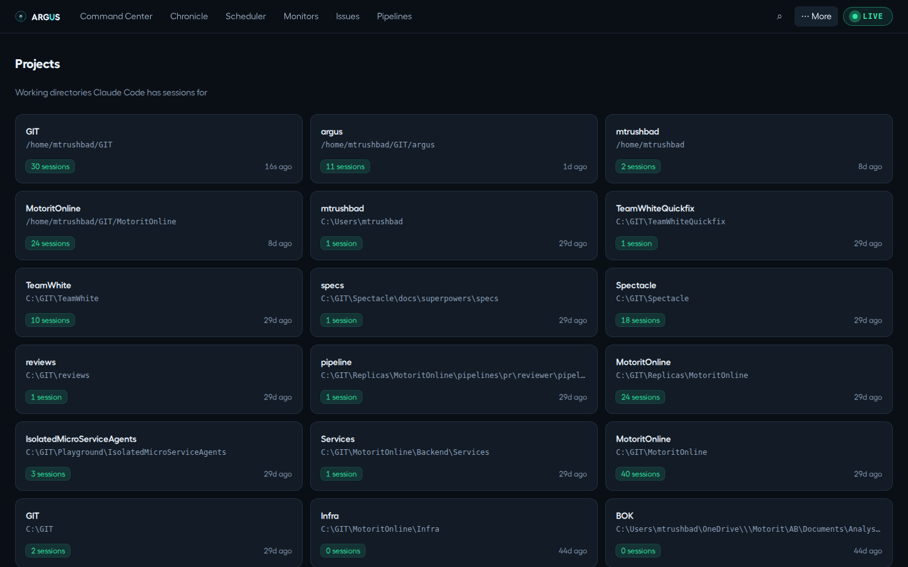
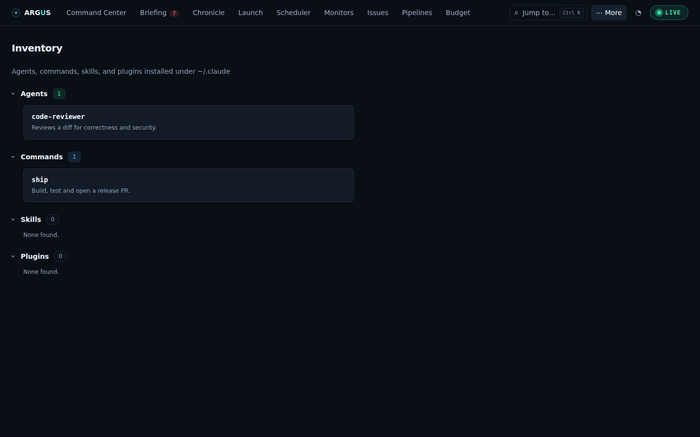

# Sessions, search, projects and inventory

[Documentation](../README.md) · [Feature guides](../guides/README.md)

Find past conversations and understand the local resources Argus discovered.

## Before you start

Readable local CLI state under the configured runtime homes. OpenCode transcripts are not available to the Sessions reader.

## Try it

1. Open **More → Sessions** and choose a project, then a session.
2. Use **Search** (palette or **/**) for text across readable transcripts.
3. Open a match and inspect the surrounding conversation rather than treating the snippet as complete context.
4. Open **More → Inventory** to see discovered agents, commands, skills and plugins. Discovery does not prove a selected CLI is installed or authenticated.
5. If the lists are empty, compare configured homes and runtime support in [troubleshooting](../reference/operations.md).

**Expected result:** You can locate a readable transcript and understand which runtime/state source supplied it.

## On this page

- [Search](#search)
- [Sessions](#sessions)
- [Projects](#projects)
- [Inventory](#inventory)

## Search

_Full-text across all transcripts._ Route: `#/search` (`/` from anywhere, or
the palette — it has no tab of its own)

**Purpose:** find any text anywhere in your session history — a phrase, a
file name, an error message — when you don't remember which session it was in.

**What you see:** a search box; as you type (debounced ~300ms), a match count and
results. Each result shows a role badge (user/assistant), the project, the
session's short id, and a **snippet centered on the match** with your terms
highlighted.

The count is honest about being a cap. The scan reads newest transcripts first and
stops at 100 matches, so a common word never reads your whole history — when it
stops early the line reads **"first 100 matches — narrow the query"** rather than
"100 matches", which would be a number you could reasonably take literally.

**How to use it:** just type — case-insensitive substring matching, not fuzzy. For
finding a pipeline, schedule or session _by name_, `⌘K` is the better tool; this
one is for text inside a conversation. Click a result to open that transcript.

**Where the data comes from:** `GET /api/search?q=`, scanning every
readable Claude Code, Codex and Qwen Code transcripts under their configured homes per query. OpenCode transcripts are not included.

## Sessions

_Browse & read transcripts._ Route: `#/sessions` (⋯ More menu);
`#/sessions/<project>` narrows the list to one working directory.

**Purpose:** read the actual conversation transcripts of your agent sessions
across all projects — Claude Code's, Codex's rollouts and Qwen Code's chats
alike. The latter two are written in their own CLI's vocabulary and translated
on read, so one list and one reader serve all three; only OpenCode is absent,
because it keeps its sessions in a private database rather than as files.

**What you see:** a count of transcripts and the projects they span, then cards
**grouped by day** — Today, Yesterday, the weekday within the last week, the date
beyond it — each with a title (from the first user prompt or AI-generated),
project, message count, tool-use count, the model used, and last-activity time.
A transcript with no usable timestamp lands in a trailing "Undated" group rather
than being dropped.

**Filter transcripts** (top-right) searches titles, project paths and model names
with the same fuzzy subsequence matching the command palette uses, so `ftm` finds
"Fix the migration". While you are filtering, the day headings step aside and
results come back in relevance order, freshest first among equal matches.

**Clicking a card opens the transcript:**

- The full message stream in order — each message with a role pill
  (user/assistant), a tool badge where a tool was invoked, a red error badge
  on failed steps, and a timestamp.
- **Following** (top-right): auto-scrolls to the newest message as a live
  session grows — Argus doubles as a live viewer for running sessions.
- **Export Markdown**: download the whole transcript as a `.md` file.
- **Back to sessions** returns to the list.

**Where the data comes from:** `GET /api/sessions` and
`GET /api/sessions/:project/:id`, reading
Claude Code JSONL transcripts, Codex rollouts and Qwen Code chats under their
configured homes. Codex and Qwen lines are translated on read.

## Projects

_Folded into Sessions._ A project is now a filter on the transcript list:
`#/sessions/<project>` shows that working directory's sessions with a chip
naming it, and the palette's project entries land there. `#/projects` lands on
Sessions. `GET /api/projects` is unchanged.

What the page was

_Working-directories overview._ Route: `#/projects`

**Purpose:** a directory-level roll-up — every folder Claude Code has worked
in, with how much activity each has.

**What you see:** a grid of project cards — short folder name, the full
decoded path, a **session-count** badge, and last-activity time. Paths from
other operating systems (e.g. a Windows `C:\GIT\…` history read on Linux)
decode correctly — Argus keys off the encoded names, not absolute paths.

**How to use it:** see which repos are most active and when each was last
touched. Informational only — drill into content via Sessions or Search.

**Where the data comes from:** `GET /api/projects`, scanning
`~/.claude/projects/` subdirectories.

## Inventory

_Installed extensions catalog._ Route: `#/inventory`

**Purpose:** see everything installed into your Claude Code environment — the
agents, commands, skills, and plugins available to you.

**What you see:** four collapsible, color-accented sections with count badges —
**Agents**, **Commands**, **Skills**, **Plugins** (with marketplace and
version) — each item showing its name and description from frontmatter.

**How to use it:** a reference catalog — "what do I have and what does each
do." No install/remove actions.

**Where the data comes from:** `GET /api/inventory`, reading
`~/.claude/agents/`, `commands/`, `skills/`, and
`plugins/installed_plugins.json`.
