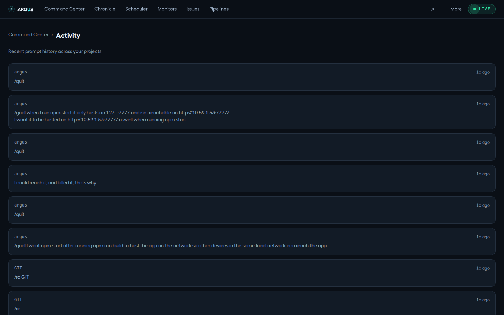
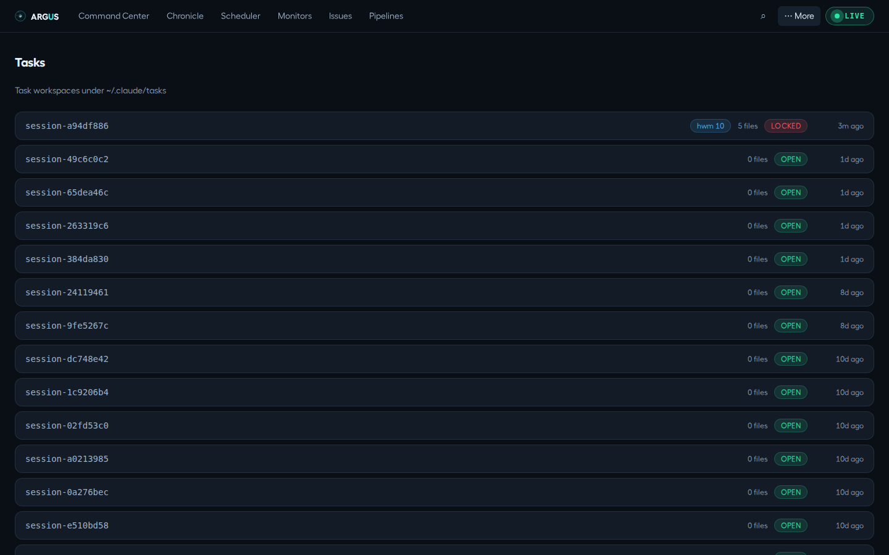
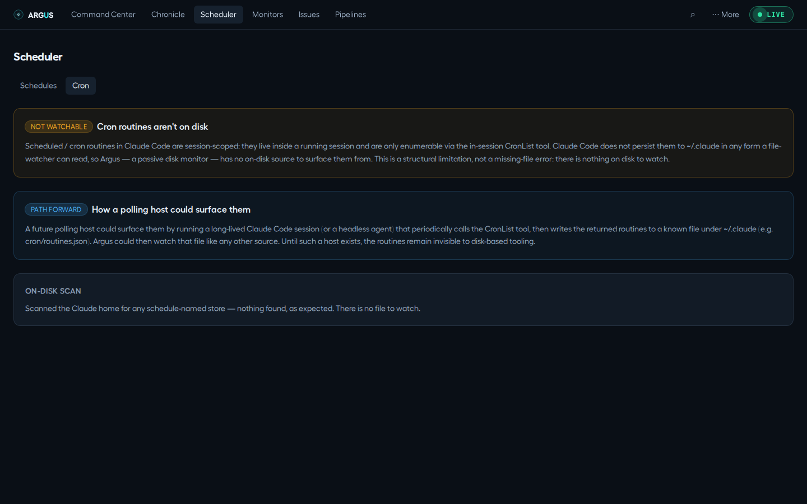

# Removed views and API-only features

[Documentation](../README.md) · [Feature guides](../guides/README.md)

Find the current home of old bookmarks and distinguish API-only data from UI features.

## Before you start

A running server for API reads. The removed views are retained here as compatibility reference.

## Try it

1. Use Sessions for old Activity/Projects bookmarks and Command Center for old Tasks bookmarks.
2. Use the API reference for `GET /api/activity` and `GET /api/tasks`; they are not current navigation destinations.
3. Use Argus Scheduler for persisted triggers. Native Claude cron routines are session-scoped and cannot be recovered by scanning disk.

**Expected result:** You do not look for removed tabs or confuse native CLI cron with Argus schedules.

## On this page

- [Activity](#activity)
- [Tasks](#tasks)
- [Cron panel](#cron-panel)

## Activity

_Removed from the UI._ `GET /api/activity` still serves the feed; `#/activity`
lands on Sessions, which shows the same prompts in the transcripts they belong
to, and Search finds them by text.

What the page was

_Global prompt feed._ Route: `#/activity`

**Purpose:** a single chronological stream of recent prompts issued across
**all** projects and sessions — your "what have I been doing lately" firehose.

**What you see:** a newest-first list; each row shows the project name, a
relative timestamp, and the prompt text (truncated to ~240 chars). Read-only.

**Where the data comes from:** `GET /api/activity`, reading
`~/.claude/history.jsonl` (most recent ~100 entries).

## Tasks

_Removed from the UI._ `GET /api/tasks` still serves the listing; `#/tasks`
lands on the Command Center.

What the page was

_Task-queue workspace inventory._ Route: `#/tasks`

**Purpose:** a low-level view of Claude Code's internal task directories (the
in-session task queue's working folders) — mostly diagnostic.

**What you see:** one row per task workspace — its id, a **highwatermark**
badge (progress marker) if present, the file count, a **lock status** (red =
locked/in use, green = open), and last-updated time. Read-only.

**Where the data comes from:** `GET /api/tasks`, scanning
`~/.claude/tasks/<id>/` for `.lock` / `.highwatermark` files.

## Cron panel

_Removed from the UI._ The sub-tab was three panels explaining that it could
show nothing; the explanation is below and `GET /api/cron` still returns it.
The Scheduler's second sub-tab is now [One-off runs](../guides/scheduling.md#one-off-runs).

What the panel was

_An honest empty state, by design._ Found under **Scheduler → Cron** sub-tab
(there is deliberately no `#/cron` route).

**Purpose:** explain why Claude Code's **native cron routines** can't be shown
as a live table — and what would be needed to surface them.

**What you see:**

- A **"not watchable"** panel: cron routines are session-scoped — they live
  inside a running Claude session, enumerable only via the in-session
  `CronList` tool, and are never persisted under `~/.claude`. A pure
  file-watcher fundamentally cannot see them.
- A **"path forward"** panel: a polling host could publish them to a file
  (e.g. `cron/routines.json`) that Argus would then watch like any source.
- An **on-disk scan**: Argus name-matches anything schedule-related under
  `~/.claude` and lists candidates as hints — usually "nothing found, as
  expected."

Don't confuse this with **Argus's own Scheduler** (section 5), which is fully
on-disk and fully supported — this panel is only about Claude Code's
harness-managed routines.

**Where the data comes from:** `GET /api/cron`, returning
`{ available: false, reason, howTo }` plus filename hints.

